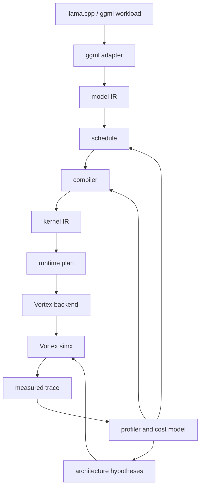

<a id="readme-top"></a>

<div align="center">

# Mandrel

**Rust-first RISC-V GPGPU backend laboratory for LLM inference co-design.**

[](#current-status)
[](https://www.rust-lang.org/)
[](https://github.com/vortexgpgpu/vortex)
[](#toolchain-policy)
[](#license)

**[Explore the design](docs/design.md) · [View the roadmap](docs/roadmap.md) · [Inspect the C ABI](crates/vortex-backend/include/mandrel_vortex.h)**

</div>

---

## Table of contents

- [About the project](#about-the-project)
  - [Why Mandrel](#why-mandrel)
  - [What it is not](#what-it-is-not)
  - [Built with](#built-with)
- [Current status](#current-status)
- [Architecture](#architecture)
- [Getting started](#getting-started)
  - [Prerequisites](#prerequisites)
  - [Rust workspace checks](#rust-workspace-checks)
  - [Vortex toolchain on ARM/aarch64](#vortex-toolchain-on-armaarch64)
- [Usage](#usage)
  - [Inspect the pipeline](#inspect-the-pipeline)
  - [Run Vortex smokes](#run-vortex-smokes)
  - [Rust backend API](#rust-backend-api)
  - [C ABI boundary](#c-abi-boundary)
- [Workspace layout](#workspace-layout)
- [Toolchain policy](#toolchain-policy)
- [Roadmap](#roadmap)
- [Documentation](#documentation)
- [Contributing](#contributing)
- [License](#license)
- [Acknowledgments](#acknowledgments)

---

## About the project

Mandrel is an experimental backend/compiler/runtime stack for studying how LLM operators can run on a simulated RISC-V GPGPU architecture. The current hardware target is [Vortex](https://github.com/vortexgpgpu/vortex), starting with `simx` so that the software feedback loop can mature before investing in RTL or FPGA flows.

The project is designed as the low-level co-design layer that can eventually sit below a Rust inference framework such as Ferrule, or behind a `ggml` / `llama.cpp` backend.

### Why Mandrel

Efficient LLM inference is not only a kernel-writing problem. It requires a feedback loop across the full stack:

| Layer | Design question | Mandrel responsibility |
| --- | --- | --- |
| Workload | Which LLM operators dominate prefill/decode? | Model `ggml`-like operator boundaries. |
| Compiler | Which tiling, layout, and thread maps fit the target? | Lower operator IR into kernel plans. |
| Runtime | Which buffers, launches, and fallback paths are stable? | Own Vortex runtime resources through Rust RAII APIs. |
| Kernel | Which generated code path is executable today? | Emit Vortex C++ and textual Vortex LLVM IR artifacts. |
| Architecture | Which machine parameters should change next? | Feed simulator traces and estimates back into scheduling. |

The name reflects the role: a mandrel is the shaped core around which material is formed. This project is the core around which workload-driven RISC-V GPGPU inference experiments are shaped.

### What it is not

Mandrel is intentionally not:

- a full inference framework;
- an OpenCL-first product route;
- a one-off handwritten matmul demo;
- a fork-in-place of Vortex;
- a C++ host runner project.

The host/runtime side should remain Rust-first. Device kernels may be generated through Vortex C++ for the stable/debug path and through textual Vortex LLVM IR for the main experimental lowering path.

### Built with

- [Rust 2024](https://www.rust-lang.org/) and Cargo workspaces.
- [Vortex](https://github.com/vortexgpgpu/vortex) as the primary RISC-V GPGPU target.
- Vortex-patched LLVM for device compilation and `__vx_kentry_*` / `VXSYMTAB` metadata.
- Textual LLVM IR and generated Vortex C++ for kernel artifact experiments.
- [`genco`](https://crates.io/crates/genco) for source-generation infrastructure.
- A small C ABI surface for future `ggml` / `llama.cpp` integration.

<p align="right">(<a href="#readme-top">back to top</a>)</p>

---

## Current status

| Area | Status |
| --- | --- |
| Rust workspace | Strict `fmt`, `clippy -D warnings`, tests, and no-std policy for core crates. |
| Primary backend | Vortex RISC-V GPGPU, `simx` first. |
| Toolchain | Source-built Vortex-patched LLVM + rv64 `compiler-rt` is the supported ARM/aarch64 path. |
| Direct matmul | `matmul_i8_i32` is generated as Vortex C++ by default. |
| LLVM IR path | Direct matmul can also be generated as textual Vortex LLVM IR. |
| Tiled matmul | Experimental `4x4x32` local-memory LLVM IR path passes correctness smoke, but is not the default. |
| Runtime wrapper | Rust `vortex2.h` FFI wrapper with `Runtime`, `Device`, `Queue`, `Module`, `Kernel`, `Buffer`, and RAII ownership. |
| Backend API | `VortexBackend` owns runtime/device/queue, caches modules/kernels, manages buffers, and exposes stable Rust matmul APIs. |
| C ABI | Public header exists at `crates/vortex-backend/include/mandrel_vortex.h`. |
| Research loop | Static metrics and first runtime trace summaries exist; richer Vortex counter parsing is next. |

<p align="right">(<a href="#readme-top">back to top</a>)</p>

---

## Architecture



Mandrel separates high-level workload semantics from backend-specific execution details:

```text
operator model -> schedule -> kernel plan -> Vortex artifact -> Rust runtime -> simulator trace
```

This keeps the project from becoming a pile of handcrafted kernels. New kernels should enter through the IR/schedule/compiler path, then become executable artifacts that the backend can load, cache, launch, and measure.

<p align="right">(<a href="#readme-top">back to top</a>)</p>

---

## Getting started

### Prerequisites

For the Rust-only checks:

- Rust toolchain compatible with `rust-toolchain.toml`.
- Cargo.

For Vortex device smokes on Linux ARM/aarch64:

```sh
sudo apt install build-essential cmake ninja-build git make python3 clang lld llvm-18-dev \
  gcc-riscv64-unknown-elf binutils-riscv64-unknown-elf \
  picolibc-riscv64-unknown-elf
```

Clone your Mandrel repository and enter it:

```sh
git clone <your-mandrel-repository-url>
cd Mandrel
```

### Rust workspace checks

```sh
cargo fmt --all
cargo check --workspace --all-targets --all-features
cargo clippy --workspace --all-targets --all-features -- -D warnings
cargo test --workspace --all-targets --all-features
cargo no-std-check
```

Common aliases are configured in `.cargo/config.toml`:

```sh
cargo fmt-check
cargo check-all
cargo clippy-all
cargo test-all
cargo miri-test
cargo no-std-check
```

### Vortex toolchain on ARM/aarch64

Do not use the upstream x86_64 prebuilt Vortex toolchain on ARM/aarch64. Build the Vortex-compatible LLVM toolchain locally:

```sh
cargo vortex-toolchain-source

MANDREL_VORTEX_TOOLCHAIN_MODE=skip \
MANDREL_VORTEX_TOOLDIR=external/vortex-source-tools \
cargo vortex-install
```

This creates a local Vortex-compatible layout under `external/vortex-source-tools`, including `llvm-vortex` and bare-metal RISC-V `compiler-rt`.

<p align="right">(<a href="#readme-top">back to top</a>)</p>

---

## Usage

### Inspect the pipeline

```sh
cargo run -- overview
cargo run -- plan
cargo run -- compile-plan
cargo run -- ggml-probe
cargo run -- matmul reference
```

These commands show the project direction, an example runtime plan, the current Vortex matmul launch plan, the ggml-like offload probe, and the host reference kernel.

### Run Vortex smokes

Official Vortex environment check:

```sh
MANDREL_VORTEX_TOOLCHAIN_MODE=skip \
MANDREL_VORTEX_TOOLDIR=external/vortex-source-tools \
cargo vortex-run-vecadd
```

Project direct matmul smoke, default generated C++ path:

```sh
MANDREL_VORTEX_TOOLCHAIN_MODE=skip \
MANDREL_VORTEX_TOOLDIR=external/vortex-source-tools \
cargo vortex-run-matmul
```

Project direct matmul smoke, textual LLVM IR path:

```sh
MANDREL_VORTEX_TOOLCHAIN_MODE=skip \
MANDREL_VORTEX_TOOLDIR=external/vortex-source-tools \
MANDREL_VORTEX_CODEGEN=llvm-ir \
cargo vortex-run-matmul
```

Experimental tiled local-memory matmul smoke:

```sh
MANDREL_VORTEX_TOOLCHAIN_MODE=skip \
MANDREL_VORTEX_TOOLDIR=external/vortex-source-tools \
cargo vortex-run-matmul-tiled
```

A successful direct smoke prints output similar to:

```text
PERF: instrs=241472, cycles=265239, IPC=0.910
launch: grid=(8, 8, 1) block=(4, 4, 1)
runtime-trace: h2d=4096 d2h=4096 workgroups=64 threads_per_workgroup=16 shared_memory_bytes=0
custom Vortex direct matmul PASSED
```

A successful tiled smoke currently proves correctness, not performance superiority:

```text
experimental tiled matmul plan
tile: M=4 N=4 K=32
launch: kernel=matmul_i8_i32_tiled grid=(8, 8, 1) block=(4, 4, 1) shared_memory_bytes=256
custom Vortex experimental tiled matmul PASSED
```

### Rust backend API

The stable Rust-facing API is intentionally small and backend-owned:

```rust
use mandrel_vortex_backend::{MatmulShape, VortexBackend, VortexBackendConfig};

let config = VortexBackendConfig::new("target/vortex/matmul_i8_i32/kernel.vxbin");
let mut backend = VortexBackend::new(config)?;

let shape = MatmulShape::new(32, 32, 64);
let output: Vec<i32> = backend.mul_mat_i8_i8_i32(shape, &lhs, &rhs)?;
```

`VortexBackend` owns the Vortex runtime, device, queue, kernel/module caches, and temporary buffers used by the operation.

### C ABI boundary

The public C boundary is kept deliberately conservative:

```c
#include "mandrel_vortex.h"
```

Header location:

```text
crates/vortex-backend/include/mandrel_vortex.h
```

The first exported operation is a contiguous row-major `i8 * i8 -> i32` matrix multiply. Unsupported shapes should be rejected cleanly so a future `ggml` / `llama.cpp` shim can fall back to its existing backend.

<p align="right">(<a href="#readme-top">back to top</a>)</p>

---

## Workspace layout

```text
Mandrel/
├── crates/
│   ├── core/             # shared shape, dtype, layout descriptors
│   ├── model-ir/         # operator-level IR for matmul, attention, future LLM ops
│   ├── schedule/         # tiles, layouts, thread maps, copy atoms, candidates
│   ├── compiler/         # model-ir + schedule + catalog -> launch plan
│   ├── kernel-ir/        # kernel symbols, signatures, launch descriptors
│   ├── profiler/         # static estimates and measured trace schema
│   ├── device/           # device capabilities, buffers, command abstractions
│   ├── runtime/          # backend-neutral runtime target and plans
│   ├── ggml-adapter/     # ggml-like shape/type/offload shim
│   ├── kernels/          # host reference kernels
│   ├── vortex-backend/   # Vortex FFI, backend context, codegen, artifacts
│   └── xtask/            # external tool and smoke orchestration
├── docs/
│   ├── design.md         # architecture and design rationale
│   └── roadmap.md        # next milestones and research plan
└── src/                  # root CLI entry
```

Local third-party checkouts and generated artifacts are expected under ignored directories such as `external/`, `target/`, `logs/`, and `trace/`.

<p align="right">(<a href="#readme-top">back to top</a>)</p>

---

## Toolchain policy

The supported Vortex kernel path uses **Vortex-patched LLVM** from `vortexgpgpu/llvm`.

System LLVM is not equivalent for Vortex kernels: it does not provide the Vortex-specific backend behavior needed to emit `__vx_kentry_*` and the `VXSYMTAB` footer. If `kernel.elf` only contains `kernel_main`, the root cause is a toolchain/backend mismatch, not a missing `vxbin.py` fallback.

Project policy:

- use Vortex-patched LLVM for device kernels;
- do not patch `external/vortex` directly;
- if Vortex changes are required, use a fork/ref or managed patch staging;
- do not hide toolchain mismatches with a `vxbin.py` fallback;
- do not use `libgcc.a` as the default replacement for Vortex `compiler-rt`;
- keep `xtask` as orchestration only, not as a dependency of the Rust runtime wrapper.

<p align="right">(<a href="#readme-top">back to top</a>)</p>

---

## Roadmap

- [x] Rename and clean the workspace as Mandrel.
- [x] Establish Rust IR, schedule, compiler, runtime, profiler, and backend crate boundaries.
- [x] Run a generated Vortex direct matmul smoke through `simx`.
- [x] Add a Rust `VortexBackend` that owns runtime/device/queue/cache/buffer lifetimes.
- [x] Add a minimal C ABI header for future `ggml` / `llama.cpp` integration.
- [x] Add experimental tiled local-memory LLVM IR lowering.
- [ ] Generalize the artifact pipeline beyond matmul-specific smoke commands.
- [ ] Expand the kernel catalog toward softmax, reductions, attention prefill, and KV-cache paths.
- [ ] Parse richer Vortex simulator counters into the profiler.
- [ ] Implement the first conservative `ggml` / `llama.cpp` backend slice.
- [ ] Close the loop from workload traces to schedule and architecture hypotheses.

See [docs/roadmap.md](docs/roadmap.md) for the detailed plan.

<p align="right">(<a href="#readme-top">back to top</a>)</p>

---

## Documentation

- [Design](docs/design.md): architecture, crate boundaries, lowering pipeline, runtime flow, Vortex toolchain policy, and current kernel state.
- [Roadmap](docs/roadmap.md): milestones, next workstreams, kernel expansion plan, ggml/llama.cpp integration steps, and co-design research direction.
- [C ABI header](crates/vortex-backend/include/mandrel_vortex.h): public boundary intended for downstream C/C++ integration experiments.

<p align="right">(<a href="#readme-top">back to top</a>)</p>

---

## Contributing

Mandrel is currently a research prototype. The most useful contributions are focused and measurable:

1. Keep changes Rust-first on the host side.
2. Keep `external/vortex` clean; stage Vortex changes through a fork/ref or explicit patch process.
3. Add kernels through IR, schedule, compiler, and artifact plumbing rather than bypassing the stack.
4. Include a smoke, unit test, trace check, or documented measurement for behavior changes.
5. Keep `cargo fmt`, `cargo check`, focused tests, and `clippy -D warnings` passing.

<p align="right">(<a href="#readme-top">back to top</a>)</p>

---

## License

Distributed under the repository license. See `LICENSE` for details.

<p align="right">(<a href="#readme-top">back to top</a>)</p>

---

## Acknowledgments

- [Vortex GPGPU](https://github.com/vortexgpgpu/vortex) for the RISC-V GPGPU software/hardware stack.
- [LLVM](https://llvm.org/) and the Vortex LLVM backend for the device compilation path.
- [RISC-V](https://riscv.org/) for the open ISA foundation.
- [`ggml`](https://github.com/ggml-org/ggml) and [`llama.cpp`](https://github.com/ggml-org/llama.cpp) for the backend integration target model.

<p align="right">(<a href="#readme-top">back to top</a>)</p>
