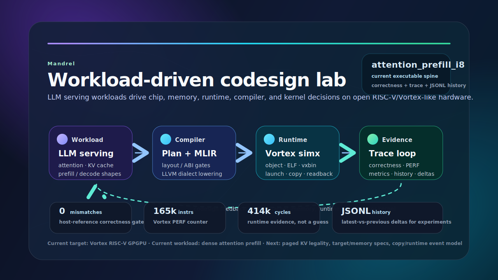

# Mandrel

> **Workload-driven full-stack codesign for open AI accelerators.**
>
> Mandrel uses LLM serving workloads, starting from attention and KV cache, to explore the joint design of chip architecture, memory hierarchy, data movement, runtime/driver interfaces, compiler lowering, and operator kernels on RISC-V/Vortex-like hardware.

Mandrel is not just an attention-kernel demo. The current Vortex attention path is the first executable spine of a broader codesign lab: a narrow but real path from workload semantics to generated kernel artifacts, runtime correctness, and trace-driven evidence.

```text
Open attention kernels for open AI hardware.
```

## Mission

Mandrel exists to test how open AI hardware should be built for LLM serving — across chip, memory, runtime, compiler, and kernels.

The project currently focuses on Vortex/RISC-V GPGPU because it provides an open, inspectable target where design ideas can be made executable. The long-term goal is a reproducible lab where LLM serving workloads drive hardware/software codesign decisions with correctness checks and measurable traces.

Read the full mission: [`docs/mission.md`](docs/mission.md).

## Why Mandrel

Modern LLM serving is dominated by CUDA-centric kernel infrastructure. Open RISC-V AI hardware needs more than microbenchmarks: it needs realistic workload paths that expose attention, KV-cache, copies, communication, runtime overhead, memory hierarchy, and compiler lowering decisions.

Mandrel starts from the hardest useful slice:

- **Attention first**: dense `attention_prefill_i8` is the active executable baseline; paged KV legality is next.
- **Compiler/runtime together**: model IR, schedule metadata, ABI/layout validation, MLIR generation, artifacts, runtime launch, and traces live in one Rust workspace.
- **Vortex/RISC-V first**: generated device code targets the Vortex toolchain and runs through `simx` today.
- **Correctness first**: generated kernels are compared against a Rust host reference.
- **Observability first**: runtime shape, launch, transfer, cache, counters, workload, wall-time, and derived metrics are persisted as JSONL history.

## Current executable spine



Today this spine is implemented for dense attention prefill:

```text
AttentionOp::prefill_i8_demo
  -> dense online-softmax schedule
  -> VortexAttentionPrefillPlan
  -> ABI/layout metadata validation
  -> LLVM dialect MLIR
  -> Vortex LLVM object, ELF, and vxbin
  -> Vortex simx runtime launch
  -> host reference compare
  -> JSONL trace history and deltas
```

## What works today

| Area | Current state |
| --- | --- |
| Workload | Dense `attention_prefill_i8` baseline with runtime shape overrides. |
| Schedule | Dense KV layout, online max/sum softmax strategy, `4x16x64` tile metadata. |
| ABI/layout metadata | Buffer slots, scalar arg indices, dense row-major strides, quantization, runtime shape policy, and KV policy are validated at codegen/runtime gates. |
| Codegen | Rust plan emits LLVM dialect MLIR for Vortex. |
| Artifact pipeline | MLIR validates through `mlir-translate`, Vortex `clang`, `.o`, startup-aware `.elf`, and `.vxbin` packaging. |
| Runtime | `VortexBackend` wraps runtime/device/queue, artifact lookup, kernel cache, launch, transfers, and readback. |
| Correctness | Device output is compared against a Rust host reference. |
| Observability | `PERF`, launch dimensions, transfer bytes, cache hits, workload bytes/elements, logical MACs, wall time, derived ratios, and JSONL history. |
| CLI | `xtask` is modularized and exposed through `clap` commands such as `cargo vortex-run-attention`. |
| Next | Paged KV legality planning, target/hardware specs, data-movement modeling, and tiled online lowering. |

## How to read the current output

Mandrel's output is meant to explain the whole spine, not only say that a kernel ran. A recent local `cargo vortex-run-attention` run shows three kinds of evidence.

### 1. Flow gates

```text
attention.runtime: compiling attention launch plan
attention.runtime: validating attention ABI/layout metadata
attention.runtime: building deterministic attention input
attention.runtime: runtime shape compiled=64x64 default=8x16 actual=8x16 tile(query=4, key=16, head_dim=64)
attention.runtime: backend transfers host_to_device=384B device_to_host=128B total=512B
attention.runtime: execution shape workgroups=16 threads_per_workgroup=16 total_threads=256
attention.runtime: compare summary elements=128 mismatches=0 status=exact
attention runtime correctness PASSED
```

What this means:

| Line | Why it matters |
| --- | --- |
| `compiling attention launch plan` | The workload is represented as a Rust plan, not manually launched as an opaque binary. |
| `validating attention ABI/layout metadata` | Buffer slots, scalar arg indices, dense row-major layout, quantization, KV policy, and runtime shape are checked before codegen/runtime use them. |
| `compiled=64x64 ... actual=8x16` | The generated kernel has a compiled maximum shape while the smoke uses a smaller runtime prefix. This is the first step toward serving-shaped runtime variation. |
| `host_to_device=384B device_to_host=128B` | Data movement is visible. For a codesign lab, copy and memory traffic are first-class signals, not hidden overhead. |
| `workgroups=16 threads_per_workgroup=16` | The launch maps schedule decisions to hardware execution shape. |
| `mismatches=0 status=exact` | Correctness is a gate: metric changes are not trusted unless the host reference still matches. |

### 2. Runtime trace summary

```text
attention.runtime trace summary:
  kernel: attention_prefill_i8
  runtime: sequence=8 head_dim=16 query_tile=4 key_tile=16
  compiled: sequence=64 head_dim=64 head_dim_tile=64
  execution: workgroups=16 threads_per_workgroup=16 total_threads=256 module_cache_hit=false kernel_cache_hit=false
  workload: logical_macs=2048 q_elements=128 kv_elements=256 output_elements=128
  memory: q_bytes=128 kv_bytes=256 output_bytes=128 host_to_device_bytes=384 device_to_host_bytes=128 total_transfer_bytes=512
  counters: instructions=165144 cycles=414598 ipc=0.398
  derived: instrs/output=1290.188 cycles/output=3239.047 transfer_bytes/output=4.000 cycles/logical_mac=202.440 logical_macs/cycle=0.005
```

How to interpret the fields:

| Field group | Meaning | Codesign use |
| --- | --- | --- |
| `runtime` | The actual problem shape and tile knobs used for this run. | Lets experiments compare prefill/decode sizes, tile choices, and runtime prefix shapes. |
| `compiled` | The shape and tile assumptions baked into the generated artifact. | Separates generated-kernel capacity from runtime workload shape. |
| `execution` | Grid/block-derived workgroups, threads, and cache-hit state. | Connects schedule decisions to runtime launch behavior and module/kernel cache effects. |
| `workload` | Logical MACs and element counts. | Normalizes performance across shape changes. |
| `memory` | Logical buffer bytes and observed transfer bytes. | Makes copy/storage costs visible before paged KV and device-device movement are added. |
| `counters` | Vortex `PERF` instructions, cycles, and IPC. | Gives hardware/runtime evidence instead of relying on estimates. |
| `derived` | Per-output and per-MAC ratios. | Makes latest-vs-previous comparisons meaningful even when workload shape changes. |

### 3. History and deltas

```text
cargo vortex-trace-attention

records: 6 (showing latest 5)
delta latest vs previous:
  instrs: +0 (+0.00%) latest=165144
  cycles: +0 (+0.00%) latest=414598
  total_transfer_bytes: +0 (+0.00%) latest=512
  wall_time_ms: -1 (-0.28%) latest=358
  ipc: +0.000 (+0.00%) latest=0.398
  instrs/output: +0.000 (+0.00%) latest=1290.188
  cycles/output: +0.000 (+0.00%) latest=3239.047
  transfer_bytes/output: +0.000 (+0.00%) latest=4.000
  cycles/logical_mac: +0.000 (+0.00%) latest=202.440
  logical_macs/cycle: +0.000 (+0.00%) latest=0.005
```

This is the start of the lab loop: change a schedule, ABI, memory model, runtime policy, or kernel lowering, then compare the new trace against history. Exact wall time varies by host and build state; cycle/instruction values come from Vortex `PERF` output for the current smoke.

## Quick start

Inspect the local Vortex setup:

```sh
cargo vortex-status
```

Build/install the source toolchain when needed:

```sh
cargo vortex-toolchain-source
cargo vortex-install
```

Inspect, generate, run, and review the current attention path:

```sh
cargo vortex-plan-attention
cargo vortex-generate-attention
cargo vortex-run-attention
cargo vortex-trace-attention
```

Useful runtime knobs:

```sh
MANDREL_ATTENTION_RUNTIME_SEQUENCE=64 \
MANDREL_ATTENTION_RUNTIME_HEAD_DIM=64 \
cargo vortex-run-attention

MANDREL_ATTENTION_RUNTIME_SCALAR_LAUNCH=1 cargo vortex-run-attention
```

## Workspace map

```text
crates/
  core/             shared shape, dtype, and layout descriptors
  model-ir/         attention and LLM operator IR
  schedule/         attention tiling, layouts, and schedule candidates
  compiler/         model-ir + schedule -> Vortex kernel plans
  kernel-ir/        kernel symbols, signatures, and launch descriptors
  profiler/         estimates, runtime trace parsing, and counters
  vortex-backend/   Vortex codegen, ABI validation, artifacts, runtime wrapper, and C ABI
  runtime/          higher-level runtime-facing surfaces and experiments
  kernels/          kernel catalog and CPU/reference-side helpers
  xtask/            clap CLI, toolchain, status, generation, runtime, trace commands
docs/
  mission.md        project mission and codesign framing
  roadmap.md        active milestones and short-term priorities
  design.md         design notes
  mlir.md           MLIR notes
external/           local Vortex/LLVM checkouts and builds
```

## Codesign axes

Mandrel is being shaped around these layers:

| Layer | Codesign question |
| --- | --- |
| Chip/target | Which RISC-V/Vortex execution resources matter for attention and KV paths? |
| Memory/storage | How should dense/paged KV, local memory, and cache behavior be modeled? |
| Data movement | Which copies, layout transforms, and future overlaps dominate serving paths? |
| Runtime/driver | How do allocation, launch, queue, sync, module cache, and transfer overhead affect decode/prefill? |
| Compiler | How should semantic/layout metadata lower into target-specific loops and memory movement? |
| Kernels/operators | Which attention, softmax, reduction, copy, and KV primitives are worth specializing? |
| Observability | Can every design change be explained through correctness, trace, and derived metrics? |

## Roadmap snapshot

The current near-term track is:

1. **Executable attention spine**: done for dense `attention_prefill_i8` on Vortex `simx`.
2. **Runtime trace loop**: done for current smoke, with JSONL history and derived metrics.
3. **ABI/layout metadata gates**: in progress; codegen/runtime now validate the current attention ABI and reject unsupported Paged KV metadata.
4. **Paged KV legality planning**: next; model page size, logical layout, and legality before lowering.
5. **Tiled online lowering**: next; make `key_tile` structural in MLIR, then add online max/sum/accumulator state.
6. **Codesign lab expansion**: introduce target specs, memory/copy models, runtime event records, and experiment reports.

See [`docs/roadmap.md`](docs/roadmap.md) for details.

## Community direction

Mandrel is designed to sit below, not replace, serving/runtime projects:

- **RISC-V / open hardware**: provide workload-driven feedback from real LLM kernels.
- **SGLang-class serving**: use prefill/decode, paged KV, and batching shapes as north-star workloads.
- **llama.cpp / ggml-style runtimes**: provide a future conservative C/C++ boundary for one-op backend probes and local-inference experiments.

The intended contribution is a transparent low-level lab: generated kernels, artifacts, correctness, traces, and reports that explain how open AI hardware behaves under LLM serving pressure.

## Validation

Recent local validation includes:

```sh
cargo fmt --check
cargo test -p mandrel-profiler -p mandrel-compiler -p mandrel-vortex-backend -p xtask
cargo vortex-run-attention
cargo vortex-trace-attention
```

The Vortex runtime smoke requires a local Vortex toolchain/runtime under `external/` or equivalent environment configuration.

## Status

Mandrel is early and intentionally narrow. The project currently prioritizes one hard vertical slice over many shallow demos. The goal is to keep the attention path executable while gradually turning hardware target specs, memory systems, copies, communication, and runtime events into first-class experiment objects.