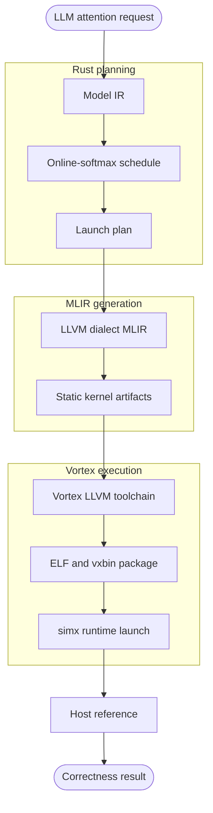

# Mandrel

Mandrel is a Rust-first compiler/runtime workspace for exploring LLM attention kernels on the Vortex RISC-V GPGPU stack.

## Why this project

Mandrel focuses on a narrow, end-to-end path instead of a broad framework surface:

- **Attention first**: the active baseline is dense `attention_prefill_i8` with an online-softmax schedule.
- **MLIR first**: generated device code goes through LLVM dialect MLIR before Vortex LLVM builds the final binary.
- **Runtime checked**: generated kernels are packaged as `.vxbin`, launched on Vortex `simx`, and compared with a Rust host reference.
- **Rust controlled**: planning, code generation, artifact management, and runtime launching live in one workspace.



## What works today

| Area | Current state |
| --- | --- |
| Kernel path | Dense `attention_prefill_i8` from Rust plan to generated MLIR. |
| Toolchain path | Source-built Vortex LLVM/MLIR tools under `external/vortex-source-tools`. |
| Runtime path | Vortex `simx` launch, readback, and host-reference correctness check. |
| Backend | Rust wrapper around Vortex runtime objects plus artifact lookup and launch validation. |
| C ABI | Minimal backend lifecycle surface; operator ABI is intentionally deferred until layouts settle. |

## Quick start

Inspect local Vortex setup:

```sh
cargo vortex-status
```

Build/install the source toolchain when needed:

```sh
cargo vortex-toolchain-source
cargo vortex-install
```

Inspect, generate, and run the current attention path:

```sh
cargo vortex-plan-attention
cargo vortex-generate-attention
cargo vortex-run-attention
```

Useful runtime knobs:

```sh
MANDREL_ATTENTION_RUNTIME_SEQUENCE=64 \
MANDREL_ATTENTION_RUNTIME_HEAD_DIM=64 \
cargo vortex-run-attention

MANDREL_VORTEX_RUNTIME_TRACE=1 cargo vortex-run-attention
```

## Workspace map

```text
crates/
  core/             shared shape, dtype, and layout descriptors
  model-ir/         attention and LLM operator IR
  schedule/         attention tiling, layouts, and schedule candidates
  compiler/         model-ir + schedule -> launch plans
  kernel-ir/        kernel symbols, signatures, and launch descriptors
  vortex-backend/   Vortex codegen, artifacts, runtime wrapper, and C ABI
  xtask/            toolchain, status, generation, and runtime commands
docs/               design notes, MLIR notes, and roadmap
external/           local Vortex/LLVM checkouts and builds
```

## Validation

Common checks:

```sh
cargo fmt --check
cargo check -p mandrel-vortex-backend -p xtask
cargo test -p mandrel-vortex-backend -p xtask
cargo vortex-run-attention
```
