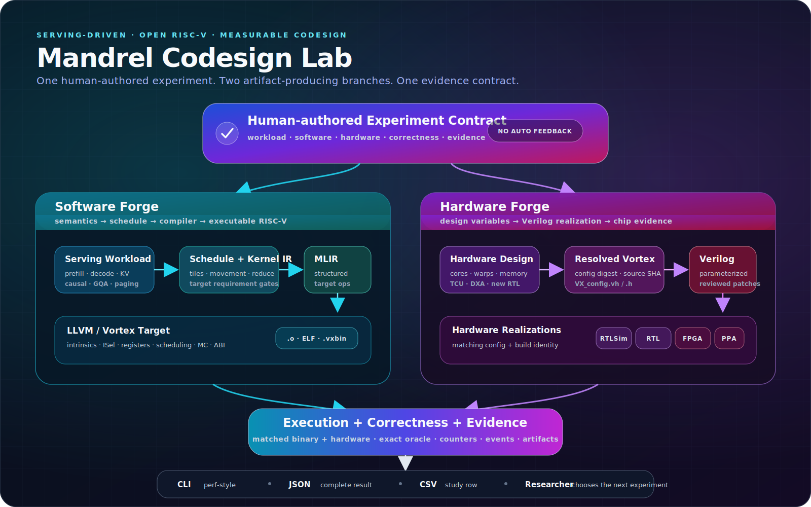
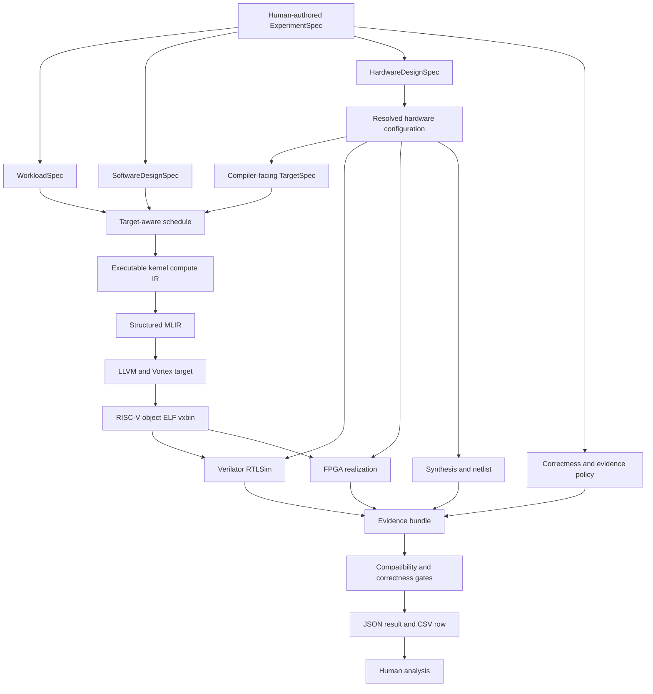

# Codesign Architecture

Mandrel has one experiment plane and two artifact-producing branches. The software branch turns a serving workload into an executable RISC-V binary. The hardware branch turns architectural design variables into a resolved Vortex realization. They meet at compatibility, execution, correctness, and evidence collection.

This document distinguishes **target architecture** from **implemented architecture**. Today the dense attention path is executable end to end through Vortex SystemVerilog RTL using the pinned project-local Verilator RTLSim.



## 1. System view



Mandrel does not automatically turn a report into a new design. Researchers choose hypotheses, controls, and the next experiment.

The automation boundary is deliberate: Bash under `scripts/env/` owns `uv`, pinned checkouts, patch application, toolchain/RTLSim builds, and environment export; Rust `xtask` owns operator artifacts, launch planning, runtime execution, exact correctness, and profiling/reporting.

## 2. Software branch

Target flow:

```text
WorkloadSpec
  -> ScheduleSpec
  -> executable Kernel IR
  -> structured MLIR
  -> LLVM dialect / LLVM IR
  -> Vortex-aware RISC-V object
  -> startup-aware ELF
  -> vxbin
```

Responsibilities:

### Workload/model IR

Defines semantic facts that must survive lowering:

- prefill versus decode;
- causal masking and scale;
- batch, query heads, KV heads, GQA/MQA;
- dense or paged KV;
- element and quantization semantics;
- sequence/page tails and serving shape.

### Schedule

Defines implementation policy:

- query/key/head-dimension tiles;
- workgroup and subgroup mapping;
- sequence splitting and work assignment;
- reduction strategy;
- local-memory staging;
- TCU/DXA use;
- synchronization and movement overlap.

A schedule is legal only if its `KernelRequirements` are satisfied by the selected target.

### Kernel IR

The target kernel IR represents executable loops, memory operations, movement, reductions, synchronization, and target operations independently of final syntax.

Current limitation: `mandrel-kernel-ir` mainly holds kernel catalog, signature, ABI, availability, and launch descriptors. The attention computation is currently built from a Rust compiler plan into an internal Vortex device IR. A structured compute IR remains roadmap work.

### MLIR

Mandrel should use MLIR to preserve structure long enough to make transformations and target boundaries explicit:

- serving/operator semantics at high level;
- schedule and loop/memory structure in mid-level IR;
- Vortex target operations for TCU, DXA, and future primitives;
- LLVM dialect only after those choices are resolved.

Current limitation: the executable path directly renders textual LLVM-dialect MLIR. This is a bridge, not a complete structured MLIR pipeline.

### LLVM-Vortex

LLVM owns target machinery:

- target features;
- intrinsics;
- instruction definitions and selection;
- legalization;
- register classes and grouped-register constraints;
- scheduling/resource models;
- assembler/disassembler;
- object compatibility and diagnostics.

LLVM does not own attention, KV, paging, tiling, or work-assignment policy.

Initial TCU/DXA target operations may lower to helper calls or inline assembly. Formal LLVM support follows after semantics and the end-to-end experiment path are validated.

## 3. Hardware branch

Target flow:

```text
HardwareDesignSpec
  -> resolved Vortex configuration
  -> generated VX_config.vh / VX_config.h
  -> Verilator RTLSim / FPGA / synthesis realization
  -> RealizedHardwareManifest
```

### HardwareDesignSpec

A design spec expresses variables under study rather than build-directory accidents:

- XLEN;
- clusters and cores;
- warps/core and threads/warp;
- local memory and cache capacity;
- TCU enablement and data types;
- DXA enablement and resources;
- future Mandrel RTL features;
- memory-system and synthesis constraints.

The current tracked default lives in `hardware/vortex/configs/current-default.toml`.

### Source identity

`hardware/vortex/source.lock.toml` pins:

- Vortex: `c992f3f35fa17b83dcc83648a5ac4014b0ea0ac6`;
- LLVM-Vortex: `b2ecfe086df2d00233a87f3d3ebe6a74aba129e2`.

`external/` contains materialized checkouts/builds and is not sufficient experiment identity on its own.

### Realized hardware manifest

A realized manifest binds:

- requested design;
- resolved config and digest;
- source revision;
- generated config headers;
- build identity and tool versions;
- realization kind;
- derived compiler target;
- backend-observed facts;
- RTL, bitstream, netlist, or synthesis artifacts where applicable.

### Realization kinds

| Kind | Purpose | Evidence boundary |
|---|---|---|
| Verilator RTLSim | Execute the matching SystemVerilog RTL and collect cycle/event behavior | `rtl_simulation` evidence; potentially slow and workload-limited, and not FPGA timing. |
| FPGA | Realized clocked implementation | Board/bitstream/toolchain-specific measurement. |
| Synthesis | Timing/area/power/netlist studies | Tool/constraint-dependent estimate, not silicon. |

## 4. Vortex map

The existing Vortex tree already provides the first hardware mechanisms Mandrel should study.

### Configuration

- `external/vortex/VX_config.toml`
- `external/vortex/VX_types.toml`
- `external/vortex/ci/gen_config.py`
- generated `build/hw/VX_config.vh`
- generated `build/sw/VX_config.h`

Current tracked defaults include one cluster/core, four warps/core, four threads/warp, 16 KiB local memory, 16 KiB D-cache, TCU disabled, and DXA disabled.

### Tensor Core Unit

- RTL: `external/vortex/hw/rtl/tcu/`
- core integration: `VX_decode.sv`, `VX_execute.sv`, `VX_gpu_pkg.sv`
- software header: `external/vortex/sw/kernel/include/vx_tensor.h`

The upstream TCU supports multiple WMMA/WGMMA and low-precision modes. Mandrel should not invent a replacement before testing how attention schedules map to it.

### DXA asynchronous copy

- RTL: `external/vortex/hw/rtl/dxa/`
- kernel/runtime headers: `vx_dxa.h`, `dxa.h`

DXA supports tiled GMEM→LMEM movement, multicast, transpose, barriers, and counters. It is the natural first mechanism for testing explicit K/V staging and overlap.

### RTL and synthesis

- RTL simulation: `external/vortex/sim/rtlsim/`
- Yosys flow: `external/vortex/hw/syn/yosys/`
- other FPGA/synthesis targets: `external/vortex/hw/syn/`

Mandrel must bind these outputs to the same design/config identity used by scheduling and compilation.

## 5. Requested, realized, and observed target model

Target truth has three stages:

### Requested

What the experiment asks for:

- hardware design variables;
- compiler target/features;
- execution backend;
- exact or minimum capability expectations.

### Realized

What was actually built or materialized:

- resolved source revision;
- canonical Vortex configuration;
- generated headers;
- Verilator RTLSim/FPGA/synthesis build identity;
- derived target capabilities.

### Observed

What the backend reports at execution:

- warp/workgroup/local-memory facts;
- enabled features where queryable;
- counters and runtime events;
- actual execution backend.

Two comparisons are required:

1. **Exact identity compatibility** — requested and realized/observed target facts match the claimed design point.
2. **Kernel requirement compatibility** — the target has enough XLEN, threads, local memory, arithmetic, TCU, DXA, and other operations to execute the kernel legally.
3. **Binary/RTL ISA compatibility** — final ELF build attributes must not require `M/A/F/D/C/V/Zicond` extensions disabled by the resolved RTL configuration, and must declare `xvortex`, before `.vxbin` packaging.

A larger target can satisfy a kernel without being the exact requested target. Mandrel records these facts instead of conflating them.

## 6. Build identity and provenance model

Mandrel does not use one global artifact registry. Operational build paths and runtime kernel-image lookup belong to the backend that consumes them; experiment reports currently retain only lightweight references to emitted MLIR, LLVM IR, object, ELF, and `.vxbin` files.

The target provenance model uses two typed manifests:

- a software-build manifest binding compiler target, toolchain identity, commands, and generated kernel outputs;
- a hardware-realization manifest binding design input, resolved configuration, source and patch identities, generated headers, build tools, and RTLSim/FPGA/synthesis outputs.

An experiment references those manifest identities and the image actually executed. Transient files such as startup probes remain compiler-build details rather than flat top-level experiment artifacts. Content hashing and live manifest binding are the next schema milestone.

## 7. Experiment and report model

A complete experiment binds:

```text
ExperimentSpec
  workload
  software design
  hardware design
  compiler/toolchain identity
  execution backend
  correctness policy
  evidence policy
  input/seed identity
```

A result records:

```text
ExperimentResult
  status or failure outcome
  requested/realized/observed target facts
  artifacts and identities
  correctness
  counters and runtime events
  static estimates
  derived metrics
  evidence class
```

Current command output:

- terminal: concise `perf stat`-style summary;
- JSON: complete `mandrel.experiment.result.v2` record;
- CSV: one row of stable core fields for manual aggregation.

There is intentionally no automatic nearest-history comparison. Study-level baselines and comparisons are human-authored experimental choices.

## 8. First TCU/DXA validation study

The first hardware/software study should test existing mechanisms, not a new attention accelerator.

### Software factors

- S0: scalar two-pass direct-global baseline;
- S1-TCU: TCU-aware dot/MMA lowering;
- S1-DXA: explicit tiled K/V staging through DXA;
- S2: combined TCU+DXA schedule after isolated studies.

### Hardware factors

- H0: TCU/DXA disabled current default;
- H-TCU: TCU enabled with pinned data-type/config choices;
- H-DXA: DXA enabled with pinned queue/port choices;
- H-BOTH: both enabled.

### Evidence requirements

- same semantic workload and correctness policy;
- explicit unsupported outcomes for illegal software/hardware pairs;
- exact correctness through the matching Verilator RTLSim configuration before hardware-performance claims;
- instruction/event/counter attribution;
- generated config and binary identities;
- synthesis impact for enabled hardware;
- no comparison of RTL-simulation cycles to synthesis timing as if they were one metric.

A 2×2 table is the minimum design skeleton for an interaction claim. If one cell is illegal, record it as unsupported and either provide a controlled fallback/emulation for a four-point estimate or limit the claim accordingly.

## 9. First new RTL primitive

A Mandrel-specific primitive is selected only after TCU/DXA studies isolate a residual bottleneck. Plausible candidates are:

- warp/subgroup max/sum reduction for online softmax;
- a packed int8 dot/accumulate form not efficiently served by the selected TCU mode;
- a KV gather/layout primitive;
- a narrow synchronization/movement operation.

Every new primitive requires a SystemVerilog RTL implementation exercised by Verilator RTLSim, compiler exposure, capability/requirement checks, exact correctness, counters, and synthesis evidence. A standalone full attention accelerator is not the first step.

## 10. Anti-goals and novelty language

Mandrel does not claim that no related path exists. Relevant precedents include Gemmini/Chipyard, VTA/TVM, Vortex, Buddy/IREE, CIRCT/Dynamatic/Allo/ScaleHLS, LLMCompass, Timeloop, and serving/attention systems.

The defensible research gap is the conjunction Mandrel is trying to make reproducible:

- serving-faithful attention/KV workloads;
- an open RISC-V GPGPU;
- generated compiler artifacts;
- parameterized RTL and chip configurations;
- Verilator RTLSim, FPGA, and PPA evidence;
- runtime events and exact correctness;
- unified software/hardware ablations.

That is a project motivation, not a priority or uniqueness claim. Any future novelty statement must be tied to a literature review and measured evidence.
