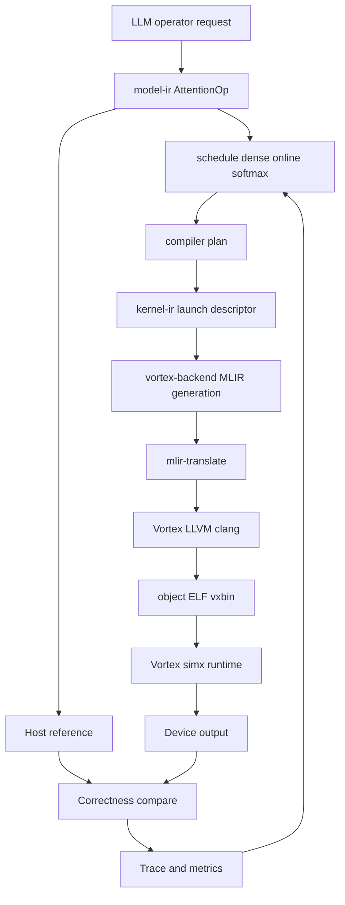
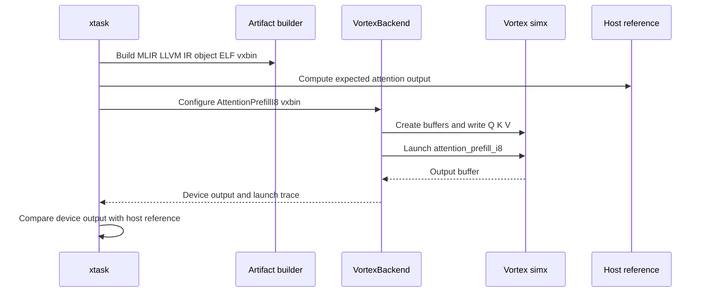

# Design

Mandrel is organized around attention-like operators and an MLIR-first device-code path. The current baseline can schedule `attention_prefill_i8`, generate LLVM dialect MLIR, build Vortex RISC-V artifacts, package a `.vxbin`, launch it through Vortex `simx`, read back output, and compare against a host reference.

## End-to-end architecture



The key separation is:

- `model-ir`: stable operator semantics (`AttentionOp`, `SoftmaxOp`, future reductions/layout transforms).
- `schedule`: tile shape, thread block, KV layout, online-softmax strategy.
- `compiler`: schedule selection plus launch/argument/metric plan construction.
- `kernel-ir`: symbols, signatures, availability, launch descriptors.
- `vortex-backend`: runtime wrapper, artifact registry, MLIR generation, Vortex artifact builder, launch validation, and runtime execution.
- `xtask`: toolchain bootstrap/status commands plus artifact/runtime correctness entry points.

## Runtime correctness flow



The Vortex artifact flow intentionally preserves the upstream startup path:

```text
kernel.o
  -> startup_probe.elf
  -> kernel_startup.sh detects startup flags
  -> gen_config.py --cflags=-DVX_CFG_XLEN=64
  -> clang -c sw/kernel/src/vx_start.S -DKMU_ENABLE ...
  -> vx_start.o + kernel.o + libvortex2.a + libc/libm/builtins
  -> ELF with STARTUP_ADDR=0x80000000 and --undefined=__vx_kentry_attention_prefill_i8
  -> vxbin with VXSYMTAB
```

This is required for `simx` runtime correctness; bypassing `vx_start.S` can lead to launches that wait forever for completion.

## Current operator path

The active plan is `attention_prefill_i8`:

```text
AttentionOp::prefill_i8_demo
  -> AttentionPrefillSchedule::dense_online_4x16x64
  -> VortexAttentionPrefillPlan
  -> KernelSymbol::AttentionPrefillI8
  -> LLVM dialect MLIR
  -> mlir-translate
  -> Vortex clang object
  -> startup-aware Vortex ELF
  -> vxbin package
  -> simx runtime launch
  -> host/device correctness compare
```

The generated ABI struct has eight launch arguments:

| Index | Meaning |
| --- | --- |
| 0 | Q buffer |
| 1 | K buffer |
| 2 | V buffer |
| 3 | output buffer |
| 4 | sequence length |
| 5 | head dimension |
| 6 | query tile |
| 7 | key tile |

The current demo plan uses:

| Field | Value |
| --- | --- |
| sequence | 64 |
| head dimension | 64 |
| query tile | 4 |
| key tile | 16 |
| block | 4 × 4 |
| workgroups | 16 |
| local memory | 2336 bytes/workgroup |
| softmax | online max/sum |
| KV layout | dense contiguous |

Runtime correctness defaults to a smaller smoke shape for speed (`sequence <= 8`, `head_dim <= 16`) unless overridden by environment variables.

## Kernel catalog

| Symbol | Domain | Status | Notes |
| --- | --- | --- | --- |
| `VecAddF32` | Elementwise | Available | Upstream Vortex SDK reference smoke only. |
| `AttentionPrefillI8` | Attention | Planned | Dense online-softmax schedule, launch plan, metrics, generated LLVM dialect MLIR, `.o`/`.elf`/`.vxbin` artifacts, and simx correctness smoke. It stays `Planned` until the public ABI/status decision is made. |
| `SoftmaxF32` | Reduction | Planned | Row/block softmax primitive for attention lowering. |

`Available` means Mandrel can present the symbol as a stable runnable capability. `Planned` means the symbol can be scheduled, lowered, or tested internally but should not yet be treated as a public stable kernel.

## Backend design

`VortexBackend` owns:

- dynamic Vortex runtime loading;
- device and queue lifetime;
- module/kernel caches;
- artifact lookup by `KernelSymbol`;
- generic launch validation against Vortex device caps;
- current attention prefill buffer setup, launch, readback, and trace capture.

The Rust backend now uses `snafu` typed errors (`VortexError`, `VortexBackendError`, `VortexToolchainError`, `VortexCodegenError`) rather than ad hoc string errors. Backend runtime milestones are emitted through `tracing` and can still be mirrored to stdout for hang diagnosis with `MANDREL_VORTEX_RUNTIME_TRACE=1`.

## MLIR strategy

Today, Mandrel emits textual LLVM dialect MLIR and lowers it with the Vortex fork's `mlir-translate`, then uses the Vortex `clang` driver to compile LLVM IR to an object, link a Vortex ELF, and package a `.vxbin` with the upstream `vxbin.py` flow. Direct `llc` is intentionally avoided for this path because Vortex uniform intrinsics are marker intrinsics that the driver pipeline must strip before instruction selection.

Later, the same plan objects should lower through a small `mandrel-opt` tool or custom dialects.

The LLVM fork should stay thin:

- target features;
- Vortex intrinsics and ABI;
- object/metadata emission;
- no Mandrel operator policy.

## Attention scheduling principles

The local model follows FlashInfer/FlashAttention concepts at the planning level, not CUDA implementation details:

- separate planning from execution;
- make dense vs paged KV layout explicit;
- represent online softmax state explicitly;
- keep query/key/value tile shapes independent;
- model local-memory and workgroup constraints before lowering.

## Validation commands

```sh
cargo fmt --check
cargo check -p mandrel-kernel-ir -p mandrel-schedule -p mandrel-profiler -p mandrel-compiler -p mandrel-vortex-backend -p mandrel-ggml-adapter -p mandrel-kernels -p mandrel-runtime -p xtask
cargo test -p mandrel-kernel-ir -p mandrel-schedule -p mandrel-profiler -p mandrel-compiler -p mandrel-vortex-backend -p mandrel-ggml-adapter -p mandrel-kernels -p mandrel-runtime -p xtask
cargo vortex-plan-attention
cargo vortex-generate-attention
cargo vortex-run-attention
```
