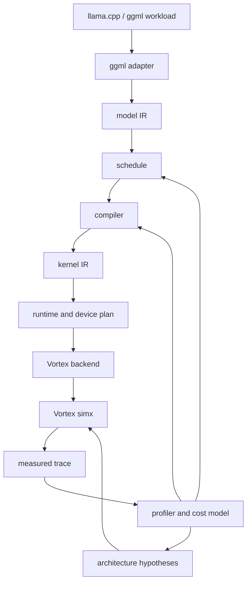
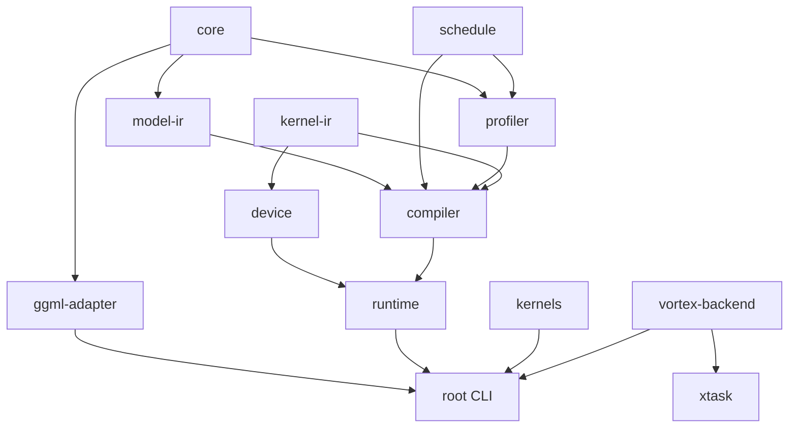
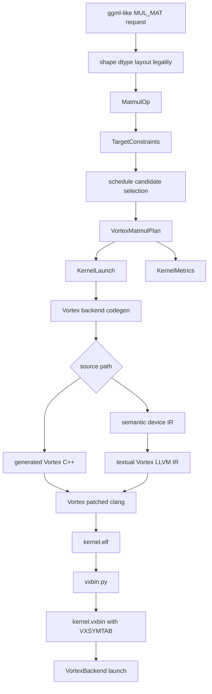
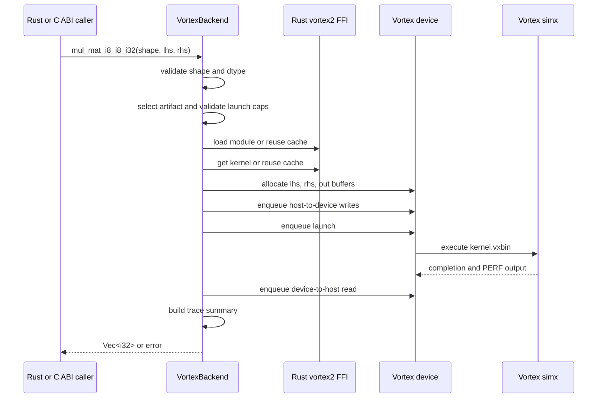
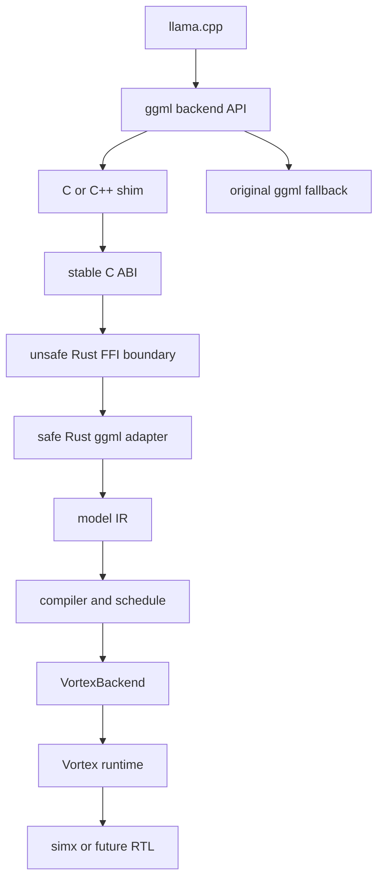
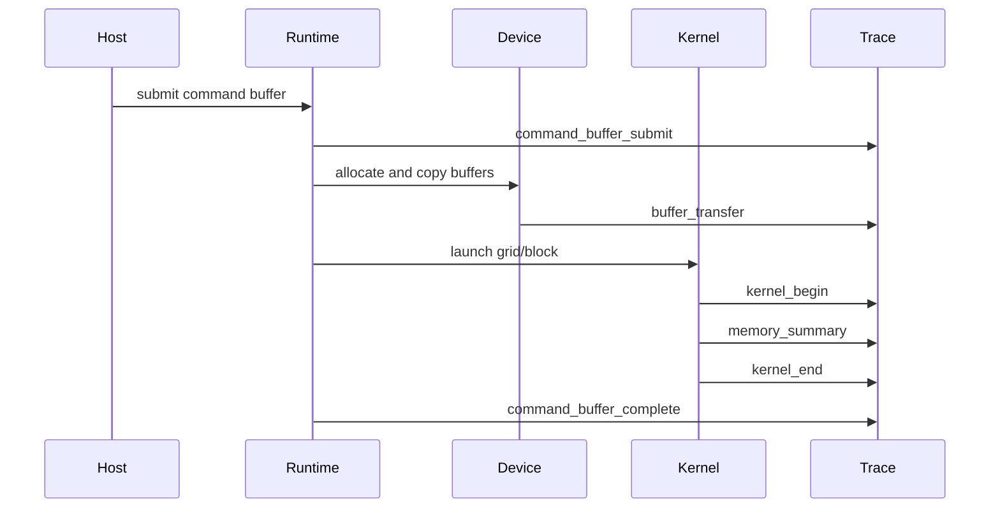
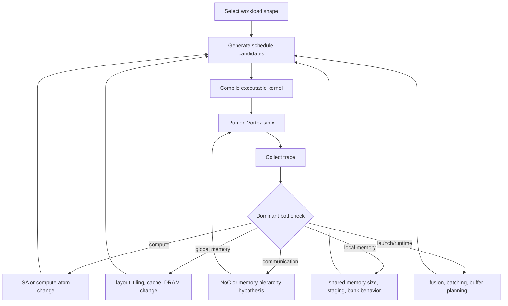

# Design

Mandrel is a Rust-first RISC-V GPGPU backend and co-design laboratory for LLM inference.

The design goal is not to maintain a single matrix-multiplication demo. The goal is to build an executable feedback loop from high-level LLM workloads to compiler schedules, generated kernels, runtime traces, and eventually architecture parameters.

```text
LLM workload
  -> operator model
  -> schedule and cost model
  -> kernel plan
  -> Vortex artifact
  -> Rust runtime execution
  -> simulator trace
  -> compiler/operator/architecture feedback
```

## 1. Design context

### 1.1 What this project is

Mandrel is the backend/co-design layer for studying how LLM inference maps onto a RISC-V GPGPU architecture.

It currently focuses on:

- `ggml` / `llama.cpp` style operator boundaries;
- Rust-native IR, schedule, compiler, runtime, and profiling abstractions;
- Vortex RISC-V GPGPU as the primary accelerator target;
- `simx` execution first, with RTL/FPGA deferred until the software loop is useful;
- executable kernels instead of paper-only cost models;
- measured trace feedback for workload-driven architecture exploration.

### 1.2 What this project is not

Mandrel is not:

- a full inference framework;
- an OpenCL-first product route;
- a generic deep learning compiler;
- a wrapper around one hand-written kernel;
- a fork-in-place of Vortex;
- a C++ host runner project.

The host/runtime side should remain Rust-first. Device kernels can be generated through Vortex C++ for the stable/debug path and textual Vortex LLVM IR for the main experimental lowering path.

### 1.3 Primary constraints

| Constraint | Decision |
| --- | --- |
| Main backend | Vortex RISC-V GPGPU. |
| First execution target | `simx`. |
| Host/runtime language | Rust-first. |
| External Vortex source | Do not modify `external/vortex` directly. |
| Device compiler | Vortex-patched LLVM, not system LLVM. |
| Kernel metadata | Require proper `__vx_kentry_*` and `VXSYMTAB`. |
| Tool orchestration | `xtask` may build/run tools, but runtime wrappers must not depend on it. |
| Core crates | Keep IR/schedule/compiler/runtime data structures no-std friendly where possible. |
| Default kernel policy | Only select kernels that are marked available and validated. |

## 2. End-to-end architecture



The system separates high-level workload semantics from backend-specific runtime details:

1. `ggml-adapter` receives or models a framework request.
2. `model-ir` stores stable operator semantics such as matmul or attention payloads.
3. `schedule` describes layout, tiling, thread mapping, copy atoms, and candidate schedules.
4. `compiler` selects an available or experimental plan under target constraints.
5. `kernel-ir` records kernel symbols, signatures, launch dimensions, and arguments.
6. `runtime` and `device` describe command execution and device capabilities.
7. `vortex-backend` lowers plans into Vortex source/artifacts and launches them through Rust FFI.
8. `profiler` connects static estimates with measured runtime traces.

## 3. Crate boundaries



| Crate | no_std target | Responsibility |
| --- | --- | --- |
| `mandrel-core` | Yes | Shared shape, dtype, layout, and tensor descriptors. |
| `mandrel-model-ir` | Yes | Operator-level IR for matmul, attention, and future LLM operators. |
| `mandrel-schedule` | Yes | Tiles, thread maps, affine-lite access maps, layout algebra, copy atoms, schedule candidates. |
| `mandrel-profiler` | Yes | Static metrics and backend-neutral measured trace schema. |
| `mandrel-compiler` | Yes | Lower `model-ir + schedule + catalog` into kernel launch plans. |
| `mandrel-kernel-ir` | Yes | Kernel catalog, symbols, availability, signatures, launch descriptors, arguments. |
| `mandrel-device` | Yes | Device capabilities, buffers, command abstractions. |
| `mandrel-runtime` | Yes | Backend-neutral runtime targets and executable plan skeletons. |
| `mandrel-ggml-adapter` | Yes | ggml-like request descriptors, offload policy, conversion into model IR. |
| `mandrel-kernels` | Yes | Host reference kernels for correctness. |
| `mandrel-vortex-backend` | No | Vortex FFI, backend context, module/kernel cache, buffers, codegen, artifacts, C ABI. |
| `xtask` | No | External checkout/build/install/smoke orchestration. |

Core library crates avoid storing C++ or LLVM IR source strings. Source generation lives in `vortex-backend`, where `std`, filesystem access, and external tool execution are acceptable.

## 4. Current workspace module structure

```text
crates/kernel-ir/src/
  catalog.rs              # kernel domain, signature, availability, catalog helpers
  launch.rs               # Dim3, KernelArg, KernelLaunch
  symbol.rs               # KernelSymbol

crates/schedule/src/
  affine.rs               # Axis, AffineExpr, AccessMap
  layout.rs               # Layout2D, ThreadTileMap2D, CopyAtom2D
  matmul.rs               # MatmulSchedule and candidate selection

crates/compiler/src/
  matmul.rs               # Vortex matmul lowering and plan construction

crates/profiler/src/
  estimate.rs             # static KernelMetrics and matmul estimates
  trace.rs                # backend-neutral measured trace schema

crates/vortex-backend/src/
  backend.rs              # VortexBackend context, runtime/device/queue, buffers
  executor.rs             # module/kernel cache and launch trace summary
  vortex2.rs              # dynamic Rust FFI wrapper for vortex2.h
  matmul.rs               # matmul executor and compatibility API
  ffi.rs                  # C ABI / cdylib boundary
  toolchain.rs            # Vortex checkout/build/toolchain configuration
  demo.rs                 # demo capabilities and compile-plan helpers
  codegen/
    mod.rs                # generated source metadata and codegen errors
    cpp.rs                # C/C++ rendering helpers
    matmul.rs             # direct Vortex C++ matmul generator
    device_ir.rs          # semantic device IR for LLVM path
    llvm_ir.rs            # textual LLVM IR helpers
    vortex_ir.rs          # Vortex CSR and semantic constants
    matmul_abi.rs         # shared matmul ABI lowering
    matmul_llvm.rs        # direct matmul LLVM IR generator
    matmul_tiled_llvm.rs  # experimental tiled/local-memory LLVM IR generator
```

`lib.rs` files should stay thin: module declarations and stable public re-exports only.

## 5. Operator and lowering pipeline

The first supported operator is:

```text
lhs: i8[M, K]
rhs: i8[K, N]
out: i32[M, N]
```

The current lowering path is:



### 5.1 XLA-inspired boundaries

The project borrows several design boundaries from XLA without adopting XLA as an implementation dependency:

| XLA concept | Local equivalent |
| --- | --- |
| HLO operator semantics | `model-ir` operator payloads. |
| BackendConfig/autotune data | `schedule` candidates and target constraints. |
| Executable/thunk boundary | `kernel-ir`, `device`, and `runtime` launch plans. |
| Profile feedback | `profiler` static estimates plus Vortex measured traces. |

The important rule is that operator semantics must not be polluted by Vortex buffer handles, module handles, or runtime ABI details.

### 5.2 CuTe-inspired schedule algebra

The project also borrows ideas from CuTe-like layout algebra:

| Concept | Local structure |
| --- | --- |
| Coordinate to linear offset | `Layout2D`. |
| Thread ownership inside a tile | `ThreadTileMap2D`. |
| Explicit data movement atom | `CopyAtom2D::global_to_local(...)`. |
| Staged local memory kernel | Experimental tiled matmul lowering. |

This is intentionally lightweight and Rust-native. The project is not trying to replicate CuTe's C++ template machinery.

## 6. Kernel catalog and current kernels

| Kernel symbol | Runtime symbol | Status | Source path | Notes |
| --- | --- | --- | --- | --- |
| `MatmulI8I32` | `matmul_i8_i32` | Available | Generated Vortex C++ by default; generated LLVM IR opt-in | Stable direct baseline. |
| `MatmulI8I32Tiled` | `matmul_i8_i32_tiled` | Experimental | Generated textual Vortex LLVM IR | Correctness smoke passes with `4x4x32`, but it is slower than direct baseline and is not selected by default. |

### 6.1 Direct matmul baseline

| Field | Value |
| --- | --- |
| DType | `i8 * i8 -> i32` |
| Tile | `M=4, N=4, K=1` |
| Block | `4 x 4 x 1` |
| Local memory | `0` bytes |
| Grid X | `ceil(N / 4)` |
| Grid Y | `ceil(M / 4)` |
| Default codegen | Vortex C++ |
| Optional codegen | Textual Vortex LLVM IR with `MANDREL_VORTEX_CODEGEN=llvm-ir` |

The direct kernel remains the default because it is validated and currently faster than the tiled path on the observed simulator configuration.

### 6.2 Experimental tiled matmul

The old `16x16x32` candidate used 256 threads per workgroup and can hang the current `simx` configuration. The observed default configuration is:

```text
VX_CFG_NUM_WARPS=4
VX_CFG_NUM_THREADS=4
max workgroup threads = 16
```

The current simx-compatible tiled candidate is therefore:

| Field | Value |
| --- | --- |
| Tile | `M=4, N=4, K=32` |
| Block | `4 x 4 x 1` |
| Threads per workgroup | `16` |
| Local memory | `256` bytes |
| Staging | Global-to-local copies for lhs and rhs tiles |
| Synchronization | Vortex barrier / `__syncthreads` equivalent |
| Boundary handling | Guarded partial tiles |
| Status | Correctness smoke passes, not default |

Launch validation in `VortexBackend` checks workgroup size and local-memory budget before enqueueing a kernel. This avoids sending oversized launches into `simx`, where they can otherwise hang in CTA/barrier scheduling.

## 7. Runtime and backend design

`VortexBackend` is the stable Rust boundary above the raw Vortex runtime.

It owns:

- `Runtime`;
- `Device`;
- `Queue`;
- module cache;
- kernel cache;
- per-run buffer ownership;
- launch validation;
- trace summary conversion.

The stable Rust API includes:

```rust
backend.mul_mat_i8_i8_i32(shape, lhs, rhs) -> Result<Vec<i32>, Error>
```

The C ABI should remain narrow and stable. C/C++ callers should not depend on internal Rust enum layouts or schedule structures.

### 7.1 Runtime sequence



### 7.2 Raw Vortex objects

The Rust FFI wrapper exposes RAII types for:

- `Runtime`;
- `Device`;
- `Queue`;
- `Buffer`;
- `Module`;
- `Kernel`;
- `Event`.

The wrapper dynamically loads the Vortex runtime library from:

1. `MANDREL_VORTEX_RUNTIME_LIB`;
2. `VORTEX_PATH/runtime/lib/libvortex.so`;
3. `VORTEX_BUILD_DIR/sw/runtime/libvortex.so`;
4. `libvortex.so`.

`cargo vortex-run-matmul` starts a subprocess for the actual execution path because Vortex runtime dependencies must be visible in `LD_LIBRARY_PATH` before process startup.

## 8. C ABI and llama.cpp boundary

The long-term product entry is a custom `ggml` / `llama.cpp` backend with unsupported fallback.



Initial offload policy should be conservative:

| Field | First policy |
| --- | --- |
| DType | `i8 * i8 -> i32` only. |
| Shape | 2D matmul first. |
| Layout | Contiguous row-major first, explicit stride support later. |
| Fallback | Unsupported requests return false/status and let ggml use another backend. |
| Trace | Every offloaded call must produce enough metadata for profiling. |

The C ABI should expose probe/plan/execute/free style functions rather than the entire internal runtime:

```text
backend_name() -> const char*
can_offload_mul_mat(desc) -> bool
compile_mul_mat(desc, out_plan) -> status
execute_mul_mat(plan, buffers) -> status
free_plan(plan) -> void
```

## 9. Profiling and trace design

Static metrics and measured traces serve different purposes.

Static metrics answer: should we even try this schedule?

Measured traces answer: what actually happened on the Vortex target?

Current static fields include:

| Field | Meaning |
| --- | --- |
| `logical_macs` | Semantic MAC count. |
| `scheduled_macs` | MAC count after tiling and padding. |
| `kernel_launches` | Number of launches. |
| `workgroup_count` | Number of workgroups. |
| `thread_count` | Total scheduled threads. |
| `global_bytes_read` | Estimated global reads. |
| `global_bytes_written` | Estimated global writes. |
| `local_memory_bytes_per_workgroup` | Local/shared memory budget. |

Current measured summaries include launch dimensions, host-to-device bytes, device-to-host bytes, workgroup count, threads per workgroup, shared memory bytes, and Vortex `PERF` output. The next step is to parse Vortex counters into backend-neutral trace records.



## 10. Co-design feedback loop



This loop is the reason the project keeps schedule, profiling, runtime, and device capability abstractions separate. The goal is to compare concrete schedule variants and architecture assumptions, not merely to make one demo pass.

## 11. Vortex toolchain policy

The supported kernel compiler is Vortex-patched LLVM from `vortexgpgpu/llvm`.

System LLVM is not sufficient for Vortex kernels. It does not implement the Vortex-specific semantics required for:

- `+xvortex` and related target features;
- `annotate("vortex.kernel")` lowering;
- `__vx_kentry_*` emission;
- `VXSYMTAB` footer generation through `vxbin.py`.

If a generated ELF only contains `kernel_main` and the `.vxbin` lacks `VXSYMTAB`, the root cause is a backend/toolchain mismatch. The project should not patch `vxbin.py` to hide this mismatch.

Supported policy:

- source-build Vortex LLVM + rv64 `compiler-rt` on ARM/aarch64;
- use `MANDREL_VORTEX_TOOLCHAIN_MODE=skip` with `MANDREL_VORTEX_TOOLDIR=external/vortex-source-tools` once the toolchain exists;
- keep `external/vortex` clean;
- use a fork/ref or patch staging if a real upstream Vortex change is required;
- use `libgcc.a` only under an explicit experimental opt-in, never as the default ABI solution.

## 12. Why `simx` first

`simx` is the right first target because it gives fast executable feedback while the compiler/runtime design is still changing.

The project should move toward RTL/Verilator/FPGA only when:

1. the Rust backend path can run multiple kernels reliably;
2. trace fields are structured enough to identify bottlenecks;
3. schedule candidates can be compared reproducibly;
4. the architecture question cannot be answered by `simx` alone.

OpenCL, Vulkan, HIP, and XiangShan remain useful references, but they are not the current main route.

## 13. Current validation commands

Rust checks:

```sh
cargo fmt --all
cargo test \
  -p mandrel-schedule \
  -p mandrel-model-ir \
  -p mandrel-device \
  -p mandrel-profiler \
  -p mandrel-compiler \
  -p mandrel-vortex-backend \
  -p xtask

cargo clippy \
  -p mandrel-schedule \
  -p mandrel-model-ir \
  -p mandrel-device \
  -p mandrel-profiler \
  -p mandrel-compiler \
  -p mandrel-vortex-backend \
  -p xtask \
  --all-targets --all-features -- -D warnings
```

Vortex smokes:

```sh
MANDREL_VORTEX_TOOLCHAIN_MODE=skip \
MANDREL_VORTEX_TOOLDIR=external/vortex-source-tools \
cargo vortex-run-matmul

MANDREL_VORTEX_TOOLCHAIN_MODE=skip \
MANDREL_VORTEX_TOOLDIR=external/vortex-source-tools \
MANDREL_VORTEX_CODEGEN=llvm-ir \
cargo vortex-run-matmul

MANDREL_VORTEX_TOOLCHAIN_MODE=skip \
MANDREL_VORTEX_TOOLDIR=external/vortex-source-tools \
cargo vortex-run-matmul-tiled
```

## 14. Design acceptance criteria for new kernels

Every new executable kernel should provide:

- operator shape, dtype, and layout contract;
- kernel symbol and ABI;
- schedule candidate and target constraints;
- grid, block, and local memory usage;
- static MAC and memory estimates;
- artifact generation path;
- host reference correctness check;
- launch trace summary;
- Vortex configuration used for validation;
- reproducible command;
- explicit availability status: available, experimental, planned, or unsupported.
