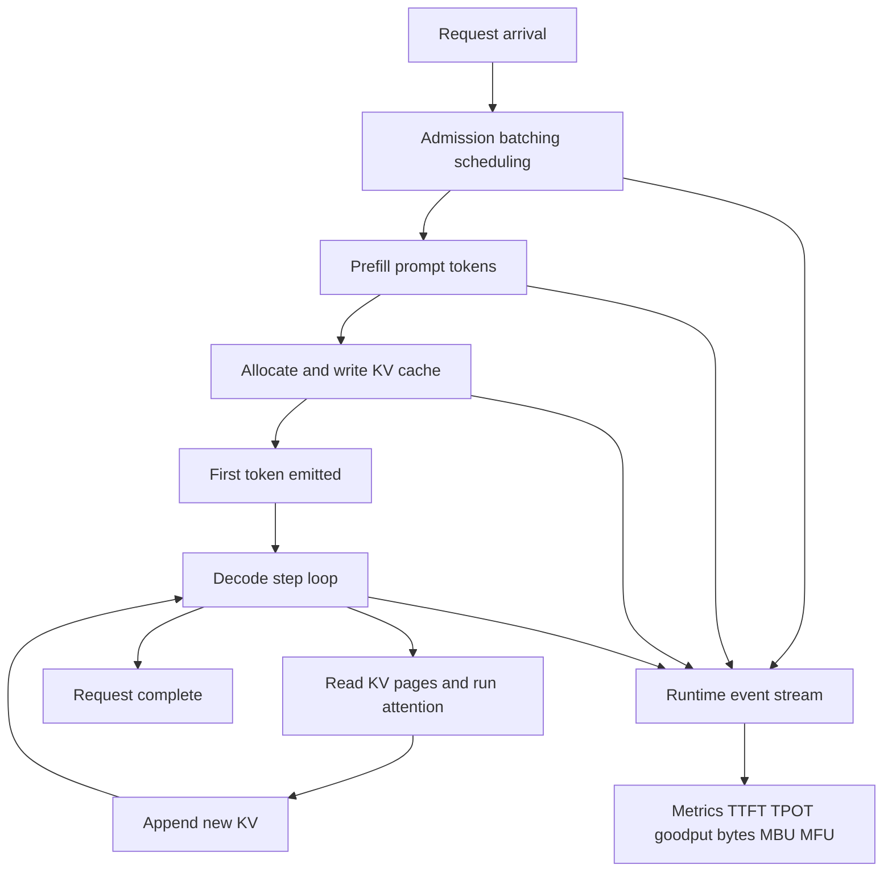
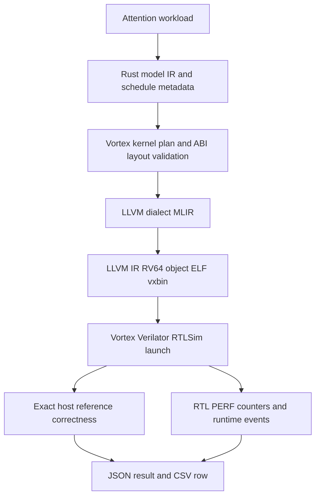
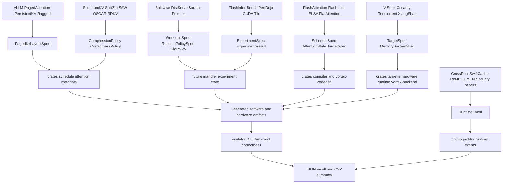
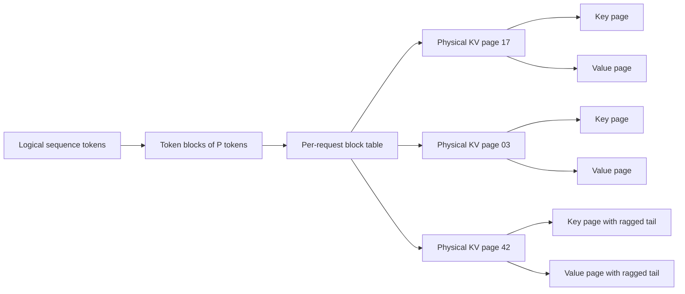
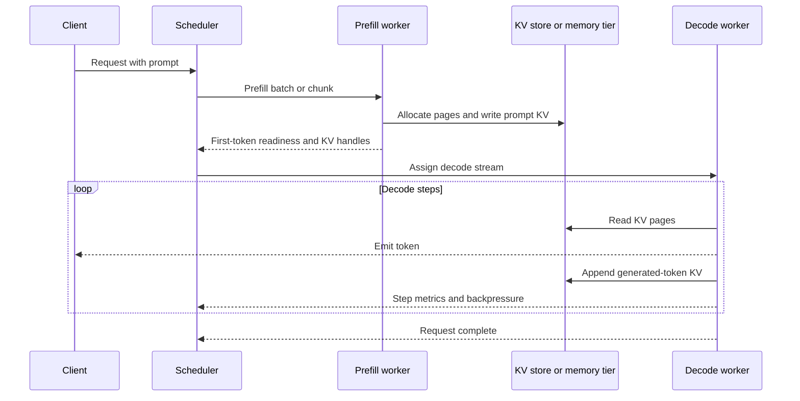
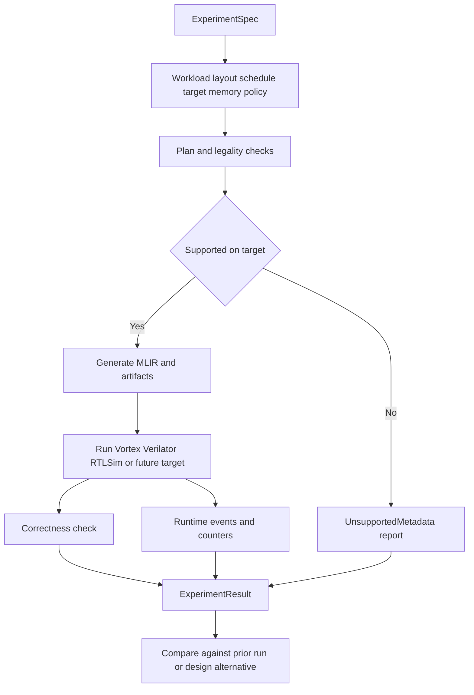

# A Survey of LLM Serving Systems for Open Accelerator Codesign

**Mandrel Technical Report**  
**Date:** 2026-06-29  
**Status:** arXiv-style survey draft for internal project planning  
**Repository context:** Mandrel, an executable Vortex/RISC-V-oriented codesign stack for LLM-serving kernels

## Abstract

Large-language-model (LLM) serving has shifted from a pure matrix-multiplication throughput problem to a cross-layer systems problem dominated by key-value (KV) cache storage, page-table indirection, prefill/decode phase imbalance, runtime data movement, scheduling policy, target-specific attention kernels, and observability. This survey reviews recent work on LLM serving, paged KV cache management, attention kernels, KV compression and sparse retrieval, runtime/security mechanisms, compiler and kernel DSL infrastructure, and open accelerator/RISC-V systems. It is written for Mandrel, a workload-driven full-stack codesign laboratory whose current executable spine lowers dense `attention_prefill_i8` through LLVM-dialect MLIR, LLVM IR, an RV64 object, ELF, and `.vxbin`; executes Vortex SystemVerilog with pinned project-local Verilator RTLSim; checks exact correctness; and records RTL `PERF` metrics in JSON/CSV with `rtl_simulation` evidence.

The central finding is that Mandrel should not evolve directly from a dense attention demo into a production serving backend. Instead, it should first become a page-aware, event-aware, target-aware, and metric-driven experiment system. The most important near-term abstractions are `ExperimentSpec`, `ExperimentResult`, `WorkloadSpec`, `TargetSpec`, `MemorySystemSpec`, `RuntimeEvent`, `PagedKvLayoutSpec`, and a policy boundary between attention math and work assignment. These objects would allow Mandrel to compare dense and paged KV layouts, runtime copy policies, target memory assumptions, tiled attention schedules, and future decode work-assignment policies with correctness and trace evidence. The paper also provides notation and metrics for discussing serving systems, paper-reported comparison tables, key-paper deep reads, and Mandrel mapping diagrams.

The resulting roadmap is staged: keep the dense Vortex spine executable; introduce experiment and event records; expand paged KV legality; model target and memory systems; make dense tiled online attention structural in MLIR; add serving-shaped replay traces; and only then pursue paged decode lowering or framework-facing integration.

## Keywords

LLM serving; KV cache; paged attention; prefill/decode disaggregation; attention kernels; FlashAttention; FlashInfer; MLIR; RISC-V; Vortex; open accelerator; hardware/software codesign.

## 1. Introduction

LLM inference is increasingly constrained by system effects outside dense GEMM. During **prefill**, models process prompt tokens in parallel and can be compute intensive. During **decode**, each generation step often reads an ever-growing KV cache and can be memory-bandwidth, launch, synchronization, or scheduling limited. Serving systems therefore depend on KV cache allocation, page-table indirection, continuous batching, prefix reuse, prefill/decode scheduling, KV transfer, runtime event handling, and target-specific attention kernels. Modern systems such as vLLM, SGLang, Splitwise, DistServe, Sarathi-Serve, FlashAttention-3, and FlashInfer each optimize different portions of this stack [1]--[8].

Mandrel targets a different but related problem. Rather than building a production CUDA serving framework, Mandrel uses LLM-serving workloads to study open accelerator codesign. Its current path is intentionally narrow: dense `attention_prefill_i8` is represented in Rust IR and schedule metadata, lowered through LLVM-dialect MLIR and LLVM IR into an RV64 object, ELF, and `.vxbin`, launched through Vortex SystemVerilog with pinned project-local Verilator RTLSim, exact-checked against a host reference, and recorded as versioned JSON plus a CSV summary with `rtl_simulation` evidence. This creates an executable anchor for researcher-designed hardware/software experiments on an open RISC-V/Vortex target.

The question is how such a system should evolve in light of recent LLM-serving literature. A naive direction would be to immediately port a paged attention kernel or expose a framework backend. The literature suggests a different order. Paged attention is no longer just a memory layout; it is a scheduling and runtime problem [1], [10]--[13]. Prefill/decode separation is no longer just a cluster-level deployment trick; it changes KV movement, runtime policy, and service-level objectives [3]--[5], [14]--[22]. KV compression, eviction, and sparse retrieval are no longer isolated model-side approximations; they must be compatible with paged layouts, fused kernels, and correctness policies [33]--[44]. Kernel performance is increasingly target-specific, and abstractions that work well on Hopper, TPU, Ascend, or disaggregated GPU clusters cannot be assumed to transfer to Vortex [6], [7], [11], [46], [47], [51]--[54].

This survey makes six contributions:

1. It defines notation and metrics for reasoning about prefill, decode, KV cache size, paging overhead, runtime movement, and target utilization.
2. It organizes recent LLM-serving and attention-system work into a taxonomy useful for Mandrel's roadmap.
3. It provides key-paper deep reads for the systems most relevant to Mandrel's near- and mid-term design.
4. It summarizes paper-reported quantitative results in comparison tables, while explicitly noting that the results are not reproduced or normalized in Mandrel.
5. It maps literature mechanisms onto concrete Mandrel crates, current code objects, and proposed experiment objects.
6. It extracts a staged roadmap that preserves Mandrel's executable Vortex spine while making modern serving workloads measurable.

## 2. Research Questions

This survey is structured around five research questions.

**RQ1.** Which recent LLM-serving trends are most relevant to Mandrel's attention and KV-cache roadmap?

**RQ2.** Which metrics and notation should Mandrel use to compare dense attention, paged KV, scheduling, compression, runtime movement, and target-specific kernels?

**RQ3.** Which abstractions should be promoted from documentation concepts into first-class Mandrel code objects?

**RQ4.** Which external projects should be treated as north-star workload or design references, and which should not be treated as immediate integration targets?

**RQ5.** What staged roadmap preserves Mandrel's executable Vortex spine while allowing it to study modern serving workloads?

## 3. Methodology, Scope, and Evidence Policy

### 3.1 Retrieval method

The corpus was collected from arXiv API queries and GitHub project lookups performed on 2026-06-29. The paper queries covered `LLM serving`, `KV cache`, `paged attention`, `FlashAttention`, `FlashInfer`, `prefill decode`, `RISC-V`, and `accelerator`. Title-specific searches were used for foundational systems such as SGLang, DistServe, Sarathi-Serve, Splitwise, FlashAttention-3, FlashInfer, PersistentKV, Ragged Paged Attention, Frontier, SpectrumKV, SplitZip, SAW-INT4, OSCAR, RDKV, ELSA, and FlatAttention.

The project search covered serving frameworks, kernel libraries, kernel DSLs, MLIR/compiler frameworks, Vortex/open accelerator projects, and small exploratory KV/paged-attention simulators.

### 3.2 Inclusion criteria

A work is included if the retrieved title or abstract is relevant to at least one of the following:

- LLM serving runtime, batching, scheduling, or disaggregation;
- KV cache layout, paging, sharing, compression, eviction, transfer, recovery, or security;
- attention kernel or attention algorithm design for inference;
- compiler, kernel DSL, benchmark-loop, or trace infrastructure for inference kernels;
- RISC-V, Vortex-like, or open accelerator systems relevant to Mandrel's target direction.

### 3.3 Evidence policy

This document is a survey draft based on retrieved metadata, abstracts, and design-level reading notes. Quantitative results are **paper-reported** unless otherwise stated. They are not reproduced in Mandrel, not normalized across hardware, and not guaranteed to be directly comparable. Preprints, workshop papers, and project pages should be treated as preliminary evidence until their full text, code, and experimental setup are reviewed.

The key-paper deep reads use a common structure: problem, core idea, reported evidence, portability caveats, and Mandrel mapping. They are intended as design guidance for Mandrel, not as independent reproductions.

## 4. Background: LLM Serving Phases, Notation, and Metrics

### 4.1 Serving phases

An LLM serving request usually has two distinct execution phases.

- **Prefill** consumes the input prompt and writes one KV vector per layer and token. It exposes more parallelism across prompt tokens and usually has higher arithmetic intensity than decode.
- **Decode** generates one or a small number of new tokens per step. Each step reads the accumulated KV cache, appends new KV entries, and repeats until completion. Decode is often limited by KV memory bandwidth, launch overhead, synchronization, work imbalance, and scheduler quality.

The figure below places common metrics at their measurement boundaries.



**Figure 1.** Serving lifecycle and metric boundaries. `TTFT` ends at first-token emission; `TPOT` or inter-token latency is measured in the decode loop; goodput is throughput subject to SLO constraints.

### 4.2 Notation

The table below defines the notation used in this survey. Symbols are chosen to be implementable as fields in future Mandrel `WorkloadSpec`, `PagedKvLayoutSpec`, and `MemorySystemSpec` objects.

| Symbol | Meaning | Mandrel relevance |
| --- | --- | --- |
| $B$ | Active batch size or number of live sequences in a scheduling step. | `WorkloadSpec` and runtime trace. |
| $R$ | Number of requests in a trace or experiment window. | Experiment aggregation. |
| $L$ | Number of transformer layers. | KV memory model. |
| $S_i$ | Current sequence length of request $i$, including prompt and generated tokens. | Dense and paged KV shape. |
| $S_{\mathrm{prompt},i}$ | Prompt length of request $i$. | Prefill workload. |
| $S_{\mathrm{gen},i}$ | Generated length of request $i$. | Decode workload. |
| $H_q$ | Number of query heads. | Attention math and GQA mapping. |
| $H_{\mathrm{kv}}$ | Number of KV heads. | KV memory size and GQA/MQA layout. |
| $g = H_q / H_{\mathrm{kv}}$ | GQA group size when $H_q$ is divisible by $H_{\mathrm{kv}}$. | Head mapping legality. |
| $d_h$ | Head dimension. | ABI, tile shape, local memory. |
| $b_K$, $b_V$ | Bytes per key/value scalar after quantization or compression. | KV memory model. |
| $P$ | Page or block size in tokens for paged KV. | `PagedKvLayoutSpec.page_size`. |
| $N_{\mathrm{page},i} = \lceil S_i / P \rceil$ | Logical pages for request $i$. | Block-table length. |
| $W_i = N_{\mathrm{page},i}P - S_i$ | Token slots wasted by the ragged tail of request $i$. | Fragmentation and page-size tradeoff. |
| $Q$, $K$, $V$, $O$ | Query, key, value, and output tensors. | Operator semantics. |
| $T_q$, $T_k$ | Query and key tile sizes. | Schedule and local-memory plan. |
| $M_{\mathrm{local}}$ | Local memory or scratchpad per workgroup/core. | Target constraint. |
| $BW_g$, $BW_l$, $BW_{\mathrm{link}}$ | Global memory, local memory, and host/device or device/device link bandwidth. | `MemorySystemSpec`. |
| $E$ | Runtime event stream. | `ExperimentResult.events`. |

### 4.3 First-order KV and paging model

For an uncompressed dense KV cache, the approximate bytes per request are:

$$
\mathrm{KVBytes}_i = L \cdot S_i \cdot H_{\mathrm{kv}} \cdot d_h \cdot (b_K + b_V)
$$

For a homogeneous batch:

$$
\mathrm{KVBytes}_{\mathrm{batch}} = \sum_i \mathrm{KVBytes}_i
$$

With quantization or compression, $b_K$ and $b_V$ become effective bytes per scalar. With eviction or sparse retention, a retention factor $\rho_i$ can be modeled separately:

$$
\mathrm{EffectiveKVBytes}_i = \rho_i \cdot L \cdot S_i \cdot H_{\mathrm{kv}} \cdot d_h \cdot (b_K + b_V)
$$

For paged KV with page size $P$, logical page count and tail waste are:

$$
\begin{aligned}
N_{\mathrm{page},i} &= \left\lceil \frac{S_i}{P} \right\rceil, \\
W_i &= N_{\mathrm{page},i} \cdot P - S_i, \\
\mathrm{PageWasteRatio} &= \frac{\sum_i W_i}{\sum_i \left(N_{\mathrm{page},i} \cdot P\right)}.
\end{aligned}
$$

Paged attention adds at least three costs that are absent or less visible in dense-contiguous attention:

1. **Block-table storage and lookup.** Each sequence needs a logical-to-physical page map.
2. **Indirection and gather behavior.** KV reads may become less contiguous, depending on page allocation and kernel traversal.
3. **Work assignment complexity.** Decode kernels must map variable-length sequences and page tails to parallel workers without underutilization.

These costs explain why Mandrel should implement paged-KV legality and measurement before paged-KV lowering. A `page_size` field alone is not a sufficient specification.

### 4.4 Metrics

The following metrics recur across serving papers and should appear in Mandrel reports when applicable.

| Metric | Definition | Typical use | Mandrel implementation note |
| --- | --- | --- | --- |
| `TTFT` | Time from request arrival to first output token. | Prefill latency and disaggregation quality. | Requires request-level event boundaries. |
| `TPOT` | Time per output token after first token. | Decode latency. | Requires decode-step traces. |
| `TBT` | Time between tokens, often similar to inter-token latency. | Tail-latency reporting. | Use consistent naming per experiment. |
| `ITL` | Inter-token latency. | Decode smoothness. | Store percentile distribution. |
| E2E latency | Arrival to request completion. | User-visible latency. | Requires request trace. |
| Throughput | Tokens/s or requests/s. | Aggregate capacity. | Separate prefill tokens/s and decode tokens/s. |
| Goodput | SLO-satisfying requests/s or tokens/s. | Service-level evaluation. | Store SLO policy in `ExperimentSpec`. |
| SLO attainment | Fraction of requests meeting TTFT/TPOT/E2E constraints. | Serving quality. | Requires workload plus policy. |
| KV footprint | Bytes allocated or retained for KV. | Memory pressure. | Compute from metadata plus measured allocation events. |
| Fragmentation | Allocated KV slots minus live KV tokens. | Paged KV efficiency. | Needs page allocation events. |
| Page-table overhead | Lookup bytes, misses, or walk latency. | Paged attention cost. | Initially modeled, later measured. |
| Transfer bytes | Host-device, device-device, or remote-memory bytes. | Disaggregation and runtime cost. | Already partially present as summary fields; should become events. |
| Effective bandwidth | Bytes moved divided by elapsed time. | Memory-bound diagnosis. | Separate global, local, link, and page-table traffic when possible. |
| MFU | Achieved model FLOP/s divided by peak FLOP/s. | Compute utilization. | Requires target peak model. |
| MBU | Achieved memory bandwidth divided by peak bandwidth. | Decode and KV diagnosis. | Requires target memory spec. |
| Accuracy or quality | Task score, perplexity, exact-match, or pass rate. | Compression/eviction/sparsity. | Store correctness/quality policy explicitly. |
| Energy or cost | Joules, dollars, or normalized cost. | Deployment tradeoff. | Future target/cost model. |

A Mandrel experiment should therefore store not only kernel counters, but also workload assumptions, target capabilities, and runtime events needed to interpret those counters.

## 5. Background: Mandrel's Current Executable Spine

Mandrel's current documentation describes this executable path:



**Figure 2.** Mandrel's current executable spine. The important property is not raw performance; it is that workload semantics, compiler artifacts, runtime execution, correctness, and trace data are connected.

The current codebase already contains dense attention metadata and a paged KV placeholder. `AttentionKvLayout::Paged { page_size }` and `AttentionKvCacheMetadata::Paged` exist, but the current Vortex backend rejects paged KV metadata because the ABI and lowering do not support it yet. This is a useful state: Mandrel can represent unsupported future layouts without silently pretending that they run.

The main gap is that several roadmap concepts are still only partial code objects. `mandrel-experiment`, `mandrel-target-ir`, and `mandrel-hardware` provide first-pass experiment, target, and hardware schemas, while Vortex build outputs and kernel-image lookup stay in `mandrel-vortex-backend`. The live `vortex-run-attention` path writes a v2 JSON result and one-row CSV summary. Typed software/hardware build manifests, resolved identities, content digests, a rich `PagedKvLayoutSpec`, paged-KV legality, and structured compute IR still need to be implemented before complex paged decode lowering.

## 6. Taxonomy of the Literature

The reviewed work falls into eight categories. The taxonomy is organized around the design question most relevant to Mandrel rather than around publication venue or framework family.

| Category | Core concern | Representative references | Mandrel implication |
| --- | --- | --- | --- |
| Paged KV and memory management | KV cache paging, fragmentation, sharing, page-table indirection | [1], [10]--[13] | Replace `Paged { page_size }` with a richer `PagedKvLayoutSpec` and legality layer. |
| Attention kernels and work assignment | IO-aware attention, ragged layouts, sequence splitting, workqueues | [6], [7], [9]--[11], [39], [45], [46] | Separate attention math from work-assignment policy. |
| Prefill/decode scheduling | TTFT/TPOT, phase imbalance, disaggregation, KV transfer | [3]--[5], [14]--[22] | Add workload phase, runtime policy, and transfer events to experiments. |
| KV compression and sparse retrieval | Memory reduction, long-context decode, accuracy preservation | [33]--[44] | Model compression jointly with layout, kernel compatibility, and correctness policy. |
| Runtime, security, and recovery | Cache sharing, failure recovery, confidential serving, side channels | [23]--[32] | Runtime traces must express cache, copy, migration, restore, and security boundaries. |
| Compiler and kernel DSL infrastructure | JIT templates, benchmark loops, MLIR, generated kernels | [8], [47], [49], [50] | Preserve a reproducible plan-to-artifact-to-trace loop. |
| Open accelerator and RISC-V systems | Open hardware, RISC-V vectors, accelerator modeling | [48], [51]--[56] | Promote `TargetSpec` and `MemorySystemSpec` into core abstractions. |
| Workload and optimization foundations | Workload-specific serving and formal scheduling principles | [57], [58] | Store workload assumptions and scheduling policies explicitly. |

A useful cross-cutting view is that LLM serving systems optimize one or more of four bottleneck classes:

| Bottleneck class | Examples | Surveyed mechanisms | Mandrel measurement need |
| --- | --- | --- | --- |
| Memory capacity | KV cache exceeds device memory or limits batch size. | Paging, sharing, quantization, eviction, sparse retrieval. | KV footprint, page waste, retention, quality. |
| Memory bandwidth | Decode repeatedly streams large KV. | Flash attention variants, ragged kernels, compression, retrieval pruning. | Effective bandwidth, MBU, KV bytes/token. |
| Work imbalance | Variable sequence lengths and low-head-count decode underutilize hardware. | Sequence splitting, workqueues, chunked prefill, continuous batching. | Per-request event traces and worker occupancy proxies. |
| Runtime movement | KV transfer, host/device copies, remote memory, checkpoint/restore. | Disaggregation, mixed precision transfer, lossless compression, runtime events. | Copy events, link bytes, overlap, restore latency. |

## 7. Survey of LLM Serving and Attention Systems

### 7.1 Serving memory management and PagedAttention

PagedAttention and vLLM established the core abstraction that KV cache memory can be managed similarly to virtual memory [1]. The motivation is that serving requests have dynamically growing and shrinking KV caches, and naive allocation wastes memory through fragmentation and duplication. vLLM reports a 2--4x throughput improvement over FasterTransformer and Orca at comparable latency [1]. For Mandrel, this paper is the natural starting point for paged KV semantics.

However, the newer literature shows that a page size alone is not enough. PersistentKV studies page-aware decode scheduling for long-context LLM serving and argues that work assignment can be as important as attention math [10]. It uses native block tables, GQA-aware K/V reuse, sequence splitting, and a compact workqueue schedule. The paper reports 1.063--1.265x synchronized wall-throughput improvements on held-out B8 traces and 1.399x on a B1 bucketed trace, while avoiding a B4 regression through adaptive selection [10]. This is directly relevant to Mandrel: paged KV should be an experiment object with schedule policies, not just a layout enum.

Ragged Paged Attention extends this theme to TPUs [11]. It uses fine-grained tiling over ragged memory, a custom software pipeline, and specialized decode/prefill/mixed kernels. The reported utilization numbers, up to 86% memory-bandwidth utilization in decode and 73% model-FLOPs utilization in prefill on TPU7x, show that paged/ragged attention is not a CUDA-only issue [11]. KV-RM further reframes KV movement under a static decode interface as a way to recover runtime flexibility [12]. Tiara generalizes paged KV indirection to remote memory, proposing a memory-side programmable ISA that reduces page-table-walk latency and improves disaggregated PagedAttention throughput in its reported setup [13].

**Implication.** Mandrel should represent block-table layout, logical and physical KV strides, KV-head grouping, GQA/MQA mapping, ragged tails, page-table memory space, and target alignment constraints before implementing paged lowering.

### 7.2 Prefill/decode scheduling and disaggregation

Splitwise, DistServe, and Sarathi-Serve form the baseline literature for phase-aware LLM serving [3]--[5]. Splitwise characterizes prefill as compute intensive and decode as more memory bound, motivating phase splitting across machines [3]. DistServe disaggregates prefill and decoding to optimize goodput under TTFT and TPOT constraints, reporting up to 7.4x more served requests or 12.6x tighter SLOs compared with prior systems in its evaluated settings [4]. Sarathi-Serve uses chunked prefill and stall-free scheduling to improve throughput-latency tradeoffs, reporting large serving-capacity improvements across several model/hardware configurations [5].

Recent work expands the disaggregation space. SpectrumKV treats KV transfer in prefill/decode disaggregation as a per-token precision-allocation problem and reports 50--62% TTFT reductions at a normalized KV budget of 0.5 [14]. SplitZip proposes GPU-friendly lossless KV compression for disaggregated serving, reporting 613.3 GB/s compression and 2181.8 GB/s decompression throughput, with up to 1.30x TTFT speedup [15]. Frontier builds a discrete-event simulator for modern LLM inference, including co-location, prefill/decode disaggregation, attention/FFN disaggregation, and stateful workloads. It reports average throughput error below 4% on a 16-H800 testbed and much lower latency error than prior simulators [16].

Other works broaden runtime control. Attention-FFN disaggregation studies resource partitioning for MoE serving [17]. Nitsum treats tensor parallelism as a runtime control surface [18]. HexAGenT schedules agentic workflows across heterogeneous prefill/decode-disaggregated clusters [19]. FlexNPU virtualizes Ascend NPUs to enable dynamic prefill/decode co-location [20]. Splitwiser and edge-cloud Splitwise variants explore constrained-resource and heterogeneous partitioning [21], [22].

**Implication.** Mandrel should model prefill and decode as different workload phases, even before it implements decode kernels. Runtime traces should become event streams with copy, launch, sync, cache, and page-table events rather than only summary bytes.

### 7.3 Attention kernels, target specificity, and work assignment

FlashAttention-3 demonstrates how much modern attention performance depends on hardware-specific mechanisms: Hopper Tensor Memory Accelerator (TMA), warp specialization, asynchronous computation, interleaved matmul/softmax, and FP8 support [6]. FlashInfer provides a customizable serving attention engine with heterogeneous KV formats, JIT templates, and load-balanced scheduling [7]. A later sequence-aware split heuristic shows that even within FlashAttention-3, low-head-count decode can require sequence-level parallelism to avoid underutilization [9].

ELSA is interesting for Mandrel because it is Tensor-Core independent. It reformulates online softmax attention as an associative prefix-scan monoid and reports speedups on A100 FP32 and Jetson TX2 settings [45]. FlatAttention is even closer to architecture codesign: it proposes dataflow and fabric collective co-optimization for tile-based accelerators, reporting lower HBM traffic and higher utilization in its modeled/evaluated settings [46]. CUDA Tile evaluation shows that a kernel abstraction can perform very differently across Hopper and Blackwell GPUs, reinforcing that portability claims must be validated per target [47].

**Implication.** Mandrel should avoid direct CUDA/Triton kernel copying. The next executable step should be target-aware dense tiled attention: make `key_tile` structural in MLIR, represent online softmax state explicitly, and add local-memory staging only after target constraints are first-class.

### 7.4 KV compression, eviction, and sparse retrieval

Long-context serving makes KV compression and sparse retrieval attractive, but the surveyed work repeatedly emphasizes systems compatibility. SAW-INT4 argues for system-aware 4-bit KV quantization that remains compatible with paged memory layouts, regular access, and fused attention execution [33]. OSCAR proposes attention-aware rotations for INT2 KV cache quantization and reports about 8x KV-memory reduction, up to 7x throughput improvement at large batch sizes, and up to 3x batch-size-1 decode acceleration over BF16 [34]. RDKV treats eviction and quantization as a joint rate-distortion bit-allocation problem, reporting 97.81% full-cache accuracy with 2.48% retention and 4.5x decode speedup at 128K context in its comparison [36].

Other works reduce KV cost through different mechanisms. EpiKV avoids attention-matrix materialization and works with unchanged FlashAttention inference stacks [37]. Louver formulates sparse attention as range searching with zero-false-negative guarantees [38]. MAC-Attention reuses previous attention computations for similar recent queries and reports up to 99% KV-access reduction and over 14.3x attention-phase speedups [39]. BFLA, DashAttention, PulseCol, segmented execution, and GRC explore sparse prefill, adaptive hierarchical sparsity, diffusion-model attention sparsity, training/inference-consistent segmentation, and hybrid paged attention [40]--[44].

**Implication.** Mandrel should not treat compression as a standalone optimization. A compression policy should be attached to KV layout, target memory assumptions, event traces, and correctness tolerance.

### 7.5 Runtime state, security, recovery, and multi-tenancy

Several papers show that runtime state management can dominate serving behavior. CrossPool and SwiftCache study multi-model or multi-turn KV sharing and memory pooling, reporting large tail-latency or maximum-context improvements [23], [24]. HERALD uses CPU-GPU cooperative KV retrieval for block diffusion LLMs [25]. ReMP studies low-downtime model-parallelism reconfiguration with KV migration [26]. LUMEN coordinates failure recovery and KV checkpoint placement [27]. Execution-State Capsules generalizes reuse from KV-only caches to graph-bound execution-state snapshots, reporting sub-millisecond GPU-resident snapshot/restore and TTFT speedups that increase with context length [28].

Security-oriented work also has performance implications. The Serialized Bridge paper studies confidential GPU serving and finds that host/device movement and runtime bridge behavior can cause substantial throughput and KV-restore penalties [29]. Bifrost explores hybrid TEE-FHE serving [30]. OTRO addresses tokenizer access-pattern leakage [31]. SpliceLeak shows side-channel risks in non-prefix KV cache fusion and proposes mitigations [32].

**Implication.** Even if Mandrel does not target confidential serving or fault tolerance now, its runtime event schema should be general enough to represent copy, restore, migration, cache sharing, and synchronization boundaries.

### 7.6 Compiler, kernel DSL, and benchmark-loop infrastructure

FlashInfer-Bench is structurally important for Mandrel because it connects kernel definitions, workloads, implementations, evaluation, and deployment substitution [8]. TileLang, ThunderKittens, CUDA Tile, and similar systems show the increasing role of tile-level kernel abstractions, but CUDA Tile's cross-architecture evaluation cautions that abstraction-level portability does not guarantee performance portability [47]. PerfDojo and SimdBench explore automated optimization or code generation across heterogeneous architectures and SIMD targets [49], [50].

**Implication.** Mandrel should keep its current MLIR/Vortex path while adopting a reproducible experiment contract: workload specification, software and hardware design, generated artifacts, correctness, evidence class, and report. Experiment selection and interpretation remain human decisions.

### 7.7 RISC-V and open accelerator systems

Open hardware work provides useful context but does not yet replace Mandrel's niche. V-Seek optimizes LLM reasoning on a server-class RISC-V platform and reports token-generation and prompt-processing improvements on DeepSeek-derived models [52]. Occamy is a 432-core dual-chiplet dual-HBM2E RISC-V system with reported high utilization on dense and sparse workloads, including LLM-related workloads [53]. Tenstorrent Grayskull evaluation characterizes a RISC-V accelerator for matmul [51]. XiangShan Nanhu-vdot studies a RISC-V vector dot-product extension for GPT-2 inference [54].

These systems validate that RISC-V/open hardware is relevant to ML inference. In the corpus reviewed for this survey, we did not establish a directly comparable workflow combining the same serving-motivated attention/KV path, Vortex artifacts, parameterized RTL, correctness contract, and unified software/hardware evidence. This is a project motivation rather than a uniqueness claim.

**Implication.** Mandrel's differentiation must come from executable, reproducible evidence, not broad priority claims.

## 8. Key Paper Deep Reads

This section reads the most relevant papers one by one. The goal is not to reproduce each paper, but to extract the design contract Mandrel should learn from.

### 8.1 PagedAttention and vLLM [1]

**Problem.** LLM serving requests have variable prompt lengths, variable generated lengths, and dynamic lifetimes. A dense contiguous KV allocation wastes memory through internal fragmentation and limits batching. Prefix sharing also becomes awkward when KV is treated as a monolithic per-request buffer.

**Core idea.** PagedAttention treats KV cache blocks like virtual-memory pages. Logical token blocks map through block tables to physical KV blocks. This makes allocation more flexible, reduces waste, and enables sharing/copy-on-write-like behavior for prompts or beam-search-style branches.

**Reported evidence.** vLLM reports 2--4x throughput improvement over FasterTransformer and Orca at comparable latency [1].

**Portability caveat.** The abstraction is portable, but the efficient kernel is not automatically portable. A Vortex implementation would need a target-specific block-table traversal, local-memory staging policy, and page-table cost model.

**Mandrel mapping.** `AttentionKvLayout::Paged { page_size }` is a useful seed but not enough. Mandrel needs `PagedKvLayoutSpec` with block-table layout, physical page layout, token page size, KV-head grouping, alignment, ragged-tail policy, and page-table memory-space fields.

### 8.2 SGLang and RadixAttention [2]

**Problem.** Real LLM applications are often structured programs, not isolated prompts. They contain multi-call workflows, branches, tool calls, and repeated prefixes. A serving runtime that treats each request independently misses reuse opportunities.

**Core idea.** SGLang exposes a structured language model programming model and uses RadixAttention to reuse KV prefixes across related calls. The central design lesson is that workload structure can be a runtime optimization surface.

**Reported evidence.** The paper reports up to 6.4x throughput improvement [2].

**Portability caveat.** Prefix reuse depends on request patterns and runtime policy. It is not a kernel-only optimization.

**Mandrel mapping.** Mandrel should not immediately implement an SGLang backend. Instead, it should add replayable workload shapes that include shared prefixes, multi-turn sessions, and branch-like request graphs. These belong in `WorkloadSpec` and `RuntimeEvent`, not in the Vortex kernel alone.

### 8.3 Splitwise [3]

**Problem.** Prefill and decode stress hardware differently. Prefill is more compute-heavy and batch-friendly; decode is more memory- and latency-sensitive. Co-locating them on identical resources can waste capacity.

**Core idea.** Splitwise separates prefill and decode phases across different resources, using phase-specific provisioning to improve throughput/cost tradeoffs.

**Reported evidence.** The paper reports 1.4x throughput at 20% lower cost or 2.35x throughput under the same cost/power in its evaluated setting [3].

**Portability caveat.** The result depends on cluster topology, workload distribution, model size, and cost model. It should not be translated into a Vortex performance expectation.

**Mandrel mapping.** The design lesson is to encode `WorkloadPhase::{Prefill, Decode}` and to record inter-phase KV movement. Even a single-device Mandrel experiment can model phase boundaries and measure the transfer/launch events that disaggregation would amplify.

### 8.4 DistServe [4]

**Problem.** Serving systems must satisfy both TTFT and TPOT constraints. Optimizing raw throughput can violate latency SLOs, especially when prefill and decode interfere.

**Core idea.** DistServe disaggregates prefill and decode to optimize goodput under TTFT and TPOT constraints. It treats service-level objectives as first-class scheduling constraints rather than after-the-fact metrics.

**Reported evidence.** DistServe reports up to 7.4x more served requests or 12.6x tighter SLOs compared with prior systems in evaluated settings [4].

**Portability caveat.** DistServe's numbers are serving-cluster results. Mandrel should borrow the objective structure, not the absolute speedup.

**Mandrel mapping.** `ExperimentSpec` should include an optional `SloPolicy` with TTFT, TPOT, and E2E thresholds. `ExperimentResult` should report goodput separately from throughput.

### 8.5 Sarathi-Serve [5]

**Problem.** Large prefill requests can stall decode, while decode-only scheduling can underutilize compute. Continuous batching needs phase-aware granularity.

**Core idea.** Sarathi-Serve uses chunked prefill and stall-free scheduling to interleave prefill chunks with decode work, improving the throughput-latency tradeoff.

**Reported evidence.** The paper reports 2.6x, 3.7x, and 5.6x serving-capacity improvements across reported model/hardware settings [5].

**Portability caveat.** The improvement depends on workload mix and scheduling granularity. The mechanism is a runtime policy, not a kernel primitive.

**Mandrel mapping.** Mandrel should support prefill chunk size as a workload/schedule field. Even before decode lowering, dense prefill experiments should store `prefill_chunk_tokens` and trace how chunking would affect launch count and transfer volume.

### 8.6 FlashAttention-3 [6]

**Problem.** Attention performance on modern GPUs is limited by memory traffic, synchronization, and the ability to overlap matrix multiply with softmax and data movement.

**Core idea.** FlashAttention-3 uses Hopper-specific mechanisms such as TMA, warp specialization, asynchronous pipelines, interleaved matmul/softmax, and low-precision support.

**Reported evidence.** The paper reports 1.5--2.0x speedups, FP16 performance up to 740 TFLOPs/s, and FP8 performance close to 1.2 PFLOPs/s [6].

**Portability caveat.** This is intentionally hardware-specific. A direct port to Vortex would be misleading unless Vortex has analogous async copy, local memory, scheduling, and matrix features.

**Mandrel mapping.** The transferable idea is structural: represent online softmax state, tiling, staging, and overlap explicitly. The non-transferable part is the Hopper-specific implementation strategy.

### 8.7 FlashInfer [7]

**Problem.** Serving attention is heterogeneous: models use different KV layouts, GQA/MQA structures, batch shapes, page sizes, and decode/prefill mixes. A single fixed kernel cannot cover the serving design space.

**Core idea.** FlashInfer provides a customizable attention engine with JIT templates, load-balanced scheduling, and support for serving-specific KV formats.

**Reported evidence.** FlashInfer reports 29--69% inter-token-latency reduction and 28--30% long-context latency reduction [7].

**Portability caveat.** FlashInfer is a strong systems reference, but its CUDA implementation details should not become Mandrel's target-independent design.

**Mandrel mapping.** Mandrel should mimic the plan/template boundary: a workload and layout spec produce a target-aware plan, which produces artifacts and measurements. The plan boundary is more important than the CUDA code.

### 8.8 FlashInfer-Bench [8]

**Problem.** Kernel libraries can improve quickly, but without standardized benchmark loops it is hard to connect workload definitions, generated implementations, measured traces, and deployment decisions.

**Core idea.** FlashInfer-Bench builds a virtuous cycle among kernel definitions, workloads, implementation generation, benchmark execution, and deployment substitution.

**Reported evidence.** The paper presents a standardized benchmark framework rather than one single universal speedup [8].

**Portability caveat.** The exact benchmark suite is serving-kernel oriented and CUDA-centered, but the loop structure is general.

**Mandrel mapping.** This is a strong structural reference for `mandrel-experiment`: `ExperimentSpec -> typed build manifests -> RuntimeEvidence -> CorrectnessResult -> JSON/CSV report`. Mandrel deliberately stops before automatic experiment selection or deployment substitution.

### 8.9 PersistentKV [10]

**Problem.** Long-context decode with paged KV can suffer from poor work assignment. Variable sequence length, GQA/MQA head mapping, and page-table traversal can dominate kernel efficiency.

**Core idea.** PersistentKV uses page-aware decode scheduling, native block tables, GQA-aware K/V reuse
, sequence splitting, and compact workqueues. The key design point is that decode is a scheduling problem as much as an attention problem.

**Reported evidence.** It reports 1.063--1.265x synchronized wall-throughput improvements on held
-out B8 traces and 1.399x on a B1 bucketed trace, while avoiding a B4 regression through adaptive selection [10].

**Portability caveat.** The specific workqueue implementation is GPU-oriented. The adaptive-policy idea is portable; the schedule must be re-derived for Vortex.

**Mandrel mapping.** `ScheduleSpec` should include decode work-assignment policy, sequence splitting, and workqueue representation. `PagedKvLayoutSpec` should expose enough structure for schedule legality checks.

### 8.10 Ragged Paged Attention [11]

**Problem.** TPU serving also needs efficient ragged/paged attention. Variable sequence lengths, page tails, and mixed prefill/decode batches make static dense kernels inefficient.

**Core idea.** Ragged Paged Attention uses fine-grained tiling over ragged memory, specialized decode/prefill/mixed kernels, and a software pipeline tuned to TPU memory hierarchy.

**Reported evidence.** The paper reports up to 86% memory-bandwidth utilization in decode and 73% model-FLOPs utilization in prefill on TPU7x [11].

**Portability caveat.** TPU utilization metrics cannot be transferred to Vortex. The portable lesson is that paged/ragged attention is target-specific beyond CUDA.

**Mandrel mapping.** `TargetSpec` should include target memory hierarchy and execution granularity before Mandrel claims any paged attention performance.

### 8.11 Frontier [16]

**Problem.** Serving design choices span co-location, prefill/decode disaggregation, attention/FFN disaggregation, KV transfer, batching, and stateful workloads. Real cluster experiments are expensive.

**Core idea.** Frontier builds a discrete-event simulator for modern LLM inference and validates it against a 16-H800 testbed.

**Reported evidence.** The paper reports average throughput error below 4% and much lower latency error than prior simulators in its evaluated setting [16].

**Portability caveat.** A simulator's value depends on calibration. Mandrel should not adopt a simulator without target-specific validation.

**Mandrel mapping.** Mandrel's `RuntimeEvent` stream can be a bridge between real Vortex traces and future replay/simulation. The minimum viable step is to store events now so a simulator can consume them later.

### 8.12 SpectrumKV [14]

**Problem.** In prefill/decode disaggregation, KV transfer from prefill workers to decode workers can dominate TTFT. Sending all KV at uniform precision may waste bandwidth.

**Core idea.** SpectrumKV allocates precision per token, reducing KV transfer cost under a normalized KV budget.

**Reported evidence.** It reports 50--62% TTFT reductions at a normalized KV budget of 0.5 [14].

**Portability caveat.** The benefit depends on link bandwidth, precision support, and quality tolerance.

**Mandrel mapping.** Add `CompressionPolicy` or `KvTransferPolicy` fields that can express per-token or per-page precision. Runtime traces should record compressed and uncompressed byte counts separately.

### 8.13 SplitZip [15]

**Problem.** KV transfer in disaggregated serving is large, but lossy compression is not always acceptable. Lossless compression must be fast enough not to become the bottleneck.

**Core idea.** SplitZip proposes GPU-friendly lossless KV compression for disaggregated serving.

**Reported evidence.** It reports 613.3 GB/s compression, 2181.8 GB/s decompression, and up to 1.30x TTFT speedup [15].

**Portability caveat.** Compression throughput depends heavily on GPU memory hierarchy and implementation details.

**Mandrel mapping.** Even before implementing compression, Mandrel should represent layout-transform and compression/decompression events, because these events affect the interpretation of transfer bytes.

### 8.14 SAW-INT4 [33]

**Problem.** KV quantization can reduce memory footprint, but serving systems need quantization that remains compatible with paged memory, fused attention, and regular access patterns.

**Core idea.** SAW-INT4 is system-aware 4-bit KV quantization designed for real serving constraints.

**Reported evidence.** It reports near-lossless behavior and zero measurable overhead in the reported setup [33].

**Portability caveat.** Quantization kernels and dequantization placement are target-specific.

**Mandrel mapping.** `PagedKvLayoutSpec` should not store only dtype; it should include quantization scheme, scale layout, and dequantization placement or policy.

### 8.15 OSCAR [34]

**Problem.** Very low-bit KV quantization can harm model quality unless the distribution is transformed to be more quantization-friendly.

**Core idea.** OSCAR uses offline spectral covariance-aware rotations for 2-bit KV cache quantization.

**Reported evidence.** It reports roughly 8x KV-memory reduction, up to 7x throughput improvement at large batch sizes, and up to 3x batch-size-1 decode acceleration over BF16 [34].

**Portability caveat.** Rotation overhead, storage layout, and dequantization path matter. A low-bit format that helps one accelerator may not help another.

**Mandrel mapping.** Mandrel should treat low-bit KV as a layout and kernel compatibility question, not only a scalar dtype field.

### 8.16 RDKV [36]

**Problem.** Eviction and quantization are often treated separately, but both allocate scarce memory budget across tokens and layers.

**Core idea.** RDKV formulates joint eviction and quantization as rate-distortion bit allocation.

**Reported evidence.** It reports 97.81% full-cache accuracy with 2.48% retention and 4.5x decode speedup at 128K context in its comparison [36].

**Portability caveat.** Quality metrics and retention policies are model/task dependent.

**Mandrel mapping.** `CorrectnessPolicy` should distinguish exact numerical correctness, approximate tolerance, and model-quality metrics. KV retention must be explicit in experiment metadata.

### 8.17 ELSA [45]

**Problem.** FlashAttention-style kernels often assume GPU matrix units and memory hierarchies. Some targets need attention algorithms that map to more general scan/reduction primitives.

**Core idea.** ELSA reformulates online softmax attention as an associative prefix-scan monoid.

**Reported evidence.** It reports 1.3--3.5x A100 FP32 speedups over SDPA and gains on Jetson-class settings [45].

**Portability caveat.** The target-specific scan implementation still matters.

**Mandrel mapping.** ELSA supports a Mandrel route through explicit online-softmax state and reduction/scan primitives, which is closer to Vortex than a Tensor-Core-specific path.

### 8.18 FlatAttention [46]

**Problem.** Tile-based accelerators need attention dataflows that reduce HBM traffic and exploit on-chip collectives.

**Core idea.** FlatAttention co-optimizes attention dataflow and fabric collectives for tile-based accelerators.

**Reported evidence.** It reports 92.3% utilization, 4.1x speedup, and 16x lower HBM traffic in its evaluated/modelled settings [46].

**Portability caveat.** The result depends on fabric and collective capabilities. Vortex may not expose the same primitives.

**Mandrel mapping.** `TargetSpec` should include barrier, collective, local-memory, and inter-core communication capabilities so Mandrel can ask whether a FlatAttention-like dataflow is even legal.

### 8.19 V-Seek and Occamy [52], [53]

**Problem.** Open RISC-V platforms must demonstrate that they can support modern inference workloads, not only microbenchmarks.

**Core idea.** V-Seek optimizes LLM reasoning on a server-class RISC-V platform; Occamy demonstrates a many-core dual-HBM RISC-V system with dense and sparse compute capability.

**Reported evidence.** V-Seek reports token-generation and prompt-processing improvements, including 4.32/2.29 tok/s generation and up to 2.9x/3.0x speedups in reported configurations [52]. Occamy reports high utilization, including 89% dense-LA FPU utilization and 75% dense LLM utilization [53].

**Portability caveat.** These are different hardware systems from Vortex. They validate the RISC-V/open-hardware direction but not Mandrel's current kernel performance.

**Mandrel mapping.** These papers justify explicit open-accelerator target modeling. Mandrel's value is the executable codesign loop, not claiming equivalence with any one RISC-V platform.

## 9. Paper-Reported Comparative Results

The following tables collect paper-reported results already cited in the survey. They are intentionally conservative: the table records the metric and comparison target as stated in the retrieved evidence, but does not normalize hardware, model, workload, or software stack.

### 9.1 Serving runtime and scheduling results

| Work | Primary mechanism | Compared against or context | Paper-reported result | Mandrel interpretation |
| --- | --- | --- | --- | --- |
| vLLM / PagedAttention [1] | Paged KV allocation and sharing. | FasterTransformer and Orca at comparable latency. | 2--4x throughput improvement. | Strong evidence for paged KV semantics. |
| SGLang [2] | Structured LM programs and RadixAttention. | Framework/runtime baselines in paper. | Up to 6.4x throughput improvement. | Workload structure and prefix reuse should be replayable. |
| Splitwise [3] | Prefill/decode phase splitting. | Co-located or less phase-aware serving. | 1.4x throughput at 20% lower cost; or 2.35x throughput under same cost/power. | Phase boundary matters even for a single-target lab. |
| DistServe [4] | Goodput-optimized P/D disaggregation. | Prior systems under SLO constraints. | Up to 7.4x more requests or 12.6x tighter SLO. | Goodput and SLO policy should be first-class. |
| Sarathi-Serve [5] | Chunked prefill and stall-free scheduling. | Reported model/hardware configurations. | 2.6x, 3.7x, and 5.6x serving-capacity improvements. | Chunking belongs in workload/schedule metadata. |
| PersistentKV [10] | Page-aware decode workqueues. | Held-out B8 and bucketed B1/B4 traces. | 1.063--1.265x B8 throughput; 1.399x B1 throughput; adaptive selection avoids B4 regression. | Decode scheduling policy must be separable from layout. |
| Frontier [16] | Discrete-event serving simulator. | 16-H800 testbed validation. | Below 4% average throughput error; lower latency error than prior simulators. | Store events now to enable calibrated replay later. |
| Nitsum [18] | Adaptive tensor parallelism. | SLO-compliant serving context. | Up to 5.3x SLO-compliant goodput. | Runtime topology should be a future policy dimension. |
| FlexNPU [20] | NPU virtualization for P/D co-location. | Ascend NPU serving setup. | 5.15% and 26.33% throughput gains; over 92% TTFT reduction in one comparison. | Runtime virtualization effects require event modeling. |

### 9.2 Kernel, paging, and target-specific attention results

| Work | Primary mechanism | Hardware or context from retrieved evidence | Paper-reported result | Mandrel interpretation |
| --- | --- | --- | --- | --- |
| FlashAttention-3 [6] | Hopper asynchronous attention. | NVIDIA Hopper. | 1.5--2.0x speedup; FP16 up to 740 TFLOPs/s; FP8 close to 1.2 PFLOPs/s. | Structural lessons only; not directly portable. |
| FlashInfer [7] | Customizable serving attention engine. | Serving attention kernels. | 29--69% inter-token-latency reduction; 28--30% long-context latency reduction. | Plan/template boundary is a strong reference. |
| Sequence-aware split heuristic [9] | Sequence splitting for low-head-count decode. | FlashAttention-3 decode regimes. | 21--24% decoder-kernel efficiency improvement. | Work assignment should be a policy object. |
| Ragged Paged Attention [11] | TPU paged/ragged kernels. | TPU7x. | Up to 86% MBU decode and 73% MFU prefill. | Paged/ragged concerns are target-general. |
| Tiara [13] | Memory-side programmable indirection. | Remote-memory PagedAttention setup. | 62% page-table-walk latency reduction; 2.8x disaggregated PagedAttention throughput. | Page-table location and remote memory may become target fields. |
| ELSA [45] | Prefix-scan exact attention. | A100 FP32 and Jetson settings. | 1.3--3.5x A100 FP32 speedups over SDPA; Jetson gains. | Scan/reduction route may suit open accelerators. |
| FlatAttention [46] | Tile dataflow and fabric collectives. | Tile-based accelerator setting. | 92.3% utilization; 4.1x speedup; 16x lower HBM traffic. | Need collective and fabric fields in `TargetSpec`. |
| CUDA Tile evaluation [47] | Cross-architecture kernel DSL evaluation. | Hopper and Blackwell GPUs. | B200 fused attention 1007 TFLOP/s; architecture-dependent gaps. | Abstraction portability is not performance portability. |

### 9.3 KV compression, transfer, and state-management results

| Work | Primary mechanism | Compared against or context | Paper-reported result | Mandrel interpretation |
| --- | --- | --- | --- | --- |
| SpectrumKV [14] | Per-token mixed-precision KV transfer. | P/D disaggregated serving at normalized KV budget 0.5. | 50--62% TTFT reduction. | Transfer precision should be a policy field. |
| SplitZip [15] | GPU-friendly lossless KV compression. | Disaggregated KV transfer. | 613.3 GB/s compression; 2181.8 GB/s decompression; up to 1.30x TTFT speedup. | Compression/decompression should be runtime events. |
| CrossPool [23] | Multi-LLM KV/weight disaggregation. | Multi-model serving context. | Up to 10.4x P99 TBT reduction. | Memory-pool events may matter later. |
| SwiftCache [24] | Heterogeneous KV cache sharing. | Multi-turn serving. | Up to 69% P99 TTFT reduction; 3.98x context extension. | Prefix/session reuse is workload state. |
| Execution-State Capsules [28] | Graph-bound snapshot/restore. | On-device physical-AI serving. | Sub-ms restore; TTFT speedup from 3.9x to 27x as context grows. | Snapshot and restore boundaries belong in event schema. |
| Serialized Bridge [29] | Confidential GPU serving bottleneck analysis. | Blackwell confidential computing. | 13--27% throughput loss; copy/scheduling fixes recover much of the gap. | Security/runtime boundaries can dominate performance. |
| SAW-INT4 [33] | System-aware 4-bit KV quantization. | Real serving setup. | Near-lossless; zero measurable overhead in reported setup. | Quantization must be layout-compatible. |
| OSCAR [34] | 2-bit KV quantization with rotations. | BF16 KV comparison. | Around 8x KV-memory reduction; up to 7x throughput; up to 3x BS1 decode acceleration. | Low-bit KV is a layout plus kernel policy. |
| RDKV [36] | Joint eviction and quantization. | 128K context comparison. | 97.81% full-cache accuracy with 2.48% retention; 4.5x decode speedup. | Correctness policy must allow approximate quality metrics. |
| MAC-Attention [39] | Match-amend-complete reuse. | Attention-phase reuse context. | Up to 99% KV-access reduction; over 14.3x attention-phase speedups. | KV-access count should be measurable. |

## 10. Synthesis for Mandrel

### 10.1 First-class experiment objects

The literature supports implementing the following objects as code, not only documentation:

```text
ExperimentSpec
  workload: WorkloadSpec
  target: TargetSpec
  memory: MemorySystemSpec
  layout: LayoutSpec
  schedule: ScheduleSpec
  runtime_policy: RuntimePolicySpec
  correctness_policy: CorrectnessPolicy
  slo_policy: Option<SloPolicy>

ExperimentResult
  correctness: CorrectnessResult
  software_build: BuildManifestRef
  hardware_realization: BuildManifestRef
  counters: CounterSet
  events: Vec<RuntimeEvent>
  workload_metrics: WorkloadMetrics
  derived_metrics: DerivedMetrics
  report_paths: ReportLinks
```

`TargetSpec` should include execution resources, local memory, cache-line assumptions, supported data types, vector or packed-dot features, barrier/collective support, launch limits, and runtime capabilities. `MemorySystemSpec` should describe global memory, local memory, cache assumptions, host-device links, page-size constraints, and bandwidth/latency placeholders. `RuntimeEvent` should represent allocation, copy, launch, sync, cache, page-table, KV read/write, layout transform, compressed transfer, checkpoint, and restore events.

### 10.2 Paged KV legality before paged KV lowering

A future `PagedKvLayoutSpec` should include:

```text
page_size_tokens
block_table_layout
block_table_index_type
logical_sequence_length
max_pages_per_sequence
physical_key_layout
physical_value_layout
kv_head_count
query_head_count
gqa_group_size
head_dim
key_dtype
value_dtype
quantization
scale_layout
ragged_tail_policy
alignment
page_table_memory_space
page_allocation_policy
```

Mandrel should first implement legality checks that determine whether such a layout is representable under a target and ABI. Unsupported layouts should produce precise `UnsupportedMetadata` results and still be recorded in experiment reports.

### 10.3 Runtime event schema

A useful initial event schema can be small but extensible:

| Event kind | Required fields | Why it matters |
| --- | --- | --- |
| `Allocate` | memory space, bytes, layout role. | KV capacity and fragmentation. |
| `Copy` | source, destination, bytes, direction, compression policy. | Disaggregation and bridge overhead. |
| `KernelLaunch` | symbol, grid, block, shared/local memory, arguments hash. | Existing trace summary plus reproducibility. |
| `Sync` | queue, reason, elapsed time if available. | Decode and runtime stalls. |
| `KvRead` | layout, logical tokens, physical pages, bytes. | Decode bandwidth and page-table behavior. |
| `KvWrite` | layout, tokens appended, bytes. | Prefill and decode append cost. |
| `PageTableLookup` | pages, bytes, memory space. | PagedAttention-specific overhead. |
| `LayoutTransform` | source layout, destination layout, bytes. | Compression, interop, or target-specific transforms. |
| `CheckpointRestore` | state kind, bytes, elapsed time. | Recovery and snapshot systems. |
| `CorrectnessCheck` | policy, tolerance, mismatch count or quality score. | Exact and approximate kernels. |

### 10.4 Dense tiled online attention as the next executable kernel step

Mandrel's current dense `attention_prefill_i8` path is intentionally scalar and correctness-first. The literature suggests the next executable kernel step should not be paged decode. It should be **dense tiled online attention** with explicit state:

```text
for query tile q_tile:
  m = -inf
  l = 0
  acc = 0
  for key tile k_tile:
    scores = Q[q_tile] dot K[k_tile]
    m_new = max(m, rowmax(scores))
    alpha = exp(m - m_new)
    beta = exp(scores - m_new)
    acc = acc * alpha + beta dot V[k_tile]
    l = l * alpha + rowsum(beta)
    m = m_new
  O[q_tile] = acc / l
```

This step directly exercises `T_q`, `T_k`, local memory, reductions, synchronization, and generated MLIR structure while preserving dense contiguous correctness. It also creates the structural foundation needed for later paged KV traversal.

### 10.5 Mandrel mapping diagram



**Figure 3.** Mandrel mapping from literature categories to proposed code objects and existing crates. The diagram intentionally routes most ideas through experiment, layout, target, and event objects before new paged decode lowering.

### 10.6 Current-to-target object mapping

| Literature concept | Current Mandrel state | Proposed Mandrel object | Near-term action |
| --- | --- | --- | --- |
| Dense attention semantics | `attention_prefill_i8`, model/schedule/compiler path. | `WorkloadSpec` plus `AttentionOp` fields. | Preserve executable correctness. |
| Dense KV layout | `AttentionKvLayout::DenseContiguous`. | `DenseKvLayoutSpec`. | Keep as baseline. |
| Paged KV layout | `AttentionKvLayout::Paged { page_size }`; compiler metadata placeholder. | `PagedKvLayoutSpec`. | Add legality fields and precise rejection. |
| Attention schedule | Dense scalar two-pass 4x1x64 baseline with direct global loads. | `ScheduleSpec` with tiles, softmax, work assignment. | Add a distinct key-tiled online candidate and make `key_tile` structural in MLIR. |
| Runtime evidence | Launch, transfer, counter, and correctness records. | `Vec<RuntimeEvent>`. | Add richer hardware/backend events without conflating evidence classes. |
| Target assumptions | Canonical `TargetSpec`, requirements, and exact target contract. | Requested/realized/observed target model. | Derive realized facts from materialized Vortex configurations. |
| Memory assumptions | Local memory bytes and transfer summaries. | `MemorySystemSpec`. | Make memory parameters drive legality and reporting. |
| Experiment contract | `ExperimentSpec`, `ExperimentResult`, JSON v2, and CSV output. | Realized build/artifact provenance and study manifests. | Add digests and failure outcomes; keep comparisons human-authored. |
| Correctness | Host-reference compare for dense smoke. | `CorrectnessPolicy` and `CorrectnessResult`. | Generalize exact vs approximate policy. |
| SLO/goodput | Not present. | `SloPolicy` and serving metrics. | Add fields before serving replay. |

### 10.7 Roadmap adjustment

The canonical implementation sequence is maintained in [`roadmap.md`](roadmap.md). The survey supports four ordering constraints:

1. preserve the exact-correct dense baseline;
2. bind software artifacts to a materialized hardware/config identity;
3. make dense serving semantics and key-tiled online attention structural before paged lowering;
4. validate existing Vortex TCU/DXA and RTL evidence before introducing a Mandrel-specific primitive.

Paged KV, serving replay, compression, and framework probes follow those contracts rather than defining a parallel roadmap inside this survey.

## 11. Paged KV and Disaggregation Schematics

### 11.1 Paged KV layout schematic



**Figure 4.** Paged KV maps logical token blocks to physical KV pages. Mandrel's future `PagedKvLayoutSpec` must describe both the logical block table and the physical key/value page layout.

### 11.2 Prefill/decode disaggregation schematic



**Figure 5.** Prefill/decode disaggregation turns KV cache into a runtime data-movement object. Even without multi-device serving, Mandrel can model these boundaries as events.

### 11.3 Experiment loop schematic



**Figure 6.** Proposed Mandrel experiment loop. Unsupported layouts should still produce useful reports instead of disappearing from the evidence trail.

## 12. Project Landscape

The practical ecosystem around the surveyed papers includes serving runtimes, kernel libraries, MLIR stacks, and open accelerator projects.

| Project | Role | Mandrel relationship |
| --- | --- | --- |
| vLLM | High-throughput LLM serving and PagedAttention origin. | North-star for paged KV semantics. |
| SGLang | Serving framework for structured LLM programs. | North-star for workload shapes and prefix/KV reuse. |
| TensorRT-LLM | NVIDIA production-oriented LLM inference stack. | Runtime feature reference, CUDA-specific. |
| FlashInfer | LLM-serving kernel library. | Strong plan/template/kernel boundary reference. |
| FlashAttention | Fast exact attention kernels. | Algorithmic reference, not directly portable. |
| FlashMLA | Multi-head latent attention kernels. | Future MLA/hybrid attention reference. |
| TileLang | DSL for high-performance kernels. | Design reference; not a current dependency. |
| ThunderKittens | CUDA tile primitives. | Tile-abstraction reference. |
| IREE | Retargetable MLIR compiler/runtime. | Long-term MLIR/runtime reference. |
| Buddy-MLIR | MLIR framework for DSL-to-DSA lowering. | Custom dialect/lowering reference. |
| Vortex | Open-source RISC-V GPGPU. | Mandrel's current executable target. |
| Gemmini | Spatial array generator. | Future target/model inspiration. |
| Occamy | Open RISC-V many-core system. | Target/memory hierarchy reference. |
| Snitch Cluster | RISC-V floating-point compute cluster. | Local-memory and cluster reference. |
| Tenstorrent tt-metal | Low-level accelerator programming model. | Open-ish accelerator software comparison. |
| Timeloop | Tensor workload mapping/modeling. | Target/memory mapping reference. |
| Tessera | Rust/Python KV block manager for MLA/hybrid attention. | Conceptually close to future KV metadata. |
| llm-paged-batching | Lightweight paged attention and batching simulator. | Useful conceptual simulator. |

## 13. Threats to Validity

First, this survey is based on retrieved abstracts, metadata, and design-level reading notes, not full-paper reproduction. Quantitative claims may depend on experimental settings that are not visible in the abstract or not captured in these notes.

Second, many results are from NVIDIA GPUs, TPUs, Ascend NPUs, or cluster-scale systems. They are not directly transferable to Vortex without target-specific experiments.

Third, the corpus is query-driven and may miss relevant papers whose titles or abstracts do not match the search terms. The survey should be refreshed periodically.

Fourth, several 2026 works are preprints or workshop papers. Their claims should be treated as preliminary until peer review, artifact availability, and reproduction are checked.

Fifth, paper-reported metrics use different baselines, workloads, models, hardware, SLOs, and definitions. The comparison tables are useful for design orientation, not for ranking systems.

Sixth, Mandrel's current dense attention smoke shape is intentionally small and correctness-oriented. It should not be used to infer production serving performance.

## 14. Conclusion

The reviewed literature supports Mandrel's mission but clarifies its next steps. Modern LLM serving performance is shaped by the interaction of KV layout, page-table indirection, prefill/decode scheduling, runtime movement, target memory hierarchy, and attention work assignment. A single kernel benchmark cannot explain this system behavior.

Mandrel's opportunity is to become a reproducible open-accelerator codesign laboratory. To do that, it should keep its dense Vortex attention spine executable while making experiment specifications, target and memory models, runtime event traces, paged KV legality, and correctness policies first-class. Once these structures exist, Mandrel can study tiled online attention, paged decode, workqueue scheduling, KV compression, and serving-shaped replay traces with correctness and evidence rather than undocumented assumptions.

## Appendix A. Evidence Matrix

| ID | Work | Main contribution | Reported evidence from retrieved metadata | Mandrel relevance |
| --- | --- | --- | --- | --- |
| P01 | PagedAttention / vLLM [1] | KV paging and sharing for serving. | 2--4x throughput improvement over FasterTransformer/Orca at similar latency. | Strong. |
| P02 | SGLang [2] | Structured LM program execution and RadixAttention. | Up to 6.4x throughput improvement. | Strong workload reference. |
| P03 | Splitwise [3] | Phase splitting between prefill and decode. | 1.4x throughput at 20% lower cost; or 2.35x throughput under same cost/power. | Strong. |
| P04 | DistServe [4] | Prefill/decode disaggregation. | Up to 7.4x more requests or 12.6x tighter SLO. | Strong. |
| P05 | Sarathi-Serve [5] | Chunked prefill and stall-free scheduling. | 2.6x, 3.7x, and 5.6x serving-capacity improvements in reported settings. | Strong. |
| P06 | FlashAttention-3 [6] | Hopper-specific asynchronous attention. | 1.5--2.0x speedup; FP16 up to 740 TFLOPs/s; FP8 close to 1.2 PFLOPs/s. | Kernel reference. |
| P07 | FlashInfer [7] | Customizable attention engine for serving. | 29--69% inter-token-latency reduction; 28--30% long-context latency reduction. | Strong. |
| P08 | FlashInfer-Bench [8] | Trace and benchmark loop for kernel generation/deployment. | Standardized benchmark framework. | Strong structural reference. |
| P09 | Sequence-aware split heuristic [9] | Decode sequence splitting for low-head-count regimes. | 21--24% decoder-kernel efficiency improvement. | Strong for decode scheduling. |
| P10 | PersistentKV [10] | Page-aware decode scheduling and workqueues. | 1.063--1.265x B8 throughput; 1.399x B1 throughput. | Very strong. |
| P11 | Ragged Paged Attention [11] | TPU paged/ragged attention. | Up to 86% MBU decode and 73% MFU prefill. | Strong. |
| P12 | KV-RM [12] | Regularized KV movement under static decode interface. | Qualitative throughput/tail-latency improvements. | Strong concept. |
| P13 | Tiara [13] | Memory-side programmable indirection. | 62% page-table-walk latency reduction; 2.8x disaggregated PagedAttention throughput. | Future relevance. |
| P14 | SpectrumKV [14] | Mixed-precision KV transfer. | 50--62% TTFT reductions at budget 0.5. | Strong for event model. |
| P15 | SplitZip [15] | Lossless KV transfer compression. | 613.3 GB/s compression; 2181.8 GB/s decompression; 1.30x TTFT speedup. | Strong. |
| P16 | Frontier [16] | Discrete-event simulator for modern serving. | <4% throughput error; latency error reductions to 6.4% and 2.6%. | Very strong. |
| P17 | AFD design-space exploration [17] | Attention-FFN disaggregation. | Around 4k tokens/s under strict SLOs in reported setup. | Medium. |
| P18 | Nitsum [18] | Adaptive tensor parallelism and P/D split. | Up to 5.3x SLO-compliant goodput. | Medium. |
| P19 | HexAGenT [19] | Workflow-aware heterogeneous scheduling. | 20.1%/33.0% SLO-scale reductions at 95%/99%. | Later workload relevance. |
| P20 | FlexNPU [20] | NPU virtualization for dynamic P/D co-location. | 5.15% and 26.33% throughput gains; >92% TTFT reduction in one comparison. | Runtime reference. |
| P21 | Splitwiser [21] | Phase splitting under constrained resources. | Preliminary implementation report. | Medium-low. |
| P22 | Edge-cloud Splitwise [22] | Adaptive edge-cloud partitioning. | 1.4--2.8x latency reduction; up to 41% energy reduction. | Weak-to-medium. |
| P23 | CrossPool [23] | Multi-LLM KV/weight disaggregation. | Up to 10.4x P99 TBT reduction. | Future memory-pool reference. |
| P24 | SwiftCache [24] | Heterogeneous KV cache sharing. | Up to 69% P99 TTFT reduction; 3.98x context extension. | Future cache-sharing reference. |
| P25 | HERALD [25] | CPU-GPU cooperative KV retrieval for diffusion LLMs. | 1.59x lower latency; 2.47x higher throughput. | Future relevance. |
| P26 | ReMP [26] | Runtime model-parallelism reconfiguration. | Most switches within 1--7s; tens to >100x faster than restart. | Migration-event reference. |
| P27 | LUMEN [27] | Failure recovery for distributed serving. | Qualitative recovery improvements. | Future reference. |
| P28 | Execution-State Capsules [28] | Graph-bound snapshot/restore. | Sub-ms restore; TTFT speedup from 3.9x to 27x as context grows. | State-boundary reference. |
| P29 | Serialized Bridge [29] | Confidential GPU bridge bottlenecks. | 13--27% throughput loss; copy/scheduling fixes recover much of gap. | Strong runtime-event motivation. |
| P30 | Bifrost [30] | Hybrid TEE-FHE serving. | Projected 9.25x/9.91x latency reductions; large TTFT reductions in small-model tests. | Security context. |
| P31 | OTRO [31] | Oblivious tokenization path. | <=4.5% TTFT overhead; <0.5 GB memory overhead. | Peripheral. |
| P32 | SpliceLeak [32] | Side channel against non-prefix KV fusion. | Up to 100% extraction in bounded-entropy scenarios. | Security warning. |
| P33 | SAW-INT4 [33] | System-aware INT4 KV quantization. | Near-lossless; zero measurable overhead in reported setup. | Strong future KV policy. |
| P34 | OSCAR [34] | INT2 KV quantization with rotations. | ~8x KV-memory reduction; up to 7x throughput; up to 3x BS1 decode speedup. | Strong future KV policy. |
| P35 | AMS KV Compression [35] | Region-aware KV compression. | Qualitative quality improvements. | Medium. |
| P36 | RDKV [36] | Joint eviction and quantization. | 97.81% full-cache accuracy with 2.48% retention; 4.5x decode speedup. | Strong. |
| P37 | EpiKV [37] | Eviction without attention matrix. | 72% MATH-500 at 4096-token cache; up to 2.8x speed. | Medium. |
| P38 | Louver [38] | Range-search KV retrieval with zero false negatives. | Qualitative speedup over dense/prior sparse methods. | Future sparse retrieval. |
| P39 | MAC-Attention [39] | Reuse prior attention computations. | Up to 99% KV-access reduction; >14.3x attention-phase speedup. | Future reuse policy. |
| P40 | BFLA [40] | Block-filtered sparse prefill. | Qualitative long-context acceleration. | Medium. |
| P41 | DashAttention [41] | Adaptive sparse hierarchical attention. | 75% sparsity with comparable accuracy; reported speedup over FlashAttention-3. | Medium. |
| P42 | PulseCol [42] | Column-sparse diffusion LLM attention. | Up to 1.95x end-to-end speedup. | Peripheral. |
| P43 | Segmented execution [43] | Training/inference-consistent long-context segmentation. | ~6x lower peak prefill memory at 128K. | Medium. |
| P44 | GRC [44] | Unified generation/retrieval/compression with hybrid paged attention. | Qualitative and training-data-utilization claims. | Medium-low. |
| P45 | ELSA [45] | Exact linear-scan/prefix-scan attention. | 1.3--3.5x A100 FP32 speedups over SDPA; Jetson gains. | Strong algorithmic reference. |
| P46 | FlatAttention [46] | Tile-based accelerator attention dataflow. | 92.3% utilization; 4.1x speedup; 16x lower HBM traffic. | Strong architecture reference. |
| P47 | CUDA Tile evaluation [47] | Cross-architecture kernel DSL evaluation. | B200 fused attention 1007 TFLOP/s; architecture-dependent gaps. | Strong cautionary reference. |
| P48 | Design Conductor 2.0 [48] | Agent-designed inference accelerator. | VerTQ reports 5129 FP16/32 units, 125 MHz FPGA, 5.7 mm². | Weak-to-medium. |
| P49 | PerfDojo [49] | Automated ML library generation. | Qualitative gains across CPU/GPU architectures. | Future optimization reference. |
| P50 | SimdBench [50] | SIMD-intrinsic code-generation benchmark. | 136 tasks and 18 LLMs. | RISC-V vector context. |
| P51 | Tenstorrent RISC-V matmul [51] | Grayskull matmul characterization. | Peak 1.55 TFLOPs/Watt BF16. | Open accelerator context. |
| P52 | V-Seek [52] | LLM reasoning on RISC-V SG2042. | 4.32/2.29 tok/s generation; up to 2.9x/3.0x speedup. | Strong RISC-V reference. |
| P53 | Occamy [53] | 432-core dual-HBM2E RISC-V system. | 89% dense-LA FPU utilization; 75% dense LLM utilization. | Strong open-hardware reference. |
| P54 | XiangShan Nanhu-vdot [54] | RISC-V vector dot-product extension. | >4x dot-product speedup; ~30% GPT-2 inference speedup. | ISA-feature reference. |
| P55 | DTVM [55] | Deterministic VM with RISC-V support. | Up to ~2x over evmone. | Weak. |
| P56 | MVVM [56] | Wasm-based AI-agent migration. | Reports 10x speculative-execution latency reduction. | Weak. |
| P57 | Compliance-grade LLMOps [57] | Workload-aware compliance serving stack. | 612--650 to 3600 requests/hour; P99 31--38s to 6.4--8.7s. | Workload-shape reference. |
| P58 | Optimization foundations position [58] | Calls for formal serving algorithms. | Position paper, no metric. | Conceptual support. |

## Appendix B. Mandrel Reading Order

For implementation planning, the recommended reading order is:

1. **Paged KV semantics:** vLLM/PagedAttention [1], PersistentKV [10], Ragged Paged Attention [11].
2. **Serving phase policy:** Splitwise [3], DistServe [4], Sarathi-Serve [5], Frontier [16].
3. **Kernel structure:** FlashAttention-3 [6], FlashInfer [7], ELSA [45], FlatAttention [46].
4. **KV compression and correctness policy:** SAW-INT4 [33], OSCAR [34], RDKV [36], MAC-Attention [39].
5. **Runtime event motivation:** SpectrumKV [14], SplitZip [15], CrossPool [23], SwiftCache [24], Serialized Bridge [29].
6. **Open target context:** V-Seek [52], Occamy [53], Tenstorrent evaluation [51], XiangShan Nanhu-vdot [54].

## References

[1] W. Kwon et al., "Efficient Memory Management for Large Language Model Serving with PagedAttention," arXiv:2309.06180, 2023.

[2] L. Zheng et al., "SGLang: Efficient Execution of Structured Language Model Programs," arXiv:2312.07104, 2023.

[3] P. Patel et al., "Splitwise: Efficient generative LLM inference using phase splitting," arXiv:2311.18677, 2023.

[4] Y. Zhong et al., "DistServe: Disaggregating Prefill and Decoding for Goodput-optimized Large Language Model Serving," arXiv:2401.09670, 2024.

[5] A. Agrawal et al., "Taming Throughput-Latency Tradeoff in LLM Inference with Sarathi-Serve," arXiv:2403.02310, 2024.

[6] J. Shah et al., "FlashAttention-3: Fast and Accurate Attention with Asynchrony and Low-precision," arXiv:2407.08608, 2024.

[7] Z. Ye et al., "FlashInfer: Efficient and Customizable Attention Engine for LLM Inference Serving," arXiv:2501.01005, 2025.

[8] S. Xing et al., "FlashInfer-Bench: Building the Virtuous Cycle for AI-driven LLM Systems," arXiv:2601.00227, 2026.

[9] M. Llopart Font, J. Hernando, and C. España-Bonet, "Sequence-Aware Split Heuristic to Mitigate SM Underutilization in FlashAttention-3 Low-Head-Count Decoding," arXiv:2604.00028, 2026.

[10] M. Ahmed, "PersistentKV: Page-Aware Decode Scheduling for Long-Context LLM Serving on Commodity GPUs," arXiv:2606.26666, 2026.

[11] J. Jiang et al., "Ragged Paged Attention: A High-Performance and Flexible LLM Inference Kernel for TPU," arXiv:2604.15464, 2026.

[12] Z. Zhong et al., "KV-RM: Regularizing KV-Cache Movement for Static-Graph LLM Serving," arXiv:2605.09735, 2026.

[13] B. Li, "Tiara: A Programmable Line-Rate ISA for Remote Memory Access," arXiv:2606.13708, 2026.

[14] Y. Pengju, "SpectrumKV: Per-Token Mixed-Precision KV Cache Transfer for Prefill-Decode Disaggregated LLM Serving," arXiv:2606.08635, 2026.

[15] Y. Guo and S. Joshi, "SplitZip: Ultra Fast Lossless KV Compression for Disaggregated LLM Serving," arXiv:2605.01708, 2026.

[16] Y. Feng et al., "Frontier: Towards Comprehensive and Accurate LLM Inference Simulation," arXiv:2605.21312, 2026.

[17] H. Wu et al., "How Far Can Disaggregation Go? A Design-Space Exploration of Attention-FFN Disaggregation for Efficient MoE LLM Serving," arXiv:2605.28302, 2026.

[18] V. Srivatsa et al., "Nitsum: Serving Tiered LLM Requests with Adaptive Tensor Parallelism," arXiv:2605.05467, 2026.

[19] Y. Peng et al., "HexAGenT: Efficient Agentic LLM Serving via Workflow- and Heterogeneity-Aware Scheduling," arXiv:2605.16637, 2026.

[20] J. Gu et al., "FlexNPU: Transparent NPU Virtualization for Dynamic LLM Prefill-Decode Co-location," arXiv:2606.04415, 2026.

[21] A. Aali, A. Cardoza, and M. Capo, "Splitwiser: Efficient LM inference with constrained resources," arXiv:2505.03763, 2025.

[22] A. Younesi et al., "Splitwise: Collaborative Edge-Cloud Inference for LLMs via Lyapunov-Assisted DRL," arXiv:2512.23310, 2025.

[23] Z. Ye et al., "CrossPool: Efficient Multi-LLM Serving for Cold MoE Models through KV-Cache and Weight Disaggregation," arXiv:2606.24506, 2026.

[24] J. Hu et al., "SwiftCache: Efficient LLM Serving for Multi-turn Conversations with Heterogeneous KV Cache Sharing," arXiv:2606.16135, 2026.

[25] O. Kwon et al., "HERALD: High-Throughput Block Diffusion LLM Serving via CPU-GPU Cooperative KV Cache Retrieval," arXiv:2606.21633, 2026.

[26] H. Yuan et al., "ReMP: Low-Downtime Runtime Model-Parallelism Reconfiguration for LLM Serving," arXiv:2606.18741, 2026.

[27] Z. Cao et al., "LUMEN: Coordinated Failure Recovery for Distributed LLM Serving," arXiv:2606.17787, 2026.

[28] L. Su, "Execution-State Capsules: Graph-Bound Execution-State Checkpoint and Restore for Low-Latency, Small-Batch, On-Device Physical-AI Serving," arXiv:2606.20537, 2026.

[29] H. Yin and K. Wang, "The Serialized Bridge: Understanding and Recovering LLM Serving Performance under Blackwell GPU Confidential Computing," arXiv:2606.23969, 2026.

[30] C. Chen et al., "Bifrost: Hybrid TEE-FHE Inference for Privacy-Preserving Transformer and LLM Serving," arXiv:2606.17421, 2026.

[31] J. Lee et al., "OTRO: Oblivious Tokenization Path with Square-Root ORAM," arXiv:2606.17358, 2026.

[32] H. Sun et al., "Agent-Assisted Side-Channel Attacks on Non-Prefix KV Cache in RAG," arXiv:2606.21842, 2026.

[33] J. Jia et al., "SAW-INT4: System-Aware 4-Bit KV-Cache Quantization for Real-World LLM Serving," arXiv:2604.19157, 2026.

[34] Z. Zhou et al., "OSCAR: Offline Spectral Covariance-Aware Rotation for 2-bit KV Cache Quantization," arXiv:2605.17757, 2026.

[35] J. Yang and X. Shen, "Adaptive Mass-Segmented KV Compression for Long-Context Reasoning," arXiv:2605.23200, 2026.

[36] J. Zhang et al., "RDKV: Rate-Distortion Bit Allocation for Joint Eviction and Quantization of the KV Cache," arXiv:2605.08317, 2026.

[37] S. Kolawole and V. Smith, "Epiphany-Aware KV Cache Eviction Without the Attention Matrix," arXiv:2606.26472, 2026.

[38] M. Dehghankar and A. Asudeh, "Sparse Attention as a Range Searching Problem: Towards an Inference-Efficient Index for KV Cache," arXiv:2605.06763, 2026.

[39] J. Yao et al., "MAC-Attention: a Match-Amend-Complete Scheme for Fast and Accurate Attention Computation," arXiv:2604.00235, 2026.

[40] C. Wu et al., "BFLA: Block-Filtered Long-Context Attention Mechanism," arXiv:2605.12193, 2026.

[41] Y. Huang et al., "DashAttention: Differentiable and Adaptive Sparse Hierarchical Attention," arXiv:2605.18753, 2026.

[42] Y. Lyu et al., "PulseCol: Periodically Refreshed Column-Sparse Attention for Accelerating Diffusion Language Models," arXiv:2605.20813, 2026.

[43] X. Shang et al., "Training-Inference Consistent Segmented Execution for Long-Context LLMs," arXiv:2605.11744, 2026.

[44] Z. Miao et al., "GRC: Unifying Reasoning-Driven Generation, Retrieval and Compression," arXiv:2605.09100, 2026.

[45] C.-C. Hsu et al., "ELSA: Exact Linear-Scan Attention for Fast and Memory-Light Vision Transformers," arXiv:2604.23798, 2026.

[46] C. Zhang et al., "FlatAttention: Dataflow and Fabric Collectives Co-Optimization for Large Attention-Based Model Inference on Tile-Based Accelerators," arXiv:2604.02110, 2026.

[47] D. K. Yadav, T. Zhao, and D. Kumar, "Evaluating CUDA Tile for AI Workloads on Hopper and Blackwell GPUs," arXiv:2604.23466, 2026.

[48] The Verkor Team et al., "Design Conductor 2.0: An agent builds a TurboQuant inference accelerator in 80 hours," arXiv:2605.05170, 2026.

[49] A. Ivanov et al., "PerfDojo: Automated ML Library Generation for Heterogeneous Architectures," arXiv:2511.03586, 2025.

[50] Y. He et al., "SimdBench: Benchmarking Large Language Models for SIMD-Intrinsic Code Generation," arXiv:2507.15224, 2025.

[51] H. P. Cavagna, D. Cesarini, and A. Bartolini, "Assessing Tenstorrent's RISC-V MatMul Acceleration Capabilities," arXiv:2505.06085, 2025.

[52] J. J. Poveda Rodrigo et al., "V-Seek: Accelerating LLM Reasoning on Open-hardware Server-class RISC-V Platforms," arXiv:2503.17422, 2025.

[53] P. Scheffler et al., "Occamy: A 432-Core Dual-Chiplet Dual-HBM2E 768-DP-GFLOP/s RISC-V System for 8-to-64-bit Dense and Sparse Computing in 12nm FinFET," arXiv:2501.07330, 2025.

[54] X.-H. Chen et al., "Research on LLM Acceleration Using the High-Performance RISC-V Processor Xiangshan Based on the Open-Source Matrix Instruction Set Extension," arXiv:2409.00661, 2024.

[55] W. Zhou et al., "DTVM: Revolutionizing Smart Contract Execution with Determinism and Compatibility," arXiv:2504.16552, 2025.

[56] Y. Yang et al., "MVVM: Deploy Your AI Agents-Securely, Efficiently, Everywhere," arXiv:2410.15894, 2024.

[57] P. V. Naik, N. Dintakurthi, and Y. Wang, "Rethinking LLMOps for Fraud and AML: Building a Compliance-Grade LLM Serving Stack," arXiv:2605.11232, 2026.

[58] Z. Zhou, "Position: LLM Serving Needs Mathematical Optimization and Algorithmic Foundations, Not Just Heuristics," arXiv:2605.01280, 2026.
