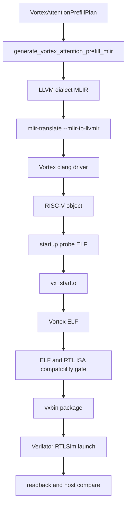

# Current MLIR and Vortex LLVM toolchain

Mandrel's current generated device-code path is a textual LLVM-dialect MLIR bridge feeding the executable Vortex RISC-V correctness flow. Source generation and plan validation live in `mandrel-vortex-codegen`; runtime execution remains in `mandrel-vortex-backend`.

## Current path



The local Vortex LLVM fork is expected to provide:

- `mlir-opt`
- `mlir-translate`
- `clang` / `clang++`
- `llvm-objdump`
- `llvm-objcopy`
- `llvm-nm`
- `llvm-readelf`

Default local path:

```text
external/vortex-source-tools/llvm-vortex/bin
```

## Why a textual LLVM-dialect bridge first

Textual MLIR is a pragmatic bridge while the Vortex fork is on LLVM/MLIR 20 and Rust MLIR bindings are version-sensitive. It gives us:

- reproducible source artifacts;
- easy debugging in `mlir-opt`/`mlir-translate`;
- a clean migration path to structured Mandrel/target dialects and a custom `mandrel-opt` tool later;
- no dependency on Rust bindings that target a newer LLVM release.

## Current lowering shape

The first attention lowering is a conservative scalar dense baseline for `attention_prefill_i8`:

```text
for assigned query row and output dimension:
  scan keys to compute dot-product max
  scan keys again to compute exp(score - max), denominator, and weighted V numerator
  normalize numerator / denominator
  clamp to [-128, 127]
  cast/truncate to i8
  store output
```

It intentionally prioritizes a verifiable end-to-end path over performance. It does not yet use local-memory tile staging, a fused FlashAttention-style block kernel, or a real quantization policy beyond clamp/cast.

The generated source currently stays in the `llvm` dialect for Vortex ABI structs, CSR reads, uniform marker intrinsics, pointer arithmetic, scalar float math, and kernel metadata. A later lowering can introduce `arith`/`scf`/`memref` or a small Mandrel dialect before final LLVM dialect emission.

## Commands

Plan inspection:

```sh
cargo vortex-plan-attention
```

Attention artifact generation:

```sh
cargo vortex-generate-attention
```

Runtime correctness:

```sh
cargo vortex-run-attention
```

Useful runtime shape/diagnostic knobs:

```sh
MANDREL_ATTENTION_RUNTIME_SEQUENCE=64 \
MANDREL_ATTENTION_RUNTIME_HEAD_DIM=64 \
cargo vortex-run-attention

MANDREL_ATTENTION_RUNTIME_SCALAR_LAUNCH=1 cargo vortex-run-attention
MANDREL_VORTEX_RUNTIME_TRACE=1 cargo vortex-run-attention
```

`vortex-generate-attention` uses the source-built tools under `external/vortex-source-tools/llvm-vortex/bin` and writes:

```text
target/mandrel/vortex/attention_prefill_i8.mlir
target/mandrel/vortex/attention_prefill_i8.ll
target/mandrel/vortex/attention_prefill_i8.o
target/mandrel/vortex/attention_prefill_i8.startup_probe.elf
target/mandrel/vortex/attention_prefill_i8.vx_start.o
target/mandrel/vortex/attention_prefill_i8.elf
target/mandrel/vortex/attention_prefill_i8.vxbin
target/mandrel/vortex/attention_prefill_i8.experiment.json
target/mandrel/vortex/attention_prefill_i8.experiment.csv
```

The object step intentionally goes through the Vortex `clang` driver instead of invoking `llc` directly. The generated LLVM IR contains Vortex uniform marker intrinsics, and the Vortex driver pass pipeline must remove those markers before RISC-V instruction selection.

## Vortex link/startup requirements

The ELF link uses the official Vortex KMU startup wrapper and runtime pieces:

- `sw/kernel/src/vx_start.S` compiled with `-DKMU_ENABLE`;
- startup flags detected by `sw/kernel/scripts/kernel_startup.sh` from a probe ELF;
- generated Vortex config flags from `ci/gen_config.py --cflags=-DVX_CFG_XLEN=64`;
- `sw/kernel/scripts/link64.ld`;
- `libvortex2.a`;
- Vortex rv64 `libm`/`libc`;
- `libclang_rt.builtins-riscv64.a`;
- non-executed startup-probe `STARTUP_ADDR=0x40000000`, keeping weak address-zero libc symbols within the RISC-V medany range;
- final executable `STARTUP_ADDR=0x180000000`, matching the upstream Vortex RV64 layout;
- `--undefined=__vx_kentry_attention_prefill_i8` so `--gc-sections` does not discard the runtime entry symbol.

After the final link, Mandrel reads the ELF RISC-V build attributes with `llvm-readelf -A` and compares XLEN plus `M/A/F/D/C/V/Zicond` requirements against the resolved `VX_CFG_EXT_*_ENABLED` flags. The ELF may use a subset of RTL capabilities, but `.vxbin` packaging is rejected if it requires an extension disabled by the materialized RTL or omits `xvortex`.

These details are part of the correctness contract. Removing the startup object, changing the startup address, or bypassing the ISA compatibility gate can produce a stuck launch, relocation failures, or invalid RTL instruction decoding.

## LLVM fork policy

Keep Mandrel lowering policy out of the LLVM fork. The fork should remain responsible for:

- Vortex target features;
- Vortex intrinsics and calling convention details;
- kernel entry metadata;
- object and artifact compatibility.

Mandrel should own operator semantics, schedule choices, attention layouts, MLIR generation, artifact orchestration, hardware-design identity, and runtime correctness checks. LLVM does not generate Verilog; the Vortex configuration/RTL branch is materialized separately and joined to the binary through the experiment contract.
