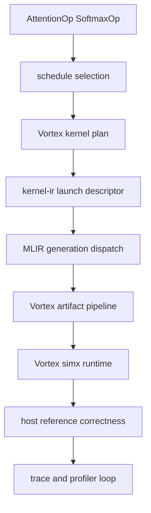
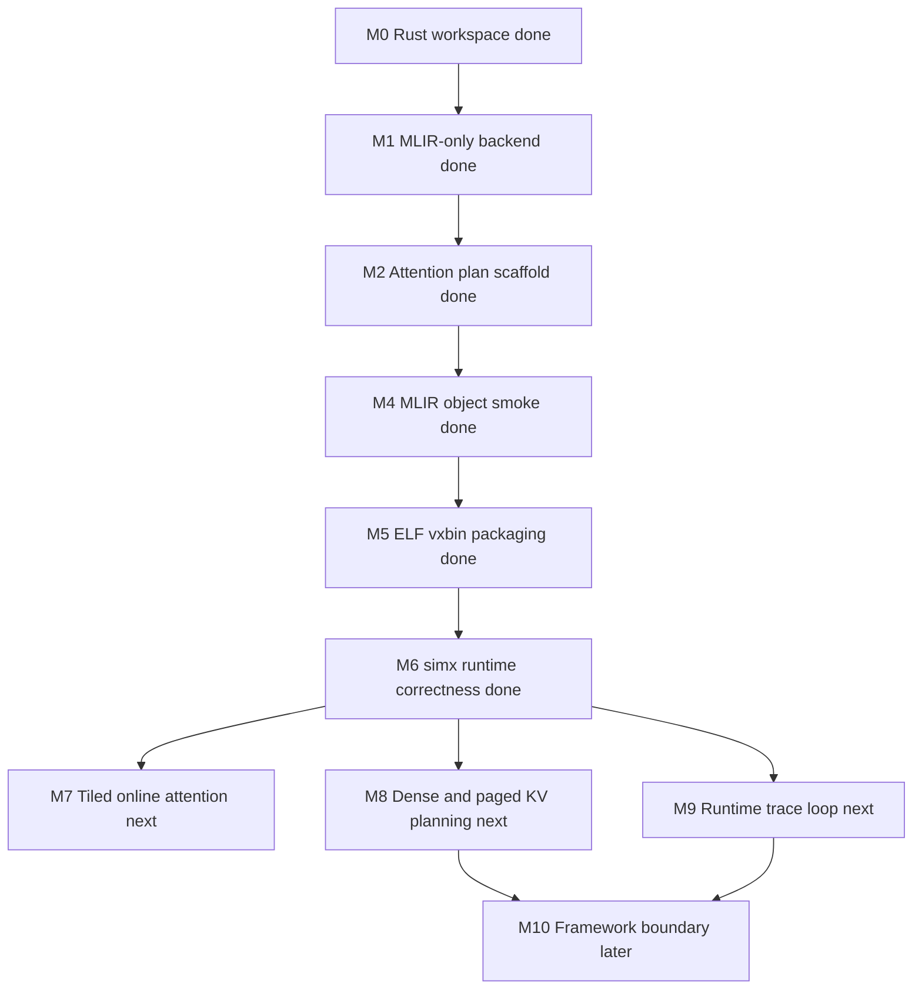

# Roadmap

Mandrel is moving directly toward attention-like operator generation on Vortex with MLIR as the maintained device-code path and `simx` runtime correctness as the first execution target.

## Current baseline



Current state:

| Area | State |
| --- | --- |
| Attention prefill planning | `attention_prefill_i8` has dense KV layout, online max/sum softmax strategy, launch shape, and metrics. |
| Softmax/reduction direction | `SoftmaxF32` is in the catalog as the next planned reduction primitive; host row-softmax reference exists. |
| MLIR/artifact generation | `attention_prefill_i8` emits LLVM dialect MLIR and validates through `mlir-translate` + Vortex `clang` to `.o`, startup-aware `.elf`, and packaged `.vxbin`. |
| Runtime correctness | `cargo vortex-run-attention` launches the generated `.vxbin` under Vortex `simx`, reads output back, and compares with a host reference. |
| Error/logging quality | Project errors are centralized with `snafu`; `xtask` and backend runtime diagnostics use `tracing` with structured fields and optional stdout progress for hang diagnosis. |
| Backend runtime | `VortexBackend` owns runtime/device/queue and generic artifact/cache/launch plumbing. |
| C ABI | Reduced to generic backend lifecycle/cache queries while operator ABI is redesigned around attention layouts. |
| Vortex toolchain | Local Vortex LLVM fork with MLIR tools is expected under `external/vortex-source-tools`. |

## Milestones

| Milestone | Status | Exit criteria |
| --- | --- | --- |
| M0: Rust workspace and IR skeleton | Done | Core crates compile/test with no-std-friendly boundaries. |
| M1: MLIR-only backend policy | Done | Generated device-code path no longer has C++ or direct textual LLVM alternatives. |
| M2: Attention plan scaffold | Done | `attention_prefill_i8` schedule, launch, metrics, and catalog entry exist. |
| M3: Remove old operator tunnel | Done | Public Rust/C APIs, commands, docs, and catalog no longer expose the previous demo path. |
| M4: Attention MLIR/object smoke | Done | Dense scalar `attention_prefill_i8` baseline emits LLVM dialect MLIR, translates to LLVM IR, and compiles with Vortex `clang` to `.o`. |
| M5: Artifact/vxbin packaging | Done | The generated object links through the Vortex ELF flow and packages to `.vxbin` with a named `VXSYMTAB` entry. |
| M6: Runtime launch and correctness harness | Done | Deterministic Q/K/V cases launch the generated `.vxbin` under `simx`/runtime and compare host reference output against the device path. |
| M7: Tiled online attention lowering | Next | Dense prefill evolves from scalar baseline to tiled/local-memory online max/sum state. |
| M8: KV layout planning | Next | Dense and paged KV layouts are represented in schedule/ABI metadata. |
| M9: Runtime trace loop | Next | Vortex counters and launch/transfer data become structured profiler traces. |
| M10: Framework boundary | Later | A conservative attention-like request can probe/plan/fallback through a stable C/C++ shim. |



## Short-term tasks

1. Stabilize the runtime/operator ABI boundary for passing `attention_prefill_i8_args_t` buffers and scalar dimensions.
2. Evolve the scalar dense lowering toward tiled/local-memory online max/sum state.
3. Add paged KV metadata and legality checks without committing to a CUDA-specific layout.
4. Parse Vortex `PERF` output into `profiler::trace` records.
5. Decide the promotion criteria for `AttentionPrefillI8` from internal runtime-correct smoke to public `Available` catalog status.

## MLIR track

Near-term lowering can stay textual and project-local:

```text
VortexAttentionPrefillPlan
  -> attention/reduction semantic builder
  -> LLVM dialect MLIR
  -> mlir-translate
  -> Vortex LLVM fork
  -> Vortex runtime correctness
```

Mid-term, introduce a small Mandrel lowering tool:

```text
Mandrel dialect / transform metadata
  -> mandrel-opt
  -> linalg/scf/arith/memref/llvm as useful
  -> Vortex LLVM
```

## Architecture co-design questions

| Axis | Questions |
| --- | --- |
| Online softmax | What workgroup shape keeps max/sum state local and avoids excess global traffic? |
| KV cache | When does paged layout dominate dense layout overhead on Vortex? |
| Local memory | How much staging helps attention before occupancy drops? |
| Reductions | Which row/block reduction shapes map cleanly to Vortex warps and barriers? |
| ISA | Which packed/vector operations are justified by measured attention traces? |
| Runtime | How much launch and transfer overhead matters for decode-sized batches? |

## Validation strategy

Rust checks:

```sh
cargo fmt --check
cargo check -p mandrel-kernel-ir -p mandrel-schedule -p mandrel-profiler -p mandrel-compiler -p mandrel-vortex-backend -p mandrel-ggml-adapter -p mandrel-kernels -p mandrel-runtime -p xtask
cargo test -p mandrel-kernel-ir -p mandrel-schedule -p mandrel-profiler -p mandrel-compiler -p mandrel-vortex-backend -p mandrel-ggml-adapter -p mandrel-kernels -p mandrel-runtime -p xtask
```

Planning, artifact, and runtime smoke:

```sh
cargo vortex-plan-attention
cargo vortex-generate-attention
cargo vortex-run-attention
```

`vortex-run-attention` is the current runtime correctness gate: it generates or refreshes artifacts, launches the Vortex simx runtime, and compares device output with the Rust host reference.
