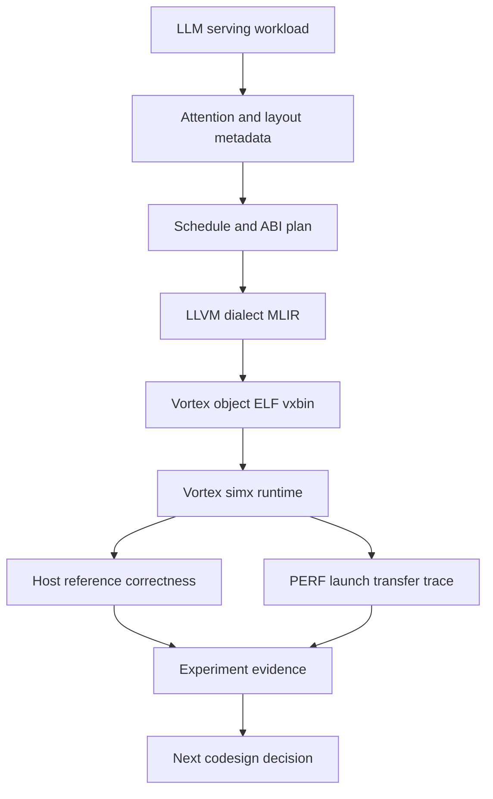
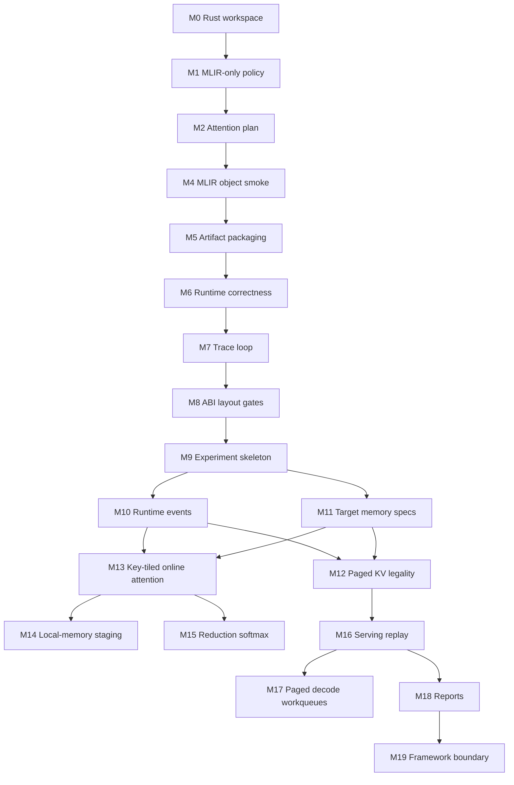

# Roadmap

Mandrel is a workload-driven full-stack design-space quantification, analysis, and optimization system for efficient LLM serving on open AI accelerators. Its current Vortex attention path is the first executable measurement spine: a real path from LLM-serving workload semantics to compiler plans, generated artifacts, runtime correctness, traces, and experiment evidence.

The next phase is not simply to add more kernels. The next phase is to turn each Vortex attention run into a reproducible **optimization experiment**: workload, target, memory model, layout, schedule, runtime events, correctness, counters, derived metrics, and report. The purpose of these experiments is to identify bottlenecks and guide design choices that maximize full-stack efficiency.

## North star

Given an LLM-serving workload and an efficiency objective, Mandrel should be able to vary hardware assumptions, memory hierarchy, KV layout, copy/runtime policy, scheduling policy, compiler schedule, and kernel lowering, then explain and compare the result with correctness, counters, runtime events, and derived metrics.

```text
Workload and efficiency objective
  -> design-space variables
  -> target and memory model
  -> layout, schedule, and runtime policy
  -> kernel ABI and lowering
  -> artifact and runtime execution
  -> correctness, counters, and event trace
  -> bottleneck analysis and experiment report
  -> next hardware/software optimization decision
```

Mandrel's long-term value is to apply the quantitative computer-architecture method to AI serving workloads: make LLM-serving design choices measurable, comparable, and optimizable on open accelerator targets, then use the analysis to guide both hardware/software stack design and algorithm choices. It should learn from vLLM, SGLang, FlashInfer, FlashAttention, PersistentKV, Frontier, and related systems, but translate their lessons into target-aware design variables and metrics rather than copying CUDA-specific implementation details.

## Current executable spine



Current state:

| Area | State |
| --- | --- |
| Attention prefill planning | `attention_prefill_i8` has dense KV layout, online-softmax schedule metadata, launch shape, and static metrics. |
| ABI/layout gates | Rust plan metadata carries buffer slots, scalar arg indices, dense row-major strides, quantization, KV policy, and runtime shape policy; codegen/runtime validate the current Vortex ABI. |
| Current lowering truth | The generated MLIR is currently a dense scalar two-pass stable-softmax baseline. It has `query_tile`/`key_tile` metadata, but `key_tile` is not yet a structural key-block loop in lowering. |
| MLIR/artifact generation | `attention_prefill_i8` emits LLVM dialect MLIR and validates through `mlir-translate` + Vortex `clang` to `.o`, startup-aware `.elf`, and packaged `.vxbin`. |
| Runtime correctness | `cargo vortex-run-attention` launches `.vxbin` under Vortex `simx`, logs runtime shape/buffer/cache/transfer/checksum flow data, reads output back, and compares with a Rust host reference. |
| Trace loop | Vortex `PERF`, launch dimensions, transfer bytes, workload metadata, cache hits, wall time, correctness summary, derived metrics, and latest-vs-previous deltas are persisted as JSONL. Current trace records can also derive a first-pass `ExperimentResult`. |
| Runtime/backend | `VortexBackend` owns runtime/device/queue and generic artifact/cache/launch plumbing. |
| Experiment crate | `mandrel-experiment` is wired into the workspace with first-pass `ExperimentSpec`, `ExperimentResult`, target/memory specs, correctness records, and runtime events; `vortex-run-attention` can now write a companion experiment-result JSONL when correctness and trace data are present. |
| C ABI | Reduced to generic backend lifecycle/cache queries while operator ABI is redesigned around attention layouts. |
| Vortex toolchain | Local Vortex LLVM fork with MLIR tools is expected under `external/vortex-source-tools`. |

Representative current evidence:

```text
attention.runtime: validating attention ABI/layout metadata
attention.runtime: compare summary elements=128 mismatches=0 status=exact
attention runtime correctness PASSED
PERF: instrs=165144, cycles=414598, IPC=0.398
```

## Positioning and anti-goals

Mandrel should be precise about what it is and is not.

| Decision | Direction |
| --- | --- |
| Primary identity | Executable quantitative computer-architecture methodology for AI serving workloads: full-stack design-space quantification, analysis, and optimization on open accelerators. |
| Near-term target | Vortex `simx` with generated MLIR artifacts and correctness evidence. |
| Main workload family | Attention, KV cache, runtime movement, scheduling/layout policy, algorithmic attention/KV variants, and serving-shaped replay traces. |
| Sequencing constraint | Production vLLM/SGLang/llama.cpp integration comes after measurement, event, and report infrastructure are credible. |
| Sequencing constraint | CUDA/Triton systems are design references; Mandrel should rederive target-aware schedules instead of directly porting kernels. |
| Sequencing constraint | Full-model serving features come after the optimization loop can explain operator, KV, runtime, target, and algorithmic bottlenecks. |
| Watch item | Tiny Mixtral/MoE fixtures are useful workload references, but they should not displace the attention/KV/runtime spine. |

The rule of thumb is: **objectives before knobs, reports before integrations, legality before lowering, event traces before serving claims.**

## Roadmap horizons

### Horizon 0: Executable spine

Purpose: keep the project honest with a runnable end-to-end path.

- Rust IR and schedule metadata.
- Vortex kernel plan and ABI metadata.
- LLVM dialect MLIR generation.
- Vortex artifact pipeline.
- Runtime launch and correctness.
- Trace JSONL and history deltas.

Status: **mostly done for dense `attention_prefill_i8`**, with the important caveat that the current lowering is scalar/two-pass rather than true key-tiled online attention.

### Horizon 1: Codesign experiment objects

Purpose: promote implicit assumptions into explicit experiment objects.

- `ExperimentSpec`: workload + target + memory + layout + schedule + runtime knobs + correctness/SLO policies.
- `ExperimentResult`: correctness, artifacts, counters, runtime events, workload metrics, derived metrics, and links to logs/reports.
- `WorkloadSpec`: attention/prefill/decode shapes, prompt/decode phases, optional serving trace/replay metadata.
- `TargetSpec`: cores, warps/subgroups, threads, local memory, cache line, supported features, runtime capabilities.
- `MemorySystemSpec`: global memory, local memory, cache model, host-device/device-device links, bandwidth/latency placeholders.
- `CorrectnessPolicy`: exact compare, tolerance compare, or future task/model-quality metric.
- `SloPolicy`: optional TTFT/TPOT/E2E constraints for future serving-shaped experiments.

Status: **next structural expansion**.

### Horizon 2: Runtime event model

Purpose: make data movement, launch overhead, synchronization, and future KV movement measurable.

Initial event kinds should be small and backed by today's attention path:

- `Allocate` for Q/K/V/O buffers.
- `Copy` for host-to-device and device-to-host movement.
- `KernelLaunch` for symbol, grid, block, shared/local memory, and args summary.
- `Sync` for launch/readback waits where observable.
- `PerfCounter` for Vortex `PERF` counters.
- `CorrectnessCheck` for host/device comparison.

Later event kinds can cover:

- `KvRead` / `KvWrite`.
- `PageTableLookup`.
- `LayoutTransform`.
- `CompressedTransfer`.
- `CheckpointRestore`.
- `CacheShare` / `Migration`.

Status: **next after or alongside experiment skeleton**.

### Horizon 3: Target and memory models

Purpose: make hardware assumptions explicit before drawing performance conclusions.

- Unify existing `TargetConstraints`, `DeviceCapabilities`, Vortex runtime caps, and schedule constraints into target-facing specs.
- Capture Vortex-derived execution resources: XLEN, max workgroup threads, threads/warp or subgroup, warps/core, local memory/core, local-memory budget per resident workgroup.
- Capture feature assumptions: int8, f32, packed/vector dot, barriers, local memory, async copy, tensor cores or absence thereof.
- Capture memory assumptions: global/local memory, cache line size, host-device link, future device-device/remote-memory links.

Status: **next after experiment/event skeleton**.

### Horizon 4: Serving-shaped memory and attention

Purpose: make Mandrel relevant to SGLang/vLLM/llama.cpp-class serving workloads without becoming a production framework.

- Prefill/decode phase separation in `WorkloadSpec`.
- Serving-shaped replay traces: batch size, prompt lengths, generated lengths, prefix reuse, phase boundaries.
- Paged KV legality and page-layout metadata.
- KV read/write/copy/gather semantics.
- Dense key-tiled online attention lowering.
- Local-memory staging experiments.
- Reduction/softmax primitive experiments.

Status: **after the lab skeleton can produce experiment reports**.

### Horizon 5: Community-facing reports and probes

Purpose: produce artifacts the RISC-V/open-hardware and LLM-serving communities can evaluate.

- Reproducible experiment reports.
- RISC-V/Vortex bottleneck notes.
- SGLang-style workload shape importer or replay harness.
- llama.cpp/ggml-style one-op backend probe through conservative C/C++ boundaries.
- Hardware/runtime/compiler feedback reports.

Status: **later; do not overcommit before the spine, experiment model, and event model are credible**.

## Milestones

| Milestone | Status | Exit criteria |
| --- | --- | --- |
| M0: Rust workspace and IR skeleton | Done | Core crates compile/test with no-std-friendly boundaries. |
| M1: MLIR-only backend policy | Done | Generated device-code path no longer has C++ or direct textual LLVM alternatives. |
| M2: Attention plan scaffold | Done | `attention_prefill_i8` schedule, launch, metrics, and catalog entry exist. |
| M3: Remove old operator tunnel | Done | Public Rust/C APIs, commands, docs, and catalog no longer expose the previous demo path. |
| M4: Attention MLIR/object smoke | Done | Dense scalar `attention_prefill_i8` baseline emits LLVM dialect MLIR, translates to LLVM IR, and compiles with Vortex `clang` to `.o`. |
| M5: Artifact/vxbin packaging | Done | The generated object links through the Vortex ELF flow and packages to `.vxbin` with a named `VXSYMTAB` entry. |
| M6: Runtime launch and correctness harness | Done | Deterministic Q/K/V cases launch the generated `.vxbin` under `simx`/runtime and compare host reference output against the device path. |
| M7: Runtime trace loop | Done | Vortex `PERF`, launch/transfer data, attention workload metadata, cache hits, wall time, and derived efficiency metrics become JSONL history with deltas. |
| M8: Attention ABI and layout metadata gates | In progress | `attention_prefill_i8_args_t` and Rust plan metadata carry strides, dense/paged KV layout, quantization/runtime shape policy, and are validated at codegen/runtime gates. |
| M9: Codesign experiment skeleton | In progress | `crates/experiment` is a workspace crate with `ExperimentSpec`, `ExperimentResult`, `WorkloadSpec`, `TargetSpec`, `MemorySystemSpec`, and a minimal attention experiment report backed by current trace data. |
| M10: Runtime event model | In progress | Runtime launch, allocation, transfer, cache, sync, PERF, and correctness are represented as event records instead of only summary bytes. |
| M11: Target and memory system specs | Next | Vortex-derived target capabilities, local/global memory assumptions, and transfer/copy descriptors are first-class metadata shared by scheduling, validation, and reporting. |
| M12: Paged KV legality planning | Next | Dense and paged KV layouts have richer schedule metadata, page-size/page-table/GQA/ragged-tail legality checks, and explicit codegen rejection for unsupported layouts. |
| M13: Dense key-tiled online attention lowering | Next | Dense prefill evolves from scalar two-pass baseline to structural key-block loops and online `(max, sum, accumulator)` state. |
| M14: Local-memory K/V staging | Later | Dense attention can stage K/V tiles in local memory with target-aware occupancy checks and trace evidence. |
| M15: Reduction/Softmax lowering | Later | `SoftmaxF32` becomes the small reduction-lowering testbed for row/block reductions, barriers, and local memory. |
| M16: Serving workload replay | Later | SGLang-class prefill/decode/KV shapes or llama.cpp/ggml-like tensor layouts can be imported/replayed without committing to a production backend. |
| M17: Paged decode and workqueue policies | Later | Decode experiments can compare dense vs paged KV, page-aware work assignment, sequence splitting, and workqueue policies. |
| M18: Community-facing reports | Later | Mandrel can emit reproducible reports that connect workload, target, kernel, runtime trace, and codesign conclusions. |
| M19: Framework boundary | Later | A conservative attention-like request can probe/plan/fallback through a stable C/C++ shim. |



## Immediate start plan

The next work should be deliberately small and should not change kernel behavior.

### Start 1: Wire the experiment crate

Goal: create a minimal `mandrel-experiment` workspace crate.

Initial types:

```text
ExperimentSpec
  id
  workload: WorkloadSpec
  target: TargetSpec
  memory: MemorySystemSpec
  correctness: CorrectnessPolicy

ExperimentResult
  spec_id
  status
  artifacts: ArtifactSet
  counters: CounterSet
  events: Vec<RuntimeEvent>
  correctness: CorrectnessResult
  derived_metrics: DerivedMetrics
```

Status: **done for the first skeleton**. The crate is wired into the workspace and can represent the current dense `attention_prefill_i8` smoke run without changing backend behavior.

Remaining work:

- Move more report construction out of `xtask` and into reusable experiment/report helpers.
- Attach real artifact paths to `ArtifactSet` in the live result.
- Add richer workload/layout fields before serving replay.

### Start 2: Convert current trace summary into event records

Goal: preserve current JSONL compatibility while adding structured events.

Initial events should be derivable from today's runtime path:

```text
Allocate Q/K/V/O
Copy H2D Q/K/V
KernelLaunch attention_prefill_i8
Sync launch/readback
Copy D2H O
PerfCounter instrs/cycles
CorrectnessCheck exact
```

Status: **partially done**. Existing trace history still works, correctness is captured in new trace records, and `vortex-run-attention` can write a companion `attention_prefill_i8.experiment.jsonl` result derived from the current trace summary.

Remaining work:

- Emit true allocation/sync/cache events from runtime boundaries instead of deriving a compact event list from summary fields.
- Add event timestamps or ordering metadata where available.
- Preserve compatibility with old trace JSONL records.

### Start 3: Record Vortex target assumptions once

Goal: avoid divergent target facts across `model-ir`, `device`, `schedule`, and `vortex-backend`.

Initial `TargetSpec::vortex_simx_default()` should include at least:

- target kind;
- XLEN;
- max workgroup threads;
- local memory bytes;
- preferred subgroup/warp width if known;
- int8/f32 support;
- tensor-core absence;
- runtime backend capability notes.

Exit criteria:

- Schedule selection and reports can point to the same target facts.
- Future target/memory fields can be added without changing attention semantics.

## Short-term priorities

1. **P0: Keep the executable spine green.** `cargo vortex-run-attention` remains the primary integration gate; it must continue to generate artifacts, run Vortex `simx`, compare host reference output, and write trace history.
2. **P1: Be precise about the current kernel.** Current generated MLIR is a dense scalar two-pass stable-softmax baseline with tiled metadata, not yet a true key-tiled online attention implementation.
3. **P2: Introduce the experiment skeleton.** Add `ExperimentSpec`, `ExperimentResult`, `WorkloadSpec`, `TargetSpec`, `MemorySystemSpec`, and initial report shape backed by current attention trace data.
4. **P3: Make runtime movement first-class.** Promote allocation, copy, launch, sync, cache, PERF, and correctness into event records.
5. **P4: Unify target and memory assumptions.** Avoid letting schedule selection, backend validation, and report generation carry separate copies of Vortex facts.
6. **P5: Paged KV legality before lowering.** Add richer page-size/page-table/GQA/ragged-tail metadata and legality checks without committing to a CUDA-specific layout.
7. **P6: Dense key-tiled online lowering.** First make `key_tile` an explicit loop structure, then introduce online `(max, sum, accumulator)` state, and only then add local-memory K/V staging.
8. **P7: Reports before broad integrations.** Generate reproducible codesign reports before attempting a production SGLang or llama.cpp backend.

## Design streams

| Stream | Near-term work | Longer-term question |
| --- | --- | --- |
| Experiment model | Wire `crates/experiment`; represent current attention run | Can every optimization be compared as an experiment result? |
| Target/chip model | Capture Vortex `simx` capabilities as `TargetSpec` | Which RISC-V/Vortex hardware features move attention/KV metrics? |
| Runtime/driver | Represent launch/cache/transfer/sync as events | What driver/runtime features are required for decode-sized serving? |
| Memory/storage | Model dense and paged KV metadata | When do page size, cache behavior, and local memory dominate? |
| Data movement | Track allocation/copy/layout descriptors | Can copies, gathers, layout transforms, or DMA overlap compute? |
| Compiler/lowering | Keep LLVM dialect MLIR path executable | When should Mandrel introduce structured dialect/transform lowering? |
| Kernels/operators | Key-tiled attention, softmax/reduction, copy/KV helpers | Which primitives should be hardware/compiler co-designed? |
| Observability | Convert trace JSONL into experiment results | Can every optimization explain its effect across layers? |
| Community boundary | Keep C/C++ shim conservative | Which one-op probes are useful for SGLang or llama.cpp/ggml? |

## MLIR track

Near-term lowering can stay textual and project-local:

```text
VortexAttentionPrefillPlan
  -> attention/reduction semantic builder
  -> LLVM dialect MLIR
  -> mlir-translate
  -> Vortex LLVM fork
  -> Vortex runtime correctness
```

Current lowering shape:

```text
for assigned query row and output dimension:
  scan all keys to compute row max
  scan all keys again to compute denominator and weighted V numerator
  normalize numerator / denominator
  clamp to [-128, 127]
  cast/truncate to i8
  store output
```

Next lowering shape:

```text
for assigned query tile:
  initialize online max/sum/accumulator state
  for key tile:
    compute tile scores
    update online state
  store normalized output
```

Mid-term, introduce a small Mandrel lowering tool only when the executable spine and experiment model justify it:

```text
Mandrel dialect / transform metadata
  -> mandrel-opt
  -> linalg/scf/arith/memref/llvm as useful
  -> Vortex LLVM
```

## Architecture codesign questions

| Axis | Questions |
| --- | --- |
| Online softmax | What workgroup shape keeps max/sum state local and avoids excess global traffic? |
| KV cache | When does paged layout dominate dense layout overhead on Vortex? |
| Page tables | How large is page-table lookup traffic and where should the page table live? |
| Local memory | How much staging helps attention before occupancy drops? |
| Copy and overlap | Which host-device, device-device, gather, or layout-copy paths should be explicit runtime events? |
| Runtime | How much launch, queue, sync, and cache overhead matters for decode-sized batches? |
| Reductions | Which row/block reduction shapes map cleanly to Vortex warps and barriers? |
| ISA | Which packed/vector/reduction features are justified by measured attention traces? |
| Target model | Which hardware parameters need to be tunable to make codesign experiments credible? |
| Serving integration | Which SGLang/llama.cpp workload shapes should Mandrel replay before offering a backend boundary? |

## Validation strategy

Rust checks:

```sh
cargo fmt --check
cargo check -p mandrel-kernel-ir -p mandrel-schedule -p mandrel-profiler -p mandrel-experiment -p mandrel-compiler -p mandrel-vortex-backend -p mandrel-ggml-adapter -p mandrel-kernels -p mandrel-runtime -p xtask
cargo test -p mandrel-kernel-ir -p mandrel-schedule -p mandrel-profiler -p mandrel-experiment -p mandrel-compiler -p mandrel-vortex-backend -p mandrel-ggml-adapter -p mandrel-kernels -p mandrel-runtime -p xtask
```

Planning, artifact, runtime, and trace smoke:

```sh
cargo vortex-plan-attention
cargo vortex-generate-attention
cargo vortex-run-attention
cargo vortex-trace-attention
```

`vortex-run-attention` is the current integration gate: it generates or refreshes artifacts, validates ABI/layout metadata, launches Vortex `simx`, compares device output with the Rust host reference, and records trace history.
