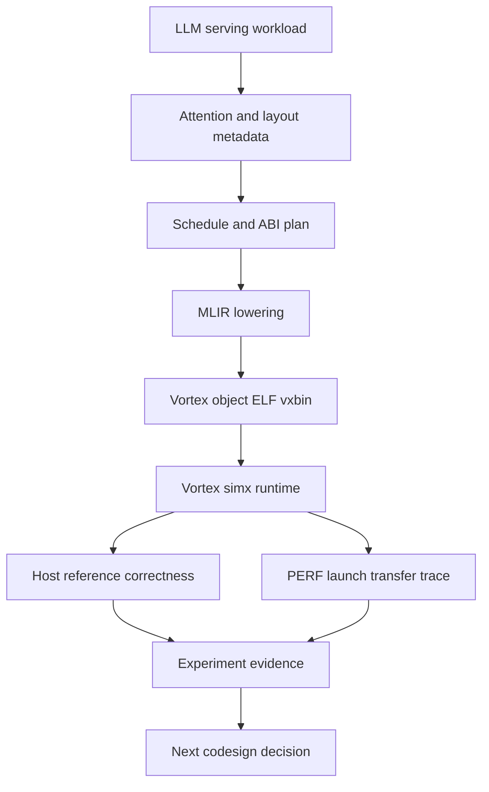
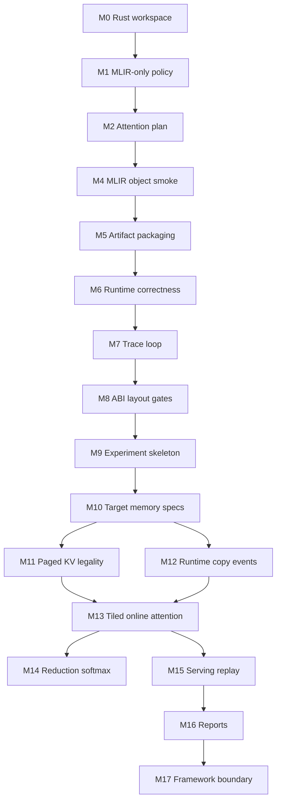

# Roadmap

Mandrel is a workload-driven full-stack codesign lab for open AI accelerators. The current Vortex attention path is the first executable spine: a real path from LLM-serving workload semantics to compiler plans, generated artifacts, runtime correctness, and trace-driven evidence.

This roadmap is calibrated around two goals:

1. **Keep one hard vertical slice executable.** Dense attention on Vortex must continue to compile, run, compare, and produce metrics.
2. **Grow that slice into a codesign lab.** Hardware target specs, memory/storage models, copy/communication events, runtime/driver behavior, compiler lowering, and kernel choices should become experiment objects.

## North star

Given an LLM-serving workload, Mandrel should be able to vary hardware assumptions, memory layout, copy/runtime policy, compiler schedule, and kernel lowering, then explain the result with correctness and metrics.

```text
Workload hypothesis
  -> target and memory model
  -> layout and schedule plan
  -> kernel ABI and lowering
  -> artifact and runtime execution
  -> correctness and trace evidence
  -> next hardware/software design decision
```

## Current executable spine



Current state:

| Area | State |
| --- | --- |
| Attention prefill planning | `attention_prefill_i8` has dense KV layout, online max/sum softmax strategy, launch shape, and metrics. |
| ABI/layout gates | Rust plan metadata carries buffer slots, scalar arg indices, dense row-major strides, quantization, KV policy, and runtime shape policy; codegen/runtime validate the current Vortex ABI. |
| MLIR/artifact generation | `attention_prefill_i8` emits LLVM dialect MLIR and validates through `mlir-translate` + Vortex `clang` to `.o`, startup-aware `.elf`, and packaged `.vxbin`. |
| Runtime correctness | `cargo vortex-run-attention` launches `.vxbin` under Vortex `simx`, logs runtime shape/buffer/cache/transfer/checksum flow data, reads output back, and compares with a Rust host reference. |
| Trace loop | Vortex `PERF`, launch dimensions, transfer bytes, workload metadata, cache hits, wall time, derived metrics, and latest-vs-previous deltas are persisted as JSONL. |
| Runtime/backend | `VortexBackend` owns runtime/device/queue and generic artifact/cache/launch plumbing. |
| C ABI | Reduced to generic backend lifecycle/cache queries while operator ABI is redesigned around attention layouts. |
| Vortex toolchain | Local Vortex LLVM fork with MLIR tools is expected under `external/vortex-source-tools`. |

Representative current evidence:

```text
attention.runtime: validating attention ABI/layout metadata
attention.runtime: compare summary elements=128 mismatches=0 status=exact
attention runtime correctness PASSED
PERF: instrs=165144, cycles=414598, IPC=0.398
```

## Roadmap horizons

### Horizon 0: Executable spine

Purpose: keep the project honest with a runnable end-to-end path.

- Rust IR and schedule metadata.
- Vortex kernel plan and ABI metadata.
- LLVM dialect MLIR generation.
- Vortex artifact pipeline.
- Runtime launch and correctness.
- Trace JSONL and history deltas.

Status: **mostly done for dense `attention_prefill_i8`**.

### Horizon 1: Codesign objects

Purpose: promote implicit assumptions into explicit experiment objects.

- `TargetSpec`: cores, warps, threads, local memory, cache line, supported features, runtime capabilities.
- `MemorySystemSpec`: global memory, local memory, cache model, bandwidth/latency placeholders.
- `CopySpec` / `RuntimeEventSpec`: host-device, device-device, layout movement, async copy, queue/sync events.
- `ExperimentSpec`: workload + target + memory + schedule + runtime knobs.
- `ExperimentResult`: correctness, artifacts, counters, transfer, workload, derived metrics, and links to logs.

Status: **next structural expansion**.

### Horizon 2: Serving-shaped memory and attention

Purpose: make Mandrel relevant to SGLang/llama.cpp-class serving workloads.

- Paged KV legality and page-layout metadata.
- Prefill/decode shape separation.
- KV read/write/copy/gather semantics.
- Tiled online attention lowering.
- Local-memory staging experiments.
- Reduction/softmax primitive experiments.

Status: **next after/alongside lab skeleton**.

### Horizon 3: Community-facing integration and reports

Purpose: produce artifacts the RISC-V/open-hardware and LLM-serving communities can evaluate.

- Reproducible experiment reports.
- RISC-V/Vortex bottleneck notes.
- SGLang-style workload shape importer or replay harness.
- llama.cpp/ggml-style one-op backend probe through conservative C/C++ boundaries.
- Hardware/runtime/compiler feedback reports.

Status: **later; do not overcommit before the spine and experiment model are credible**.

## Milestones

| Milestone | Status | Exit criteria |
| --- | --- | --- |
| M0: Rust workspace and IR skeleton | Done | Core crates compile/test with no-std-friendly boundaries. |
| M1: MLIR-only backend policy | Done | Generated device-code path no longer has C++ or direct textual LLVM alternatives. |
| M2: Attention plan scaffold | Done | `attention_prefill_i8` schedule, launch, metrics, and catalog entry exist. |
| M3: Remove old operator tunnel | Done | Public Rust/C APIs, commands, docs, and catalog no longer expose the previous demo path. |
| M4: Attention MLIR/object smoke | Done | Dense scalar `attention_prefill_i8` baseline emits LLVM dialect MLIR, translates to LLVM IR, and compiles with Vortex `clang` to `.o`. |
| M5: Artifact/vxbin packaging | Done | The generated object links through the Vortex ELF flow and packages to `.vxbin` with a named `VXSYMTAB` entry. |
| M6: Runtime launch and correctness harness | Done | Deterministic Q/K/V cases launch the generated `.vxbin` under `simx`/runtime and compare host reference output against the device path. |
| M7: Runtime trace loop | Done | Vortex `PERF`, launch/transfer data, attention workload metadata, cache hits, wall time, and derived efficiency metrics become JSONL history with deltas. |
| M8: Attention ABI and layout metadata gates | In progress | `attention_prefill_i8_args_t` and Rust plan metadata carry strides, dense/paged KV layout, quantization/runtime shape policy, and are validated at codegen/runtime gates. |
| M9: Codesign experiment skeleton | Next | `ExperimentSpec`, `ExperimentResult`, `TargetSpec`, and initial report shape exist, backed by the current attention trace path. |
| M10: Target and memory system specs | Next | Vortex-derived target capabilities, local/global memory assumptions, and transfer/copy descriptors are first-class metadata. |
| M11: Paged KV legality planning | Next | Dense and paged KV layouts have schedule metadata, page-size/page-table legality checks, and explicit codegen rejection for unsupported layouts. |
| M12: Runtime/copy event model | Next | Runtime launch, transfer, cache, copy, sync, and future device-device movement are represented as event records instead of only summary bytes. |
| M13: Tiled online attention lowering | Next | Dense prefill evolves from scalar baseline to key-tiled online max/sum state, then local-memory K/V staging. |
| M14: Reduction/Softmax lowering | Later | `SoftmaxF32` becomes the small reduction-lowering testbed for row/block reductions, barriers, and local memory. |
| M15: Serving workload replay | Later | SGLang-class prefill/decode/KV shapes or llama.cpp/ggml-like tensor layouts can be imported/replayed without committing to a production backend. |
| M16: Community-facing reports | Later | Mandrel can emit reproducible reports that connect workload, target, kernel, runtime trace, and codesign conclusions. |
| M17: Framework boundary | Later | A conservative attention-like request can probe/plan/fallback through a stable C/C++ shim. |



## Short-term priorities

1. **P0: Keep the executable spine green.** `cargo vortex-run-attention` remains the primary integration gate; it must continue to generate artifacts, run Vortex `simx`, compare host reference output, and write trace history.
2. **P1: Finish ABI/layout metadata gates.** Current validation covers the dense attention ABI and rejects unsupported Paged KV metadata. Next tighten validation around paged legality and runtime/backend assumptions.
3. **P2: Introduce the lab skeleton.** Add small `ExperimentSpec` / `ExperimentResult` / `TargetSpec` concepts, initially populated from the current attention plan and Vortex trace output.
4. **P3: Make memory and data movement first-class.** Promote KV cache, copy descriptors, transfer events, runtime queue/sync/cache behavior, and future device-device movement out of ad-hoc summaries.
5. **P4: Paged KV legality.** Add page-size/page-table metadata and legality checks without committing to a CUDA-specific layout or lowering it in the current dense MLIR path.
6. **P5: Tiled online lowering.** First make `key_tile` an explicit loop structure, then introduce online `(max, sum, accumulator)` state, and only then add local-memory K/V staging.
7. **P6: Reports before broad integrations.** Generate reproducible codesign reports before attempting a production SGLang or llama.cpp backend.

## Design streams

| Stream | Near-term work | Longer-term question |
| --- | --- | --- |
| Target/chip model | Capture Vortex simx capabilities as `TargetSpec` | Which RISC-V/Vortex hardware features move attention/KV metrics? |
| Runtime/driver | Represent launch/cache/transfer/sync as events | What driver/runtime features are required for decode-sized serving? |
| Memory/storage | Model dense and paged KV metadata | When do page size, cache behavior, and local memory dominate? |
| Data movement | Track transfer and copy descriptors | Can copies, gathers, layout transforms, or DMA overlap compute? |
| Compiler/lowering | Keep LLVM dialect MLIR path executable | When should Mandrel introduce structured dialect/transform lowering? |
| Kernels/operators | Tiled attention, softmax/reduction, copy/KV helpers | Which primitives should be hardware/compiler co-designed? |
| Observability | Convert trace JSONL into experiment results | Can every optimization explain its effect across layers? |
| Community boundary | Keep C/C++ shim conservative | Which one-op probes are useful for SGLang or llama.cpp/ggml? |

## MLIR track

Near-term lowering can stay textual and project-local:

```text
VortexAttentionPrefillPlan
  -> attention/reduction semantic builder
  -> LLVM dialect MLIR
  -> mlir-translate
  -> Vortex LLVM fork
  -> Vortex runtime correctness
```

Mid-term, introduce a small Mandrel lowering tool only when the executable spine and experiment model justify it:

```text
Mandrel dialect / transform metadata
  -> mandrel-opt
  -> linalg/scf/arith/memref/llvm as useful
  -> Vortex LLVM
```

## Architecture codesign questions

| Axis | Questions |
| --- | --- |
| Online softmax | What workgroup shape keeps max/sum state local and avoids excess global traffic? |
| KV cache | When does paged layout dominate dense layout overhead on Vortex? |
| Local memory | How much staging helps attention before occupancy drops? |
| Copy and overlap | Which host-device, device-device, gather, or layout-copy paths should be explicit runtime events? |
| Runtime | How much launch, queue, sync, and cache overhead matters for decode-sized batches? |
| Reductions | Which row/block reduction shapes map cleanly to Vortex warps and barriers? |
| ISA | Which packed/vector/reduction features are justified by measured attention traces? |
| Target model | Which hardware parameters need to be tunable to make codesign experiments credible? |
| Serving integration | Which SGLang/llama.cpp workload shapes should Mandrel replay before offering a backend boundary? |

## Validation strategy

Rust checks:

```sh
cargo fmt --check
cargo check -p mandrel-kernel-ir -p mandrel-schedule -p mandrel-profiler -p mandrel-compiler -p mandrel-vortex-backend -p mandrel-ggml-adapter -p mandrel-kernels -p mandrel-runtime -p xtask
cargo test -p mandrel-kernel-ir -p mandrel-schedule -p mandrel-profiler -p mandrel-compiler -p mandrel-vortex-backend -p mandrel-ggml-adapter -p mandrel-kernels -p mandrel-runtime -p xtask
```

Planning, artifact, runtime, and trace smoke:

```sh
cargo vortex-plan-attention
cargo vortex-generate-attention
cargo vortex-run-attention
cargo vortex-trace-attention
```

`vortex-run-attention` is the current integration gate: it generates or refreshes artifacts, validates ABI/layout metadata, launches Vortex `simx`, compares device output with the Rust host reference, and records trace history.
